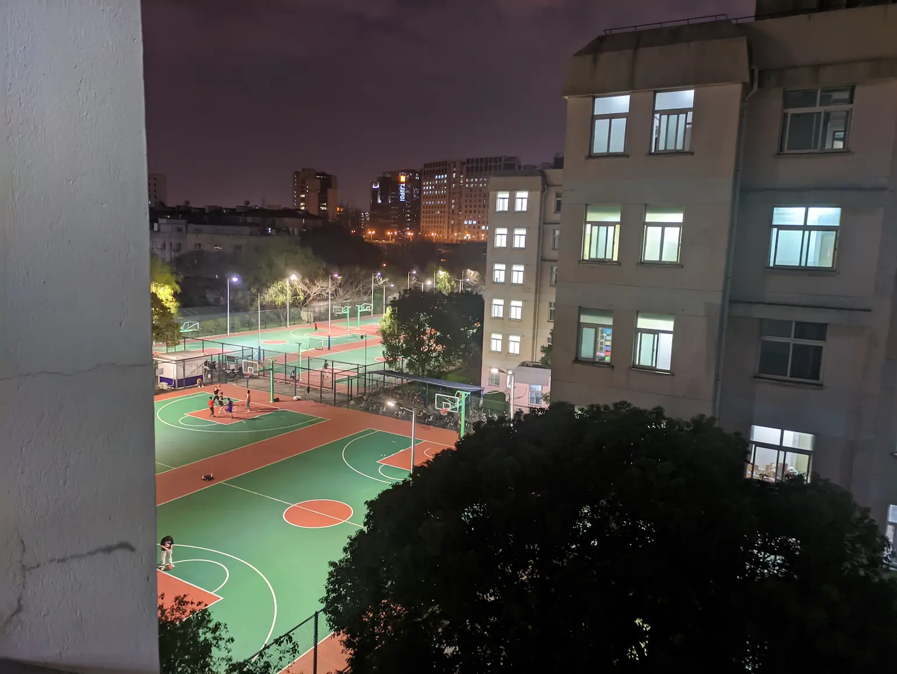

title: "2022 和我自己"
date: 2022-03-24 15:46:25 +0800
author: w568w
cover: images/nathan-dumlao-ewGMqs2tmJI-unsplash.webp
preview: 关于我鸽了一年多这件事
---

嗨，各位。距离上一次更新博客已经过去了整整一年——准确地说，是一年零三个月多。毕竟我把每年必更的年度总结都鸽掉了……

一年时间吧，说长也不长，说短也不短。进入大学之后的生活格外悠闲。没有繁重的作业和考试（期中季和期末季除外），相比于高中，每天的课程量也约等于零…… 但是，时间却不可思议地自我收缩了。虽然在大学生活了一年半的时间，却感觉收到录取通知书仿佛是昨天才发生的事。

可能这就是所谓的 Routine 吧。重复了数百遍的同一天，和经历了数百天的生活，完全是两码事，而我现在就落在了前者中。

# 生活现状
总之呢，博主现在已经从刚进大学时懵懵懂懂的高中生「升级」为了懵懵懂懂的大学生。具体就表现在缺乏探索的热情，精通烂泥扶不上墙的精神品质，哈哈。

每天忙着完成各种作业、实验和讨论，工作量上来说倒也不至于很忙，但是因为相比于疯狂压榨的高中生活，可利用的日均工作时间大大减少，所以实际上繁忙程度也差不多。

不过，留给自己的时间变得很多就是了，不然我也不会有空写代码、学习感兴趣的新东西。

# 为啥一直不更新？
还记得我在 [2020 年的日志](2020-hopes.html) 里说的吗？

当初因为工具问题，停更了一段时间，**而这次又是工具问题**……

现在我所使用的博客构建系统「纸小墨」，由于开发者弃坑很多年，使用的模板中的第三方库已经非常老旧，被报出了一大堆 Bug……

最近几周，我一直在着手升级这一块，但是苦于对前端技术了解不多，越修越烂，最后彻底坏掉不能用了。一气之下，我就把代码扔在那里摆烂了，而博客也因此一直没有更新。

上周因为上海疫情严重，我们改成了网络授课，学生都只能留居寝室区，过着食堂-寝室两点一线的生活。今天上午一时兴起，又把代码扒拉出来研究研究。经过和同寝前端大佬痛苦的 Debug，终于修到了能用的地步。

于是，才有了今天下午的这篇小短文的更新。

**之后的话，我会尽量提高更新频率，也希望各位多多关注……我这个~~年更的~~博主吧！**

# 关于《零基础微积分入门基本教程》系列
如各位所见，这个系列是我上**高二**的时候，一时兴起写的文章。高三之后因为时间不足，基本上就没怎么更新过了，等上了大学就彻底把这事给忘干净了。（**为了避免你没看我的个人简介，再提一嘴：我现在是大学二年级。**）

最近突然有很多小伙伴加我 QQ，希望了解系列的后续，也不知道是哪些好心的同学在帮我宣传。如果你们中有人看到了这篇文章，**真心感谢你们！**

怎么说呢？**在大学里真正系统学习了微积分的入门知识后，现在我已经有点不忍直视我以前写的东西了……** 感觉逻辑上有点混乱，也不是很确定这些内容是否是真的对大家有用。

**不过，既然承诺过要更新的，最近还是尽量多写一点，争取周更，尽快把求导的部分知识介绍完！**

不过，因为视角不太一样，经过大学数学的系统训练之后，感觉自己已经很难摆脱那种满嘴「显然」「易得」「假设」「被定义为」「当且仅当」的「数学腔」了……**可能之后写的内容的画风和之前有一点点不一样，我自己都察觉不到的那种细微差别。还请大家多多包涵！**

# 其他碎碎念
有人说 2022 是 2020 too，因为今年的疫情一波来得比一波猛，大有重返 2020 之势。 当下，连上网课都已经经典复刻 2.0 版了。

2020 年，我还在准备高考，坐在家里听智学网讲语数英物化生。眼下，我坐在大学寝室里，听腾讯会议讲离散数学、统计学、最优化方法……

但愿我也能有 2020 那样的探索欲和勇气，去走完这一年的历程吧。

