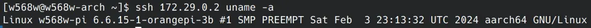
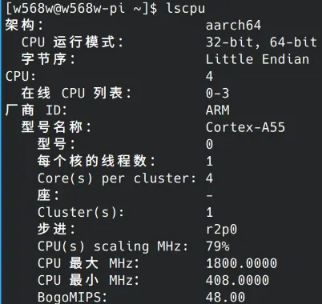

title: Arm 相关术语辨析
date: 2024-02-07 12:28:00
author: w568w
type: post
hide: false
toc: false
cover: images/arm-logo.avif
preview: Arm？Armv8？armhf？AArch64？这些术语是什么意思？
---

> 这篇文章基本是 [Disambiguating Arm, Arm ARM, Armv9, ARM9, ARM64, AArch64, A64, A78, ...](https://nickdesaulniers.github.io/blog/2023/03/10/disambiguating-arm/) 的翻译，添加了一些自己的理解和补充。

在技术复杂的地方，总有不成规范的术语表达存在。我常常听到有人说「arm 架构」「aarch64 指令集」，但这些说法并不准确。本文将尝试澄清绝大多数与 ARM 有关的术语的含义。

## Arm 公司和产品

**Arm 架构**是*一组精简指令集架构* （RISC）的统称（注意，是**一组**，不是**一个**）。「精简」是指具有简单的寻址模式，例如数据处理是在寄存器操作数上完成的，而不是依靠加载和存储将数据移入或移出寄存器。

英国公司 **Arm Limited** 是这个架构的*设计公司* ，但它不生产芯片，而是收费授权给其他公司。这就是为什么你会看到很多种 ARM 芯片，例如高通的骁龙、华为的麒麟、苹果的 A 系列等。

字母大写的 **ARM** 在很久以前是对 Acorn RISC Machine（橡果 RISC 机器）和 Advanced RISC Machines（高级 RISC 机器）的称呼，这些架构今天已经不再使用，但如果你想避免歧义，请尽量使用「Arm」。

## 架构和指令集

**Armv9** 和 **Armv8** 等是指 Arm 公司发布的*一个架构版本* 。这些版本包含了更新的指令集和特性。例如 Armv9 引入了 SVE2（Scalable Vector Extension 2）指令集。

**Armv9.4-A** 是 **Armv9** 的一个最新的扩展，相当于*补丁版本* 。这个版本引入了一组新的功能，有些是可选实现的，有些在未来的 Arm 架构中可能会成为必选标准的一部分。

后面的 **-A** 是一个*子版本* ，类似于「QQ」「QQ 极速版」「QQ 办公版」的区别，**-A** 指这个架构是用于应用场景（Application Profile）的，比如手机、电脑，还有 **-R** 用于实时场景（Real-time Profile），例如无人驾驶和工业生产控制，**-M** 用于微控制器（Microcontroller Profile），例如树莓派。不同版本的架构定义也有很大的差别。

> 也许是命名者为了凑出一个巧合，这里的后缀恰好包含 ARM 三个字母。

**AArch64** 是处理器的一种*执行状态* （注意，不是指令集！），在这个状态下，可以使用 64 位的寄存器、专用的栈指针和只读的程序计数器，这一状态在 Armv8 中首次引入（**所以 Armv7 及以前都是 32 位架构**）；相对应的，原先的 32 位状态被称为 **AArch32**。同一个处理器可以通过设置一个专门的寄存器，在这两种状态之间切换，这就是为什么你可以在 64 位的系统上运行 32 位的程序。

**A64** 是 AArch64 状态下唯一的*指令集* （虽然它操作 64 位寄存器，但每个指令本身 32 位定长）；相应地，**A32** 现在用来指代早期的 32 位指令集（大部分指令本身也是 32 位定长的，除了 T32）；**T32** 是 A32 的一个子集，它特指 Thumb2 指令集（指令 16 位和 32 位长混合，具体见「其他杂项术语」一节）。

## 移植

奇怪的是，Arm 公司自始至终没有说过 **arm64** 这个术语，这似乎是苹果、微软和 Linux 喜欢使用的术语。**arm64** 现在被广泛作为一个*移植* （Port）称呼。

> **译者注**
>
> *移植* （Port）有很多不同的解释，它似乎不是一个规范的术语。在我的理解中，它指一个代码实现，这个实现可以在一组具有类似特征的架构和指令集下运行。例如 Linux 内核的 arm64 移植可以在所有 Armv8 和 Armv9 架构的处理器上运行，i686 移植可以在所有奔腾 4 及以后的 32 位和 64 位处理器上运行，x86\_64 移植可以在所有支持 amd64 指令集的处理器上运行。
>
> **总而言之：架构和指令集是硬件设计者规定的，移植是软件（例如编译器、内核）开发者分类的。**

移植名称通常不是一个标准而是一些惯例。Arm 相关的其他移植名称包括：

* **armel**：针对 Armv4t 直到 Armv7 架构所支持的 Arm EABI（Embedded Application Binary Interface，嵌入式应用二进制接口）的移植，它是 32 位环境。它的兼容性一般是最好的；
* **armhf**：针对 Armv7 架构 + VFP3-D16 指令集 + Thumb-2 指令集 + 硬件浮点支持的移植，「l」表示它是小端顺序（相应还有大端「b」），它是 32 位环境；
* **armv7hl**：和 **armhf** 基本可以认为相同，在[某些编译器](https://together.jolla.com/question/134877/difference-between-armv7hl-armhf/)中指 armhf 再加上 NEON 指令集；
* **armv7l**：和 **armhf** 类似，去掉了硬件浮点支持（「h」）的要求；
* **armv8l**：针对 Armv8 架构的移植，小端顺序。注意，尽管 Armv8 已有 64 位支持，但这个移植是 32 位环境（什么，你问我 64 位环境的移植叫什么？笨，不就是 **arm64** 嘛）。

更多可以参考 [Debian 的 ARM Ports](https://www.debian.org/ports/arm/index.en.html) 和 [OBS 的架构说明](https://wiki.merproject.org/wiki/OBS_architecture_naming)。

再强调一次：**这些名称不是标准，不同的发行版、公司、系统和项目可能有不同的定义**。例如，同一个架构，苹果设备上可能用「arm64」，但在一些 Linux 中可能又用「aarch64」了。这也许是为什么 Arm 公司不喜欢「arm64」的原因之一……

## 微架构
有些人也许会提到某某处理器是一个「**A78** 处理器」，请不要将其与 A64 指令集混淆！A78 更正式的名称是 **Cortex-A78**。Arm 公司不仅设计架构，还设计架构的实现，我们称为**微架构** ，可以理解成给硬件工程师一个更清晰的硬件框架规定。

微架构可能会有一些特定的优化、指令集扩展、缓存大小等等，例如 Cortex-A78 微架构最高可实现 Armv8.3 架构扩展。

无论后面的数字是什么，只要看到 Cortex 或 Neoverse，那么这些都是 Arm 的微架构。

在一些不愿意给 CPU 起名的 Linux 设备中，你可能看到 Linux 读取出的 CPUID 字段就是 `Cortex-xxx`。

## 其他杂项术语
下面是一些不太常见但容易混淆的术语。

ARMv4t 架构引入了称为 **Thumb** 的压缩*指令集* ，指令是 16 位固定宽度；随后在 ARMv6t2 中，**Thumb2** 指令集为其添加了一些 32 位长度的指令。正如上面所说，Thumb2 在 ARMv8 发布以后已经主要被称为 **T32** 了。

