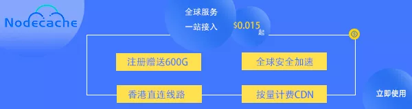

title: "《ATRI -My Dear Moments-》通关后感想"
date: 2020-09-07 20:15:00 +0800
update: 2020-09-08 13:55:00 +0800
author: w568w
cover: images/atri-wp.webp
preview: 无剧透评价，放心观看
---
# 写在前面的废话
今天，繁重的开学前任务终于告一段落了。  
然后为了庆祝（？）此事，特地把原先无比缓慢的`CloudFlare`忍痛换成了付费`CDN`。  
这个`CDN`不仅**免备案**，而且有国内直连线路，网站加载起来跟原来相比真的是呼呼的~ ~~果然充钱才能变得强大...~~    
 
除此之外，它最大的优点在于**巨特么便宜**！`1GB`流量才1块钱，1块钱啊...  
纵览国内外各种`CDN`动辄一个月成百上千的费用，这个真的是非常香了。   
 
`CDN`名叫`Node Cache`，支持欧美/亚太/中国线路无缝切换，熟悉网站的朋友应该略有耳闻。他们最近在搞新人注册送**100G无门槛流量**活动，  
[用我的邀请链接注册](https://console-api.nodecache.com/f?aff=rz1q04)可以**多拿500G流量**!  
（虽然有恰饭嫌疑，但是确实可以拿到啊QAQ） 

# ATRI总评
言归正传，不能被广告带跑了...  
 
先贴一段来自[萌娘百科](https://zh.moegirl.org.cn/ATRI_-My_Dear_Moments-)的游戏介绍：  

> 《ATRI -My Dear Moments-》是由 ANIPLEX.EXE 和 Frontwing、枕社(The pillow) 共同制作，并由 ANIPLEX.EXE 发行的一部人机恋题材的视觉小说游戏。于 2020年6月19日 在Steam平台和DMM平台上同步发售。

 
尽管我Galgame玩得非常少，但是我也知道AI人机恋已经是一个老得不能再老的题材了...  
 
就日本方面来说，比较早的动画作品有2000年的[《人形电脑天使心》](https://zh.moegirl.org.cn/%E4%BA%BA%E5%BD%A2%E7%94%B5%E8%84%91%E5%A4%A9%E4%BD%BF%E5%BF%83)、2002年的[《最终兵器彼女》](https://baike.baidu.com/item/%E6%9C%80%E7%BB%88%E5%85%B5%E5%99%A8%E5%A5%B3%E5%8F%8B/3224767)等。  
即便在中国，也有[台湾奥尔资讯](http://www.auer.com.tw/)制作的《恋爱物语：我的机器人女友》Galgame游戏（发行年份不可考，根据安装包的`Apache Ant`构建版本判断在`2007年`左右）。  
 
因此，我很怀疑`ANIPLEX.EXE`——作为一个刚刚成立不到一年的工作室——在这方面炒冷饭还能炒出什么东西来。刚开始游戏时，也就是抱着 Steam 好评99%+ 以及「原画不错」的印象去玩的，权当消磨时间。  
 

---

（温馨提示：下面有少量剧透，**不影响游戏体验**！）  

开头的剧情非常平淡，也就是捡到个张口就喊男主角「主人」的少女机器人——ATRI（亚托莉）。  
然后就埋下一个巨大Flag——亚托莉不能和男主一起生活太久。  
然后就是「阿西莫夫机器人三原则」的介绍。  
然后疯狂发糖发到齁。   
  
这样的开头基本上是所有人机恋题材的共性了，~~除了亚托莉很可爱之外，~~ 没什么可圈可点的...  
  

    
不过剧情越到后面，越能展现出这部作品的魅力所在，越让我刮目相看——**人机之间的感情还能这么写**！  
 
直至迎来第一个转折点——男主发现日志，让我对它的评价直接上升为「**大作**」（也可能是我同题材游戏玩得太少了QAQ）。这样的情节转折，是我在之前的各种作品中很少见到的。  
  
一般的人机恋爱主题作品里，常常花很大的篇幅渲染机器人的感情有多么发达、多么完善、多么与人类接近，人类又有多么痴情、多么热爱....，**而《ATRI》却展现出了另一种剧情的可能性**。（至于究竟是怎样的发展，请自行探索，在此不多剧透啦）  
  
同时，我也很担心往后的情节是否会一落千丈，或者至少因为前期情节太冲击而让我失去对后期的兴趣。  
  
不过果然这个作品的结尾还是没有让我失望。无论是`Happy end`的激情、`Bad end`的崩坏还是`True end`的感动，都帮助我找回了曾经玩 Galgame 大作的感觉...  
  

---
[Bad End 的 亚托莉 CG](images/ev019bl.webp)（防剧透，**图片容易引起生理不适**，请谨慎观看）  
（~~但是说实话我超喜欢这张CG！~~）

---

  
  
而最近的 Galgame ，越来越偏向于「成人向」、是游戏就必加色情内容的趋势，有些甚至有着一言不合就上床的神奇情节，好像不来点颜色就不算 Galgame 一样。    

这样的 sex 情节当然一时间很吸引眼球，还能骗到大把新玩家，但是很容易造成内容的同质化，玩家也容易产生「过饱和」的审“色”疲劳心理而下降对 Galgame 的兴趣程度。  

除此之外，也会给大众造成「Galgame 就是色情游戏」的片面误解，只会让 Galgame 的发展道路越来越窄。  

  
《ATRI》就是这样一部在如今的清一色Galgame中让我耳目一新的一个「全年龄向」作品，让我重新拾起了对视觉小说的热爱。

   
(「某状态」是啥？————自己去玩就知道啦ww)    
总之，如果让我给这部作品评价，我觉得完全可以称为「**神作**」。无论是有挖掘空间的剧情深度、另类末世的故事背景还是艺术性的命运巧合，抑或是游戏本身的画质和背景音乐，都达到的很高的水准。  

 
如果你从未玩过Galgame，或者对Galgame失去了信心，不妨体验一下这款“炒冷饭”作品带来的新的感动。  
 
这款作品目前在 [Steam](https://store.steampowered.com/app/1230140/ATRI_My_Dear_Moments/) 上可以买到PC正版，**自带官方简体中文**（包括CG也是中文）。   
 
如果你没有钱钱或者没有电脑，网上也有 Android 移植版资源。这里就不直接贴链接了，支持正版！
# 尾声
最后以本作的名言作结吧：   

「在日渐沉没的世界里，我找到了你。」 
 
  

「时间停止吧，你是多么美丽——」 
 