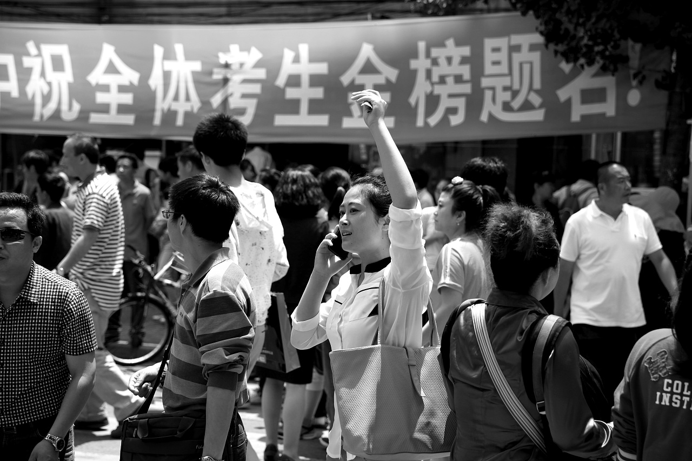
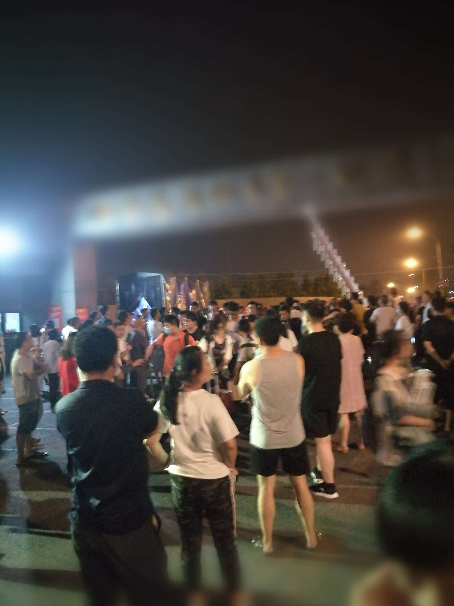

title: "向往的彼方"
date: 2020-07-24 21:04:00 +0800
author: w568w
cover: images/gaokao.webp
preview: 写于高考前夜…以及高考后
---
  
  
今天，我得知了自己的高考考场位置。 
   
很幸运，我在自己的学校考试——这意味着可以省去很多不必要的麻烦。我大大松了一口气。  
  
看身边的同学，有的愁眉苦脸，有的兴高采烈，都躁动成一团。愁眉苦脸的，想必是分到了号称"本地最差条件考场"的 SQ 中学：桌椅破旧得像解放遗物，整个教学楼就一个厕所，考场考务人员还不喜给外校考生好脸色看。  
  
据说去年有个本校女生在那里考试，因为身份证没带，一时又不能补办，被该校老师斥责哭了。当然，最后她考得也很差。
  
身边的同学依旧在闹，嘈杂混乱。  
  
不过，幸好，幸好，这些都与我无关了。我是这么想着的。
  
---
  
下文更新时间:2020年7月2日23点
  
# 4天
当我写下这些文字时，正是深夜11点40分，离高考还有四天。  
  
  
有人问我高考前是什么感受？  
  
超级紧张？激动？惶恐？晚上辗转反侧睡不着？  
  
都不是。  
  
是平静和茫然。  
  
当这场号称是人生最重要的考试，真正来到你面前时，当万千考生口耳相传的"千军万马过独木桥"之后，终于轮到你上独木桥时，你已经没有什么感觉了。  
  
独木桥在前面晃悠，你在岸边走。你知道，你迟早要过去的——你可能过得很优雅，也可能过得很狼狈；你可能会被同行人挤下桥，也可能把身边的一切都甩在身后。不管你怎么想，你终究要走上去。  
  
经历无数次考试，号称被考得最焦的高三学生，面对考试这件事，已经麻木了。  
  
《高考必刷题》上有一段话说得不错[\[2\]](#2):  
  
> 高考  
> 无非就是很多人做同一张卷子  
> 然后决定去哪座城市  
> 做什么工作  
> 今后和谁相知  
> 和谁一起旅行  
> 和谁走一辈子  
>   
> 不管结局如何  
> 那些熬过的夜  
> 刷过的题  
> 吃过的苦  
> 会铺成一条宽阔的路  
> 带你去你想去的地方  
  
---
  
    
下文更新时间:2020年7月3日22点  
    
    
# 狂欢
今天，离高考还有3天，离学校停课还有2天。明天是我们正常上课的最后一天。       
    
按理来说，今天也可以算作是毕业的"前夜"了。对于高中生活最后的时光，就算没有给老师的鲜花和掌声，至少也该有些有纪念意义的东西吧？  
  
——记得初中毕业的时候，我们流泪，我们拥抱，我们互赠同学录，互相留下姓名，承诺着"一定不要忘记"之类的幼稚的话……  
    
    
然而事实是——**我们  _什么_ 也没有做**。  
    
不知是心理和生理都太累了，还是什么别的原因，总之我们确实什么也没有做。  
    
语文老师的课照常不听。  
    
数学老师的课上继续写作业。  
    
物化生课上发呆。  
    
至于英语老师的课上，后排同学唠嗑的声音都快盖过老师的大嗓门了。略微发福的老师也不恼，就笑眯眯地看着我们继续讲卷子。  
    
丝毫没有面对高考的紧张，一切都像是离高考还有两三年的样子。  
    
    
不过，确实有一些改变发生在我们当中。  
  
傍晚，吃完有史以来在学校食堂吃的最豪气的一顿晚饭——毕业前要把饭卡里的钱刷光——之后，我和同学一边聊着特朗普能不能连任、肖战还能捞多少钱等等与高考毫无关系的话题，有一搭没一搭地回到教室。  
  
还没走到教室跟前，就听到了欢笑声，推门一看：  
后排几个同学在对象棋残局指指点点，前排几个平时不大说话的女生在纸上下五子棋，阳台上一群人围坐着打三国杀身份局……   
  
他们真的对游戏本身感兴趣吗？或许是。不过我想，最主要的，大概是对即将到来的高考的压力的逃离，以及对同学回忆的创造吧。  
  
这段时间我们实在考了太多的试，有太多的错题，想了太多的心事。游戏，是解脱，是逃避，是释放，是回忆：现在不玩，以后想作为高中生的身份再聚一起，还有可能吗？
   
愈发减少的高考倒计时牌下，是愈发躁动的心灵。
  
我加入了狂欢。
   
    
     
      
 晚自习时，班主任把我叫到阳台，祝贺我获得了本校高考的buff，又语重心长地跟我叮嘱了很多:不要贪凉，注意饮食，不要像Z同学和X同学一样在高考前受伤生病……讲了很多才让我离开。  
   
    
  离开阳台时，我心里一阵酸楚——这个40多岁就谢顶的中年男人，大概再也无法叫我上黑板写数学问题的解答了。
  
<iframe frameborder="no" border="0" marginwidth="0" marginheight="0" width=330 height=86 src="//music.163.com/outchain/player?type=2&id=458004314&auto=0&height=66"></iframe>

  
---
  
    
下文更新时间:2020年7月4日22点  
    
    
# 序幕 
  
今天是我们上课的最后一天。
  
   
7:30到学校。放下书包，我们就迷迷糊糊地开始了告别之旅。   
  
我知道小学生再见时的懵懂天真，知道初中生告别时的热泪盈眶，也知道大学生毕业时的激情飞扬。
  
 但是高中生与这三者都不同：我们早已经脱离了动辄哭鼻子的年龄，也远未达到大学生那样可以成熟而含蓄地表达感伤的思想水平。
   
 再者，在依然沉闷的试卷评讲和考前指导中，我们的伤感又被再一次冲淡。
   
   
 所以，戏剧性的是:**我们  _仍然_ 什么也没有做**。  
  
  
 不过，各科老师一点点地，帮我们找回了这种情感。
   
 首先是英语课。英语老师直接放弃了今天上午最后一节课上课的机会，让我们自由地听音乐。我们争相上去点歌，几个同学差点打起来，给我们最后的高中校园生活增加了一点笑意。  
 最后他说，抱歉，让你们三年，啊不，两年半都摊上了这样一个英语老师。(高一下学期重新分班。)
  
 气氛突然变得伤感，我们拼命地鼓起掌来，意图打破这种毕业前的歉意和尴尬。我们看着他微笑着退场。
   
 然后是语文老师。三年来她第一次没有拖堂，读完两篇高考范文，下课时一句祝愿，扬长而去。
   
 再者是物理老师。平常一口流利的方言的他，却在祝福我们高考顺利的时候，用起了标准的普通话。五十多岁的中年男教师，扭扭捏捏的，像个二十几岁的小伙子。
   
 化学老师临走时开玩笑说，高考考砸了，可不要把责任怪到我头上啊。
   
 生物老师一反常态地没有表示[\[3\]](#3)，或许是一天的课上得太累了，她一脸疲惫的来，又一脸疲惫的走。  
 一天的课结束了。我暗自思忖:我们的心情该是如何？难过，悲伤？
  
 突然想到一句诗词：
 
 > 此去经年  
 > 应是良辰好景虚设

不由得吟咏出来：便纵有千种风情，更与何人说？ 
 ……
   
 晚自习时，数学老师聚精会神地在笔记本电脑上打字，不时还敲两下鼠标。 
 他或许是在为明天的最后一次班会准备PPT，又或许已经在为下一届高一制作课件。 
 我不禁想到——送走了我们，他终会迎来下一届新的高一学生，下一批崭新的面孔，下一群性情各异的学生……  
对老师来说，三年是一个周期。一届又一届，在高一与高三之间回荡。 
我们只是他们人生中的过客，三年匆匆而来，又匆匆收拾离去。 
人生如逆旅，我亦是行人。或许他们也是我们人生中的过客，只是，我们没法再陪伴他们走完下一程了。我们就要离开了，在离开之前留下最后的终章。   
高中的结局奏罢了。  
高考的序幕拉开了。  

  
---
  
    
下文更新时间:2020年7月6日12点  
    
    
# 前夜 
  
明天是高考了。  

昨天上午，我们参加了最后一次班会。  
    
一大早到校，班主任反常地主动放起了音乐————平常，他是最反对这些“扰乱心思”的东西的。  
    
   发下准考证、毕业照、健康承诺书，他打开了临时赶做的PPT。白底黑字，内容很简单，就是一些考前注意事项。
       
   然后，他简单交代了一些东西：考试应急处理，考后日程表，还让我们抄下了班级QQ群号。
       
	  我们默默听着。 平素这些老生常谈的东西，如今看来，如此珍贵。 班会一结束，我们就彻底与高中时光说再见了。
       
	7点半到8点半，一个小时的光阴流水而逝。
	  
	末了，他扫视了一下我们所有人，好像在努力记住每个人的相貌。我们都沉默不语：仿佛经历生离死别，此时此刻，一切都在无言中。
	 
	最后，他郑重叮嘱道[\[1\]](#1)：
	
> “你们是理科生，以后免不得有人要搞科研这条路。  
>  
> 所以，一定一定要记住的是：**诚实、善良**。这比你有多大成就都重要。  
> 
> 你们要知道这句话：**越聪明的人越危险**，他/她一动歪脑筋，对国家、对社会的危害都更大。  
> 
> 社会首先看你的人品道德，然后看你的知识水平，等你们进入社会马上就知道了。  
> 
> ————还有一件事，**一定一定要热爱祖国**。你看看，你们以后要深造，可能有人要出国留学发展。  
> 
> 好多留学生在外国待久了，把家都忘了！**你们不能忘掉中国，一定要回国作贡献**！

               

今天上午，写了一张语文卷，一张理综卷。 简单批改了一下，成绩并不好。 下午要看考场，而我还在这里慢吞吞地打字。 父母劝我最后一天放松一下，但我到现在还没复习错题。 班级QQ群沉闷，无人说话。  
各种事情冲向我，但我并无所谓。  彼方在前， 前夜无梦。

**(完)**

---
  
    
下文更新时间:2020年7月27日8点  
    
  
# 后记：彼方

昨天上午10点11分，高考成绩出榜了。  
  
23日，起床之后整个人烦躁不安。我在烦躁什么？或许是在担心高考成绩吧。  
当初高考之后，估分的场景历历在目。对一题，心就凉半截；对到一半，简直没劲再对下去了。只想把手机扔掉，趴上床大哭。        
但是分还是要面对的。10点左右，爸妈坐在客厅看电视，我在卧室里一个人对着新笔记本电脑发呆。电视上正播放着高考专题，主持人正讲解着今年安徽省控分数线，还夹杂着采访学生、新闻发布会的嘈杂声。      
抱着一种似乎无所谓的心态，我假装随意点开了高考分数查询页面。不知怎么的，平时开个百度都懒得打字的我，那串复杂的网址，却输得那么熟练。        
望着那个橙色的查询网页，我有点胆怯。从抽屉里翻出了十几天未见的高考准考证，颤抖着手指快速输入信息，希望手的速度能超越大脑关掉网页的愿望。        
输完验证码，我毅然决然地按下查询。    
那一刻，我想到了很多。我想到前一天我们尽情玩乐的同学聚会，想到离交卷还有三分钟，仍有两道大题未完成的高考数学，想到我那惨不忍睹的估计分数……        
祈祷吗？我没有祈祷。现实毕竟不是影视作品，不会在关键时刻自动放慢速度，也没有扣人心弦的慢动作瞬间。    
    
   事实上，好笑的是，回应我的是屏幕上五个简单的字：        
   “验证码错误”        
诧异，但同时又松了一口气。我关掉提示框，重新输入验证码，依然是这5个字。        
如同临刑的犯人在受刑前一刻听到大喊“刀下留人”一样，我赶紧找到了合理的解释：查询系统还没有被准备好。        
我不知道这样一个小插曲给我造成了多大的影响。但是，再一次查分时，我几乎没有什么犹豫了：很快地输入准考证号，考生号和身份证号，顺手敲下回车。      
页面快速呈现了出来，没有给我什么准备时间。        
我的成绩是——692分。安徽省120+名。        
我的第一反应是惊奇：我是不是输错准考证号了？但是页面上我的姓名和个人信息都清晰地呈现，不会有错。        
那一刻我的心理又回归了“高考前”式的沉默。        692…科大倒是可以，清华估计没希望了。我的心又沉下去一点。    
母亲走进了我的房间，边走近边紧张地向我询问高考成绩。当我把电脑屏幕转向她时，她脸上的欣喜，我无法用文字描述。她高兴得亲了我一口。        
待家人都冷静下来，我心里仍是一如既往的平静。查分后感动得痛哭流涕，都是电视新闻上的桥段，我做不到。         
然后就是亲戚无休止的电话，是老师的祝贺，是同学在QQ群疯狂刷屏的“苟富贵无相忘”……            
彼方真的到来了吗？我不知道。        
我打开QQ，点开“红警（游戏群）”，输下“来一局”，回车。   
有时候，游戏真的能让人想起很多东西。  比如，为什么要探寻。

 
---
### 附注

1:非原话，凭记忆复原。  

2:两段话分别在《高考必刷题》和《高考必刷卷》上。  

3:我记不清了。  