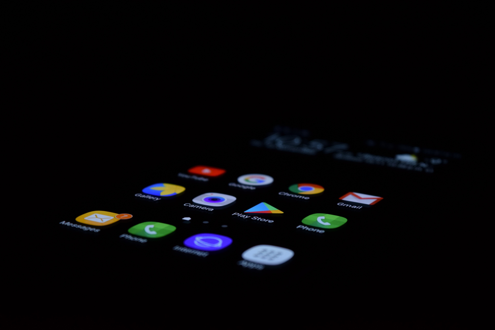
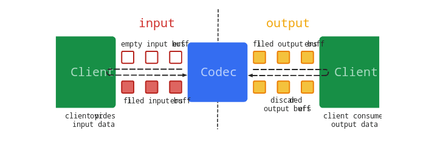

title: "对于Android MP3解码为PCM的一些研究"
date: 2018-09-22 12:46:00 +0800
author: w568w
cover: https://i.loli.net/2020/03/13/T5z3nyOjNSbXIVg.jpg
preview: Android上的媒体文件解码/编码并不是一件复杂的事。
---

# 2020年更新！
注意，经测试发现，该方法必须在每一次调用`queueInputBuffer`方法时，写入的恰好是**一个或多个**完整的 mp3 帧，否则该数据块的解析结果将是空的，因此**这个方案根本不能用！可以不用往下看了，直接用`lame`库解决吧！**
 
# 前因
最近在写一个项目，需要对大量MP3文件进行解码，并输出PCM文件。  
百度了一下，发现Android上提供了一些可以直接进行解码的类，很方便。
# 过程
主要需要用到的是[`MediaExtractor`](https://developer.android.google.cn/reference/android/media/MediaExtractor)和[`MediaCodec`](https://developer.android.google.cn/reference/android/media/MediaCodec)。  

`MediaExtractor`在Android Developer上的解释是  

> MediaExtractor facilitates extraction of demuxed,   
> typically encoded, media data from a data source.   
> 翻译:  
> MediaExtractor帮助从数据源中提取解复用的，  
> 通常编码的媒体数据。  

这个类可以帮助我们获取mp3文件的信息(例如比特率、位数、轨道数等)，还可以按帧提取mp3的数据(但并不解码)。我们主要使用的是后一个功能。  
   
接下来，我们需要对输入的文件进行数据抽取的预处理。  
思路是先用`MediaExtractor`获得媒体文件的音频轨道(mp3文件一般只有一个)，然后用`selectTrack`指定该轨道。  
代码如下：
```
        MediaExtractor mediaExtractor = new MediaExtractor();
        MediaCodec mediaCodec = null;
        mediaExtractor.setDataSource(getContext().getResources().openRawResourceFd(R.raw.mp3).getFileDescriptor()));
        int trackCount = mediaExtractor.getTrackCount();
        for (int i = 0; i < trackCount; ++i) {
            MediaFormat format = mediaExtractor.getTrackFormat(i);
            String mineType = format.getString(MediaFormat.KEY_MIME);

            if (mineType.startsWith("audio")) {
                mediaExtractor.selectTrack(i);
```
然后，创建并启动`MediaCodec`，准备开始传入编码的数据。  
```
                mediaCodec = MediaCodec.createDecoderByType(mineType);
                mediaCodec.configure(format, null, null, 0);
                break;
            }
        }
        mediaCodec.start();
```
接下来，定义一个`readData`，用于向指定的`ByteBuffer`中写入读取的数据：
```
private int readData(MediaExtractor extractor, ByteBuffer buffer, int size) {
        int totalSize = 0;
        do {
            int sampleSize;
            if (Build.VERSION.SDK_INT < Build.VERSION_CODES.LOLLIPOP) {
                sampleSize = extractor.readSampleData(buffer, totalSize);
            } else {
                sampleSize = extractor.readSampleData(buffer, 0);
            }
            if (sampleSize < 0) {
                return totalSize;
            }
            totalSize += sampleSize;
            //Advance to the next sample.
            extractor.advance();
        } while (totalSize < size);
        return totalSize;
    }
```
需要注意的是，对于`Android Lollipop`及以后的版本，`readSampleData`的第二个参数必须是`0`，数据会自动填充到末尾。  

---
接下来的，是真正的解码过程。解码过程比较麻烦，具体概括为如下几步：  

1. 获取`MediaCodec`的输入/输出`ByteBuffer`数组。
2. 调用`dequeueInputBuffer`方法，获取下一次输入所使用的`ByteBuffer`在数组中的索引。
3. 调用`readData`向该`ByteBuffer`中读取一段mp3数据。
4. 调用`queueInputBuffer`方法，将这个`ByteBuffer`加入解码队列中，进行真正的解码过程。
5. 调用`dequeueOutputBuffer`方法，获取下一次解码完成的数据所使用的`ByteBuffer`在数组中的索引。
6. 将这个`ByteBuffer`内的数据读出，即为一个PCM片段。
7. 调用`releaseOutputBuffer`释放该`ByteBuffer`。
8. 循环5~7步，直到请求不到输出，这意味着当前已经没有解码的数据了。
9. 不断循环以上1~8步，拼接PCM片段，直到解码全部完成。

完整的解码代码如下：
```java
private boolean decode(MediaCodec codec, MediaExtractor extractor) throws IOException {
        ByteBuffer[] inputDatas = codec.getInputBuffers();
        ByteBuffer[] outputDatas = codec.getOutputBuffers();

        MediaCodec.BufferInfo bufferInfo = new MediaCodec.BufferInfo();
        //Get the max input size.
        int size = DEFAULT_BUFFER_SIZE;
        if (Build.VERSION.SDK_INT >= Build.VERSION_CODES.LOLLIPOP) {
            size = codec.getInputFormat().getInteger(MediaFormat.KEY_MAX_INPUT_SIZE);
        }
        for (int i = 0; i < inputDatas.length - 1; ++i) {
            int inputIndex = codec.dequeueInputBuffer(-1);
            if (inputIndex < 0) {
                return true;
            }
            //Input data
            ByteBuffer inputBuffer = inputDatas[inputIndex];
            inputBuffer.clear();
            //Request mp3 data chunk.
            int sampleSize = readData(extractor, inputBuffer, size);
            if (sampleSize <= 0) {
                return true;
            } else {
                //Have it decoded.
                codec.queueInputBuffer(inputIndex, 0, sampleSize, 0, 0);
                decodeSize += sampleSize;
                System.out.println("decode size:" + sampleSize + ",total size:" + decodeSize);
            }
            //Get output buffer
            int outputIndex = codec.dequeueOutputBuffer(bufferInfo, TIMEOUT);
            ByteBuffer outputBuffer;
            byte[] chunkPCM;
            while (outputIndex >= 0) {
                outputBuffer = outputDatas[outputIndex];
                chunkPCM = new byte[bufferInfo.size];
                outputBuffer.get(chunkPCM);
                outputBuffer.clear();
                //Write to a byte array.
                pcmData.write(chunkPCM);

                codec.releaseOutputBuffer(outputIndex, false);
                //Get next PCM chuck.
                outputIndex = codec.dequeueOutputBuffer(bufferInfo, TIMEOUT);
            }
        }
        //Have not decoded the whole file.
        return false;
    }
```
这个方法调用起来也很简单，不断调用直到返回`true`为止。
```
while (!decode(mediaCodec, mediaExtractor)) {
            //Do nothing.
            //Wait for decoding.
}
```
然后解码就完成了。  

---
完整的类源代码如下：
```
/**
 * Created by w568w on 18-9-15.
 *
 * @author w568w
 */

public class MP3ToPCM {
    private int decodeSize = 0;
    private ByteArrayOutputStream pcmData;
    private static final int TIMEOUT = 10 * 1000;
    private static final int DEFAULT_BUFFER_SIZE = 4096;

    /**
     * @param fileDescriptor Input MP3 File
     * @return PCM data
     * @throws IOException when decoding failed or opening the file failed.
     */
    @WorkerThread
    public byte[] convert(FileDescriptor fileDescriptor) throws IOException {
        pcmData = new ByteArrayOutputStream();
        MediaExtractor mediaExtractor = new MediaExtractor();
        MediaCodec mediaCodec = null;
        mediaExtractor.setDataSource(fileDescriptor);
        int trackCount = mediaExtractor.getTrackCount();
        for (int i = 0; i < trackCount; ++i) {
            MediaFormat format = mediaExtractor.getTrackFormat(i);
            String mineType = format.getString(MediaFormat.KEY_MIME);

            if (mineType.startsWith("audio")) {
                mediaExtractor.selectTrack(i);
                mediaCodec = MediaCodec.createDecoderByType(mineType);
                mediaCodec.configure(format, null, null, 0);
                break;
            }
        }
        if (mediaCodec == null) {
            return null;
        }
        mediaCodec.start();

        while (!decode(mediaCodec, mediaExtractor)) {
            //Do nothing.
            //Wait for decoding.
        }

        byte[] pcmByteData = pcmData.toByteArray();
        pcmData.close();
        pcmData = null;
        return pcmByteData;
    }

    private int readData(MediaExtractor extractor, ByteBuffer buffer, int size) {
        int totalSize = 0;
        do {
            int sampleSize;
            if (Build.VERSION.SDK_INT < Build.VERSION_CODES.LOLLIPOP) {
                sampleSize = extractor.readSampleData(buffer, totalSize);
            } else {
                sampleSize = extractor.readSampleData(buffer, 0);
            }
            if (sampleSize < 0) {
                return totalSize;
            }
            totalSize += sampleSize;
            //Advance to the next sample.
            extractor.advance();
        } while (totalSize < size);
        return totalSize;
    }

    private boolean decode(MediaCodec codec, MediaExtractor extractor) throws IOException {
        ByteBuffer[] inputDatas = codec.getInputBuffers();
        ByteBuffer[] outputDatas = codec.getOutputBuffers();

        MediaCodec.BufferInfo bufferInfo = new MediaCodec.BufferInfo();
        //Get the max input size
        int size = DEFAULT_BUFFER_SIZE;
        if (Build.VERSION.SDK_INT >= Build.VERSION_CODES.LOLLIPOP) {
            size = codec.getInputFormat().getInteger(MediaFormat.KEY_MAX_INPUT_SIZE);
        }
        for (int i = 0; i < inputDatas.length - 1; ++i) {
            int inputIndex = codec.dequeueInputBuffer(-1);
            if (inputIndex < 0) {
                return true;
            }
            //Input data
            ByteBuffer inputBuffer = inputDatas[inputIndex];
            inputBuffer.clear();
            //Request mp3 data chunk.
            int sampleSize = readData(extractor, inputBuffer, size);
            if (sampleSize <= 0) {
                return true;
            } else {
                //Get it decoded.
                codec.queueInputBuffer(inputIndex, 0, sampleSize, 0, 0);
                decodeSize += sampleSize;
                System.out.println("decode size:" + sampleSize + ",total size:" + decodeSize);
            }
            //Get output buffer
            int outputIndex = codec.dequeueOutputBuffer(bufferInfo, TIMEOUT);
            ByteBuffer outputBuffer;
            byte[] chunkPCM;
            while (outputIndex >= 0) {
                outputBuffer = outputDatas[outputIndex];
                chunkPCM = new byte[bufferInfo.size];
                outputBuffer.get(chunkPCM);
                outputBuffer.clear();
                //Write to a byte array.
                pcmData.write(chunkPCM);

                codec.releaseOutputBuffer(outputIndex, false);
                //Get next PCM chuck.
                outputIndex = codec.dequeueOutputBuffer(bufferInfo, TIMEOUT);
            }
        }
        //Have not decoded the whole file.
        return false;
    }
}

```
# 问题
存在的问题是，解码太慢。使用的测试代码是这样的：
```
/**
 * Created by w568w on 18-9-16.
 *
 * @author w568w
 */

public class MP3ToPCMTest extends AndroidTestCase {
    private byte[] PCMdata;
    private byte[] reSamplePCM;
    private static final int reSample = 512;

    public void testConvert() throws Exception {
        CodeTimer.time(new ConvertThread());

    }

    public void testReSample() throws Exception {
        CodeTimer.time(new ReSampleThread());
    }

    private class ConvertThread implements Runnable {

        @Override
        public void run() {
            try {
                PCMdata = new MP3ToPCM()
						.convert(getContext().getResources().openRawResourceFd(R.raw.mp3).getFileDescriptor());
                System.out.println("size:" + PCMdata.length);
            } catch (IOException e) {
                e.printStackTrace();
            }
        }
    }
    private class ReSampleThread implements Runnable {

        @Override
        public void run() {
            try {
                reSamplePCM = new byte[PCMdata.length / reSample];
                for (int i = 0; i < PCMdata.length; i += reSample) {
                    reSamplePCM[i / reSample] = PCMdata[i];
                }
                System.out.println("resample size:" + reSamplePCM.length);
            } catch (NullPointerException e) {
                e.printStackTrace();
            }
        }
    }

}
```
  
`CodeTimer`是个简单的代码计时器，不再贴出代码。    
整个解码过程需要将近1分钟的时间，显然在实际环境中是不可直接应用的。  
目前的思路是换用`lame`或`ffmpeg`等解编码的原生支持库。或许了解这方面的朋友可以给我指点一二？