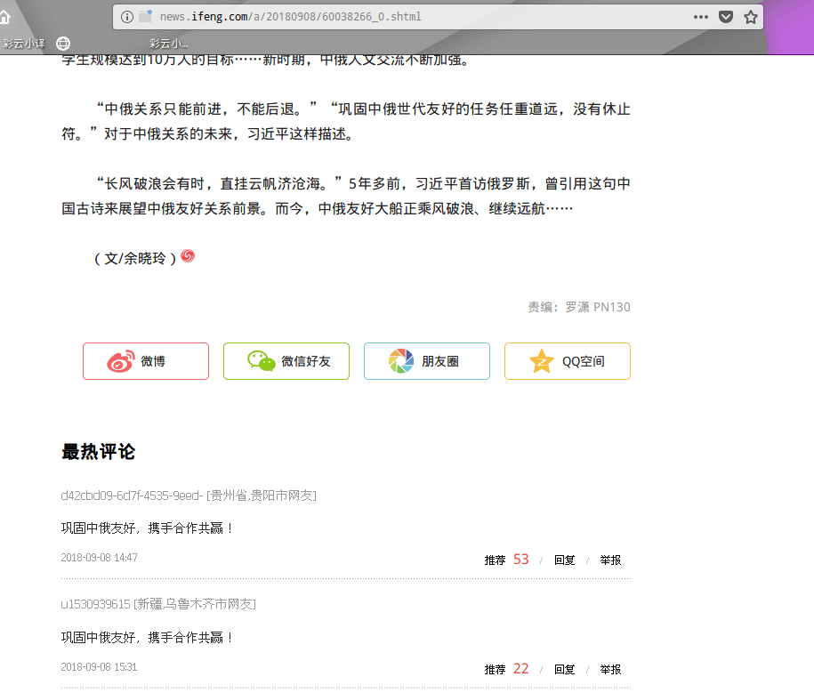
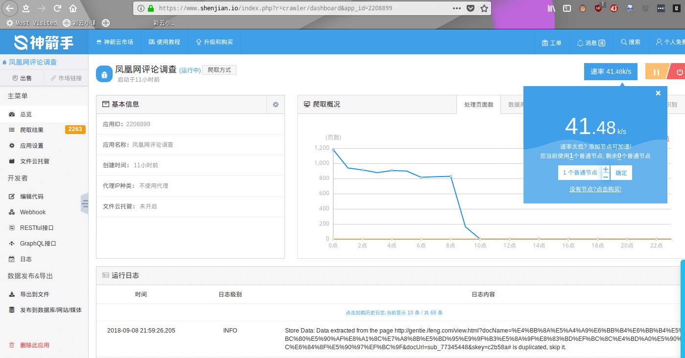
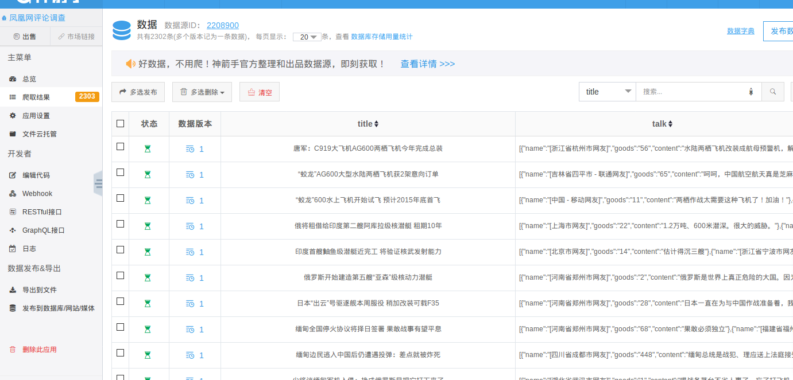
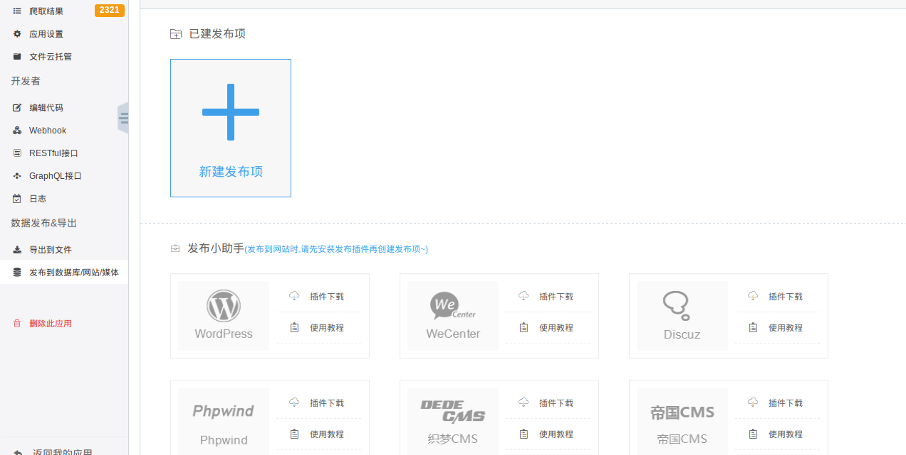
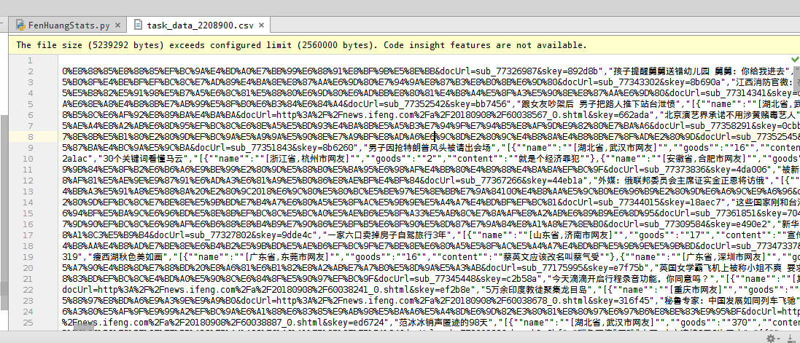

title: "从一次新闻统计概览我国新闻关注热点"
date: 2018-09-09 09:00:00 +0800
cover: -/images/chris-ried-512801-unsplash.jpg
author: w568w
preview: 一次Python练手
---

# 前因
最近学习不是很忙没，闲得蛋疼，决定完成一下学校布置的调查报告，顺便玩玩数据分析...  
所以就有了这么一次关于新闻评论的简单调查。嗯我的编程水平蒟蒻，各位大佬轻喷(/ ω \\)
# 数据收集

第一件事当然是要收集到需要分析的新闻数据啦！  
打算抓取[凤凰网](http://news.ifeng.com/)的评论，因为这里的人比较多，评论量比较大。  

下一个问题是运行数据抓取程式的设备。  
用自己的电脑跑Python脚本心疼电费，用手机跑的话需要下载[QPython](http://www.qpython.com/)，略显得有些麻烦...  
  
所幸，百度了一会儿，找到了一个[云爬虫平台](https://www.shenjian.io/)(我真的不是来打广告的！我发誓！)  
注册后默认是个人免费版，赠送一个**永久免费爬虫节点**(不是SSR那种节点啊)以及1GB的储存空间，还支持**爬取中验证码识別、POST数据、自定义请求头部、自动更换代理、抗反爬虫**...  
总的来说比较实惠...  

这个平台里的爬虫逻辑是需要自己用编写的。提供了一个网页的代码编辑器，支持代码智能补全和高亮格式化。  
开发文档也比较完善，而且预置了很多的API和回调函数，对于熟悉JavaScript语法的人来说，开发难度不大。   

配合FireFox可以获得XPath，所以很快就写完了一个爬虫...
```javascript
var configs = {
  domains: ["ifeng.com"],
  scanUrls: ["http://news.ifeng.com/"],
  contentUrlRegexes: [/http:\/\/gentie\.ifeng\.com\/view\.html.+/], //内容页url正则
  helperUrlRegexes: [/http:\/\/news\.ifeng\.com\/a\/\d+\/\d+_\d+\.shtml/], //列表页url正则 可留空
  enableJS: true,
  
  fields: [
    {
      // 抽取项
      name: "title",
      selector: "//*[@id=\"js_title\"]", //默认使用XPath
      required: true //是否不能为空
    },
    {
      name: "talk",
      selector: "//*[@class=\"mod-articleCommentList\"]", 
      required: false, 
      repeated: true,//表示可以爬取多项
      children: [
        {
          name: "name",
		  alias:"用户名",
          selector: "//*[@class=\"w-location\"]"
        },
        {
          name: "content",
		  alias:"评论内容",
          selector: "//*[@class=\"w-contentTxt\"]"
        },
        {
          name: "goods",
          type: "int",
		  alias:"点讚数",
          selector: "//*[@class=\"w-rep-num\"]"
        }
      ]
    }
  ]
};

var crawler = new Crawler(configs);
crawler.start();//启动爬虫
```
接下来就是漫长的等待。  
不过代码是在云端分布式节点上运行的，所以可以放心地去关机睡觉...
# 数据处理
第二天一大早就开机看看爬虫努力一晚上的结果。总的来说还可以，获取到了2000多条新闻的评论。  
  
数据可以直接全部导出为 **XLSX(Microsoft Excel)、CSV(纯文本，用逗号分隔的表格)或者SQL (MySql数据库)文件，也可以选择直接发佈到Word Press、Discuz、typecho、Phpwind、微信公众号、远程MySql数据库**等网络平台，甚至提供了获取数据的**Rest API**和**GraphGL API**。  
哭了，对开发者这样良心的网站真的不多.....   
  
由于我要用Python分析，因此选择导出数据为CSV。文件不大，才9MB不到的体积。  
  
很快地打开AS，把数据导入进去。
  
接下来是数据的预处理，直接贴代码吧：
```python
# coding:utf8
import csv
import json
from collections import Counter

import jieba


def contains(l, item):
    equals = lambda x, y: x[1] == y[1]
    for i in l:
        if equals(i, item):
            return True
    return False

#去除重复
def del_repeated(liebiao):
    new_list = []
    for item in liebiao:
        if contains(new_list, item) is False:
            new_list.append(item)
    return new_list


def read_list():
    with open("task_data_2208900.csv", 'rb') as f:
        lines = csv.reader(f)
        csv_list = []
        for l in lines:
		#检查空项&解码UTF-8的编码
            if l[2].decode('utf8') != '':
                csv_list.append([l[0].decode('utf8'), l[1].decode('utf8'), l[2].decode('utf8')])
        del csv_list[0]
        return del_repeated(csv_list)


data_list = read_list()#读取数据
print 'Data Size:', len(data_list)
```
输出:
```
Data Size: 1831
```
  
然后，就可以使用`jieba`、`Counter`之类的工具来分析数据啦！  
  
你可能没耐心看我的弱智代码，那就直接上——
# 分析结果
先给出分词结果排行，已经去除了单字和无意义字符（如"我"、"我们"、"这个"、"的"）：
```python 
# 格式：
# [词语] [词语频数]
Copyright (C) w568w，遵循Creative Commons BY-NC 4.0协议，禁止不规范转载
------------

中国 560
美国 372
国家 163
日本 140
国人 127
世界 103
俄罗斯 85
武器 80
支持 78
加油 70
发展 68
台湾 68
人民 63
问题 61
导弹 59
航母 59
我国 55
技术 51
战斗 46
印度 46
阿弥陀佛 45
祖国 44
改变 44
军事 44
战争 44
作战 42
发动 41
南海 40
飞机 39
发动机 39
动机 39
能力 38
经济 37
海军 36
战略 36
潜艇 35
利益 32
土耳其 31
研发 30
制造 29
威胁 28
战机 28
强大 27
和平 27
轰炸 27
历史 27
装备 26
致敬 26
西方 26
政府 25
国海军 25
国军 25
努力 25
观念 24
战斗群 24
鬼子 24
民族 24
孩子 24
攻击 24
工作 24
安全 23
美国佬 23
建设 23
百姓 22
先进 21
设计 21
轰炸机 21
科技 21
中俄 21
人员 21
```
顺便统计了一下地域分布：
```python 
# 格式：
# [地区] [地区频数]
Copyright (C) w568w，遵循Creative Commons BY-NC 4.0协议，禁止不规范转载
------------
[广东省广州市网友] 140
[北京市网友] 131
[山东省济南市网友] 62
[河南省郑州市网友] 54
[江苏省南京市网友] 52
[陕西省西安市网友] 48
[湖北省武汉市网友] 45
[上海市网友] 45
[天津市网友] 44
[浙江省杭州市网友] 42
[湖南省长沙市网友] 38
[四川省成都市网友] 35
[河北省石家庄市网友] 33
[辽宁省沈阳市网友] 33
[云南省昆明市网友] 30
[福建省福州市网友] 30
[安徽省合肥市网友] 27
[广西壮族南宁市网友] 27
[江西省南昌市网友] 20
[黑龙江省哈尔滨市网友] 18
[江苏省苏州市网友] 17
[广东省,广州市网友] 16
[吉林省长春市网友] 16
[山西省太原市网友] 15
[湖北省宜昌市网友] 14
[湖北省,武汉市网友] 14
[山东省,济南市网友] 14
[贵州省贵阳市网友] 11
[重庆市网友] 11
[宁夏回族银川市网友] 11
[海南省海口市网友] 10
[广东省深圳市网友] 9
[福建省厦门市网友] 9
[四川省,成都市网友] 9
[浙江省宁波市网友] 9
[河北省,石家庄市网友] 9
[安徽省,合肥市网友] 9
[内蒙古呼和浩特市网友] 8
[浙江省台州市网友] 8
[广东省中山市网友] 7
[江苏省常州市网友] 7
[江苏省无锡市网友] 7
[浙江省,杭州市网友] 7
[黑龙江省大庆市网友] 7
[湖南省邵阳市网友] 5
[河南省,郑州市网友] 5
[辽宁省,沈阳市网友] 5
[新疆维吾尔乌鲁木齐市网友] 5
[广东省佛山市网友] 5
[福建省,福州市网友] 5
[湖南省衡阳市网友] 5
[山西省晋城市网友] 5
```
根据以上数据，我总结出了：
# 关注热点Top5
## 1. 中美关系
无论啥时候，川普的小动作都是个大新闻..中美关系是个永恒不变的国际话题。
## 2. 中日关系
中日关系由于历史原因一直非常紧张，更不要说各种"爱国主义教育"薰陶下的我国人民了...  
这里稍微看了一下评论，有一些比较偏激：
```
那个核弹，干脆给日本使上吧！！！
跟日本绝交！还废什末话友好下去，最好定出法律不准去日本！不准购日货！！
日本人一说总是感觉到猥琐，下流。
什么是大个儿的？？？意思小日本充当王八！
日本就是美国圈养的一条狗！美国到哪它都跟随在后面吠
```
不作评论。
## 3.台湾问题
主要是有关于蔡英文的报道...感觉还是比较客观冷静的，没有那么多不堪入耳的人身攻击。
## 4.中印冲突
评论中多以"阿三"称印度反动势力。我不是特別关心这方面的问题，中国应该是佔绝对优势吧。
## 5.军事力量
果然大家关心比较多的还是我国的军事势力，主要围绕航母、导弹力量展开。  
[这里](https://www.globalfirepower.com/countries-listing.asp)有一个比较权威的世界军事力量排名。
# 最后...
讲个笑话，写爬虫、分析数据花了我30分钟，但是写这篇文章花了我2个小时....大概这就是打字速度慢的痛苦吧(笑)