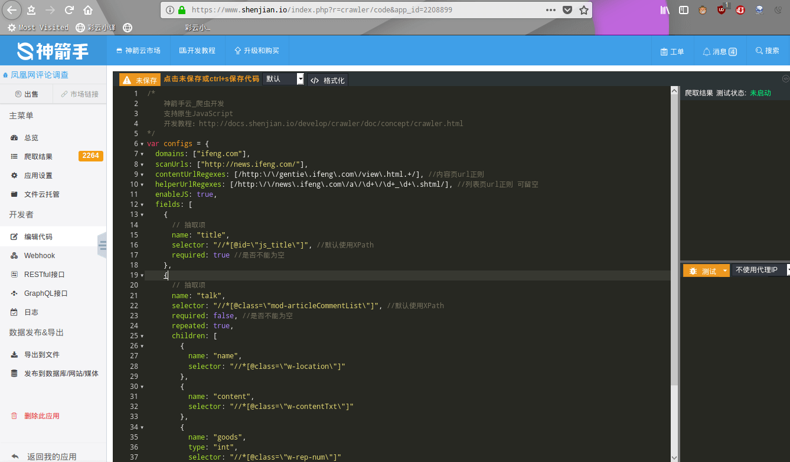

title: "從一次新聞統計概覽我國新聞關注熱點"
date: 2018-09-09 09:00:00 +0800
author: w568w
preview: 一次Python練手
---
# 前因
最近學習不是很忙沒，閒得蛋疼，決定完成一下學校佈置的調查報告，順便玩玩數據分析...  
所以就有了這麼一次關於新聞評論的簡單調查。嗯我的編程水平蒟蒻，各位大佬輕噴(/ ω \\)
# 數據收集

第一件事當然是要收集到需要分析的新聞數據啦！  
打算抓取[鳳凰網](http://news.ifeng.com/)的評論，因爲這裏的人比較多，評論量比較大。  

下一個問題是運行數據抓取程式的設備。  
用自己的電腦跑Python腳本心疼電費，用手機跑的話需要下載[QPython](http://www.qpython.com/)，略顯得有些麻煩...  
  
所幸，百度了一會兒，找到了一個[雲爬蟲平臺](https://www.shenjian.io/)(我真的不是來打廣告的！我發誓！)  
註冊後默認是個人免費版，贈送一個**永久免費爬蟲節點**(不是SSR那種節點啊)以及1GB的儲存空間，還支持**爬取中驗證碼識別、POST數據、自定義請求頭部、自動更換代理、抗反爬蟲**...  
總的來說比較實惠...  

這個平臺裏的爬蟲邏輯是需要自己用編寫的。提供了一個網頁的代碼編輯器，支持代碼智能補全和高亮格式化。  
開發文檔也比較完善，而且預置了很多的API和回調函數，對於熟悉JavaScript語法的人來說，開發難度不大。   

配合FireFox可以獲得XPath，所以很快就寫完了一個爬蟲...
```javascript
var configs = {
  domains: ["ifeng.com"],
  scanUrls: ["http://news.ifeng.com/"],
  contentUrlRegexes: [/http:\/\/gentie\.ifeng\.com\/view\.html.+/], //内容页url正则
  helperUrlRegexes: [/http:\/\/news\.ifeng\.com\/a\/\d+\/\d+_\d+\.shtml/], //列表页url正则 可留空
  enableJS: true,
  
  fields: [
    {
      // 抽取项
      name: "title",
      selector: "//*[@id=\"js_title\"]", //默认使用XPath
      required: true //是否不能为空
    },
    {
      name: "talk",
      selector: "//*[@class=\"mod-articleCommentList\"]", 
      required: false, 
      repeated: true,//表示可以爬取多項
      children: [
        {
          name: "name",
		  alias:"用戶名",
          selector: "//*[@class=\"w-location\"]"
        },
        {
          name: "content",
		  alias:"評論內容",
          selector: "//*[@class=\"w-contentTxt\"]"
        },
        {
          name: "goods",
          type: "int",
		  alias:"點讚數",
          selector: "//*[@class=\"w-rep-num\"]"
        }
      ]
    }
  ]
};

var crawler = new Crawler(configs);
crawler.start();//啓動爬蟲
```
接下來就是漫長的等待。  
不過代碼是在雲端分佈式節點上運行的，所以可以放心地去關機睡覺...
# 數據處理
第二天一大早就開機看看爬蟲努力一晚上的結果。總的來說還可以，獲取到了2000多條新聞的評論。  
  
數據可以直接全部導出爲 **XLSX(Microsoft Excel)、CSV(純文本，用逗號分隔的表格)或者SQL (MySql數據庫)文件，也可以選擇直接發佈到Word Press、Discuz、typecho、Phpwind、微信公衆號、遠程MySql數據庫**等網絡平臺，甚至提供了獲取數據的**Rest API**和**GraphGL API**。  
哭了，對開發者這樣良心的網站真的不多.....   
  
由於我要用Python分析，因此選擇導出數據爲CSV。文件不大，才9MB不到的體積。  
  
很快地打開AS，把數據導入進去。
  
接下來是數據的預處理，直接貼代碼吧：
```python
# coding:utf8
import csv
import json
from collections import Counter

import jieba


def contains(l, item):
    equals = lambda x, y: x[1] == y[1]
    for i in l:
        if equals(i, item):
            return True
    return False

#去除重複
def del_repeated(liebiao):
    new_list = []
    for item in liebiao:
        if contains(new_list, item) is False:
            new_list.append(item)
    return new_list


def read_list():
    with open("task_data_2208900.csv", 'rb') as f:
        lines = csv.reader(f)
        csv_list = []
        for l in lines:
		#檢查空項&解碼UTF-8的編碼
            if l[2].decode('utf8') != '':
                csv_list.append([l[0].decode('utf8'), l[1].decode('utf8'), l[2].decode('utf8')])
        del csv_list[0]
        return del_repeated(csv_list)


data_list = read_list()#讀取數據
print 'Data Size:', len(data_list)
```
輸出:
```
Data Size: 1831
```
  
然後，就可以使用`jieba`、`Counter`之類的工具來分析數據啦！  
  
你可能沒耐心看我的弱智代碼，那就直接上——
# 分析結果
先給出分詞結果排行，已經去除了單字和無意義字符（如"我"、"我們"、"這個"、"的"）：
```python 
# 格式：
# [詞語] [詞語頻數]
Copyright (C) w568w，遵循Creative Commons BY-NC 4.0协议，禁止不規範轉載
------------

中国 560
美国 372
国家 163
日本 140
国人 127
世界 103
俄罗斯 85
武器 80
支持 78
加油 70
发展 68
台湾 68
人民 63
问题 61
导弹 59
航母 59
我国 55
技术 51
战斗 46
印度 46
阿弥陀佛 45
祖国 44
改变 44
军事 44
战争 44
作战 42
发动 41
南海 40
飞机 39
发动机 39
动机 39
能力 38
经济 37
海军 36
战略 36
潜艇 35
利益 32
土耳其 31
研发 30
制造 29
威胁 28
战机 28
强大 27
和平 27
轰炸 27
历史 27
装备 26
致敬 26
西方 26
政府 25
国海军 25
国军 25
努力 25
观念 24
战斗群 24
鬼子 24
民族 24
孩子 24
攻击 24
工作 24
安全 23
美国佬 23
建设 23
百姓 22
先进 21
设计 21
轰炸机 21
科技 21
中俄 21
人员 21
```
順便統計了一下地域分佈：
```python 
# 格式：
# [地區] [地區頻數]
Copyright (C) w568w，遵循Creative Commons BY-NC 4.0协议，禁止不規範轉載
------------
[广东省广州市网友] 140
[北京市网友] 131
[山东省济南市网友] 62
[河南省郑州市网友] 54
[江苏省南京市网友] 52
[陕西省西安市网友] 48
[湖北省武汉市网友] 45
[上海市网友] 45
[天津市网友] 44
[浙江省杭州市网友] 42
[湖南省长沙市网友] 38
[四川省成都市网友] 35
[河北省石家庄市网友] 33
[辽宁省沈阳市网友] 33
[云南省昆明市网友] 30
[福建省福州市网友] 30
[安徽省合肥市网友] 27
[广西壮族南宁市网友] 27
[江西省南昌市网友] 20
[黑龙江省哈尔滨市网友] 18
[江苏省苏州市网友] 17
[广东省,广州市网友] 16
[吉林省长春市网友] 16
[山西省太原市网友] 15
[湖北省宜昌市网友] 14
[湖北省,武汉市网友] 14
[山东省,济南市网友] 14
[贵州省贵阳市网友] 11
[重庆市网友] 11
[宁夏回族银川市网友] 11
[海南省海口市网友] 10
[广东省深圳市网友] 9
[福建省厦门市网友] 9
[四川省,成都市网友] 9
[浙江省宁波市网友] 9
[河北省,石家庄市网友] 9
[安徽省,合肥市网友] 9
[内蒙古呼和浩特市网友] 8
[浙江省台州市网友] 8
[广东省中山市网友] 7
[江苏省常州市网友] 7
[江苏省无锡市网友] 7
[浙江省,杭州市网友] 7
[黑龙江省大庆市网友] 7
[湖南省邵阳市网友] 5
[河南省,郑州市网友] 5
[辽宁省,沈阳市网友] 5
[新疆维吾尔乌鲁木齐市网友] 5
[广东省佛山市网友] 5
[福建省,福州市网友] 5
[湖南省衡阳市网友] 5
[山西省晋城市网友] 5
```
根據以上數據，我總結出了：
# 關注熱點Top5
## 1. 中美關係
無論啥時候，川普的小動作都是個大新聞..中美關係是個永恆不變的國際話題。
## 2. 中日關係
中日關係由於歷史原因一直非常緊張，更不要說各種"愛國主義教育"薰陶下的我國人民了...  
這裏稍微看了一下評論，有一些比較偏激：
```
那个核弹，干脆給日本使上吧！！！
跟日本绝交！还废什末话友好下去，最好定出法律不准去日本！不准购日货！！
日本人一说总是感觉到猥琐，下流。
什么是大个儿的？？？意思小日本充当王八！
日本就是美国圈养的一条狗！美国到哪它都跟随在后面吠
```
不作評論。
## 3.臺灣問題
主要是有關於蔡英文的報道...感覺還是比較客觀冷靜的，沒有那麼多不堪入耳的人身攻擊。
## 4.中印衝突
評論中多以"阿三"稱印度反動勢力。我不是特別關心這方面的問題，中國應該是佔絕對優勢吧。
## 5.軍事力量
果然大家關心比較多的還是我國的軍事勢力，主要圍繞航母、導彈力量展開。  
[這裏](https://www.globalfirepower.com/countries-listing.asp)有一個比較權威的世界軍事力量排名。
# 最後...
講個笑話，寫爬蟲、分析數據花了我30分鐘，但是寫這篇文章花了我2個小時....大概這就是打字速度慢的痛苦吧(笑)