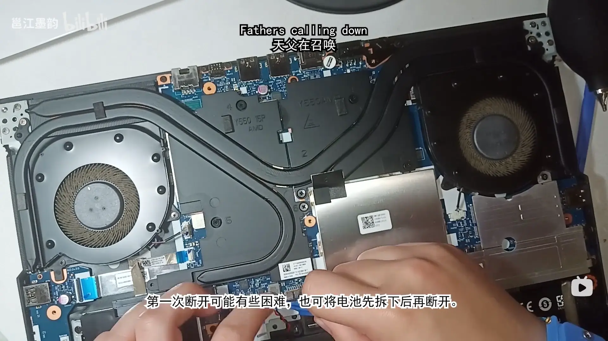
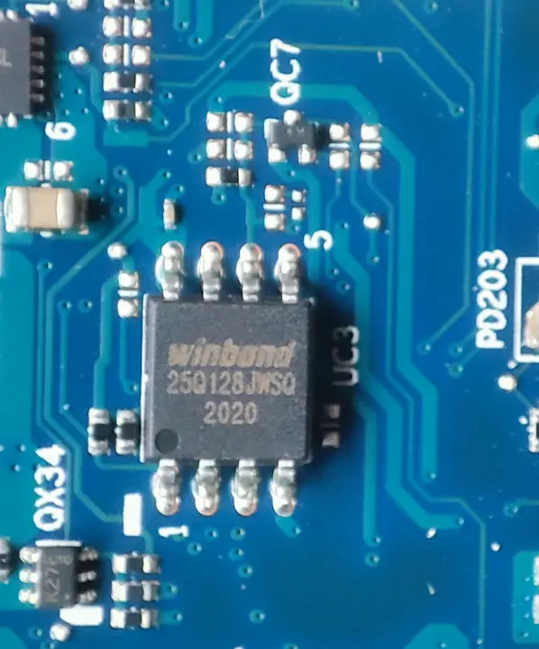
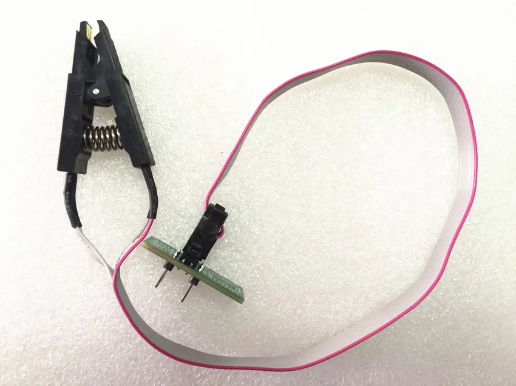
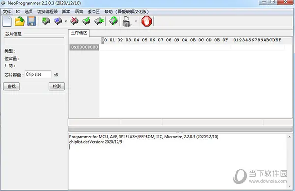
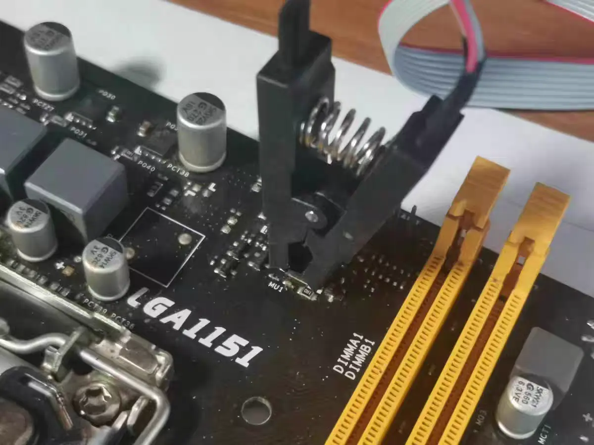
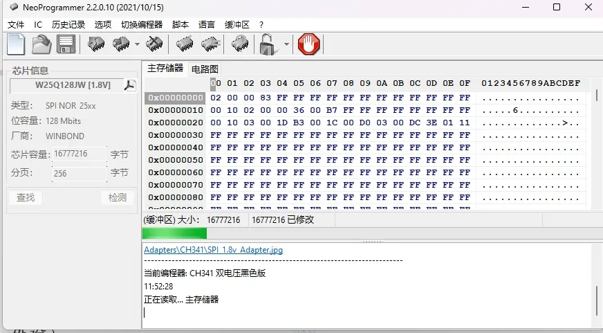
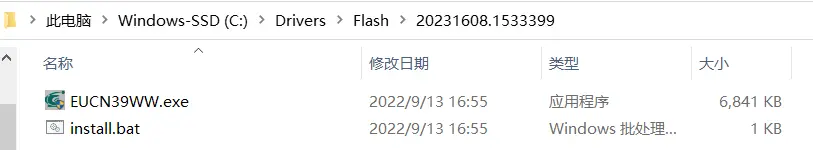
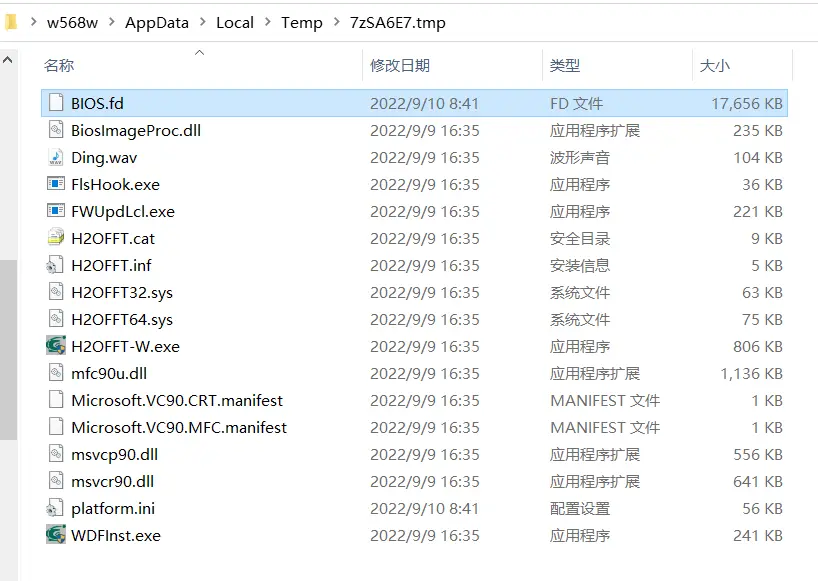
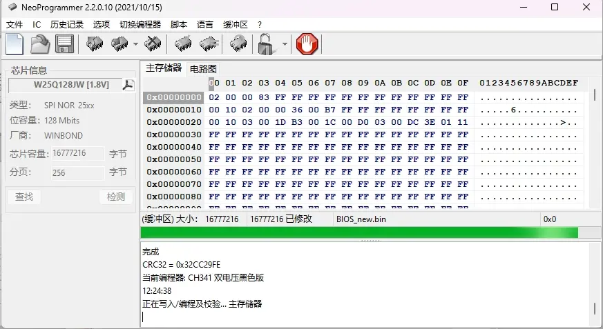

title: "[EN] How I Fixed a Bricked Laptop"
date: 2023-08-16 16:05:08
author: w568w
type: post
hide: false
cover: images/artiom-vallat-mx9axbKqKW8-unsplash.webp
preview: And it cost less than 30 yuan
---
<center>Photo by <a href="https://unsplash.com/@virussinside?utm_source=unsplash&utm_medium=referral&utm_content=creditCopyText">Artiom Vallat</a> on <a href="https://unsplash.com/photos/mx9axbKqKW8?utm_source=unsplash&utm_medium=referral&utm_content=creditCopyText">Unsplash</a></center>

---

> 📔**Note**
>
> This is a translation of [my original post in Chinese](/how-to-fix-bricked-lenovo-laptop.html).
>
> The translation was done on *2026/06/24 03:15 UTC+8*.

About a week ago, I was looking into ways to undervolt an AMD CPU in my spare time. Attempts to use tools like [amdctl](https://github.com/kevinlekiller/amdctl/) to modify the P0 State voltage ID (Vid) all failed. Other users guessed that [mobile APUs might simply ignore all configured values](https://github.com/kevinlekiller/amdctl/issues/40), which was deeply disappointing. Later, though, I found [another issue](https://github.com/kevinlekiller/amdctl/issues/18#issuecomment-1357208023) where a user claimed they had found a way to lower the voltage of a mobile APU by changing a BIOS value with [Smokeless_UMAF](https://github.com/DavidS95/Smokeless_UMAF). I immediately downloaded the tool, booted it from a USB drive, changed the P0State Vid value, and saved the BIOS.

Then I rebooted the computer, but it would not boot anymore. After powering on, the fan spun, and the power and keyboard lights came on. Nothing else happened: even the screen backlight did not turn on. Following Dell's article [How to Reset Your Dell BIOS or CMOS & Clear NVRAM](https://www.dell.com/support/kbdoc/en-ai/000124377/how-to-perform-a-bios-or-cmos-reset-and-clear-the-nvram-on-dell-systems?lang=en&lwp=rt), I tried various methods, including:

- Reconnecting both the laptop battery and CMOS battery cables, then holding the power button for 10-15 seconds to discharge the capacitors and reset NVRAM
- Holding the power button for more than 30 seconds to perform an RTC reset


All of them failed. The computer still showed only a black screen, with the sound of the fan as the only sign that it was not completely dead. It looked like **I had bricked the laptop**.

When I went back to read the Smokeless_UMAF README, I realized it said:

> For most options a bios clear is suitable, however for some of the more **dangerous settings, you might need a proper reflash**, which is why they are classed as "dangerous settings".
> 
> ...
>
> **Known Problem (Read This)**
>
> Known settings that will make your **brick your device** - Note this primarily refers to the "locked" intergrated **laptop / handheld APUs** rather than unlocked desktop APUs or CPUs.
>
> - P0State Vid

Another user had the same problem as I did, and [the author replied in Discussions](https://github.com/DavidS95/Smokeless_UMAF/discussions/13):

> It's recoverable **if you manage to have a way to reflash the bios**. Either through an OEM designated way, for example (omitted). Or by using a manual flashing device which requires you to by that and flash the bios chip yourself. Either way would work as long as you can get a bios entirely reflashed. Yea for some reason this setting does not get cleared when bios does normally thus needing a new bios to then be cleared.

...Fine. Since this was my main laptop, I had to fix it no matter what. It looked very difficult. If even the BIOS could not boot, how could I possibly reflash it with software? I needed a hardware solution, and I am not, in any sense, an electronics enthusiast. I did not have a multimeter, soldering iron, solder, hot-air gun, DuPont wires, or anything like that, and I did not know how to use them either.

Fortunately, I eventually succeeded, and it cost me less than 30 yuan and less than an hour.

Before we start, here is my configuration:

- Laptop: [Lenovo Legion R7000 2020 (China Only)](https://newsupport.lenovo.com.cn/products_index.html?fromsource=products_index&selname=Lenovo%20Legion%20R7000%202020)
- CPU: AMD Ryzen 7 4800H

I think this tutorial should also apply to other laptops, as long as you can find the BIOS chip and download the corresponding drivers and tools.

# Disassembly
Before doing any hardware operation, we first need to open up the laptop and locate the BIOS chip.

However, simply opening the laptop took me about two hours. I have to say, the Legion chassis is incredibly sturdy, and I did not have any dedicated disassembly tools such as pry picks. Taking it apart with my fingers and a card was very difficult. If you also use a Legion laptop, I recommend watching [this video (Chinese Only)](https://www.bilibili.com/video/BV1pa41187nV/) first. It shows how to remove the laptop's back cover.

After disassembly, you also need to disconnect the CMOS and laptop battery power so that no current flows through the circuit. On my laptop, the three connectors were so small and tightly packed that it took me another half hour just to unplug them.



# Understanding the BIOS Chip
The BIOS chip is a small standalone chip on the laptop that stores the BIOS firmware and can be rewritten.

On my laptop, the BIOS chip is located on the motherboard roughly where the index finger is pointing in the photo above, then about 3 cm farther up by visual estimate. It happens to be blocked by the large cooling plate above it, so the cooling plate also needs to be removed.

BIOS chips are usually in an 8-SOP package, which gives them distinctive gull-wing pins, as shown below.



The chip model was printed on the surface:

```
Winbond
25Q128JWSQ
```

This model number is very important because it determines our later settings. For my chip, it is a 128 Mbit (16 MB) flash chip made by Winbond in Taiwan, with the model number 25Q128JWSQ.

I found the datasheet for the 25Q128JW series under the [Serial NOR Flash](https://www.winbond.com/hq/product/code-storage-flash-memory/serial-nor-flash/) category on [Winbond's official website](https://www.winbond.com/) and downloaded it for reference. The last two characters, SQ, indicate that the chip uses an 8-SOP package and has a 208-mil pin layout.

# A Programmer?
Since all we have now is the chip, of course we cannot simply pull it off and plug it into another computer to copy files. This is not a USB drive. We need a **programmer**, which can read the contents of the chip into a computer or write contents from the computer into the chip. The latter is called "flashing".

The good news is that programmers are very cheap. A [CH341A-chip-based programmer (note: this is not a purchase link)](https://winraid.level1techs.com/t/guide-how-to-use-a-ch341a-spi-programmer-flasher/33041) is enough for our needs. It costs around $5 and can be bought on AliExpress. To avoid any suspicion of advertising, I will not include a purchase link; please search yourself.

**Note: before placing an order, make sure to tell customer service your chip model and confirm that the programmer supports your chip.**

When buying it, I chose a kit with an SOP8 clip so that I would not need to desolder the chip from the motherboard.



The seller also thoughtfully provided usage instructions and software. The software mainly included:

- Driver for the CH341A programmer
- NeoProgrammer programming software

NeoProgrammer is an enhanced modified version based on AsProgrammer. Newer versions support nearly 2,000 chips.

After installing the driver on another Windows computer, try opening NeoProgrammer. It will prompt you to plug in the programmer. After plugging the programmer in over USB, NeoProgrammer will recognize it automatically.



# Start Flashing!
## Connect the Chip
First, we need to connect the programmer to the chip. Since we have the clip, we only need to clamp it onto the chip pins.

**Note that the clip, programmer, and chip must all have the same orientation. Pin 1 of the chip must connect to wire 1 of the clip, the red wire in the photo below, and then to pin 1 of the programmer. Otherwise, the best case is a failed read; the worst case is burning the chip.**



After connecting it, open NeoProgrammer and click the "Detect" button on the left. It will automatically identify the chip model, or prompt you to choose the model manually.

There was an episode here. The rated operating voltage marked in the datasheet for my chip is 1.8 V, but **the programmer I bought only supports 3.3 V and 5 V output voltages**. NeoProgrammer even warned me after I selected the chip model: "**Important warning: please use a 1.8 V adapter!**" But the seller said, "It doesn't matter, the motherboard will adjust the voltage and it won't burn the chip," so I chose to trust the seller. In the end, it really did not cause any problem.

## Back Up the Original BIOS
After connecting everything, we need to back up the original BIOS so that we can recover if flashing fails.

In NeoProgrammer's toolbar, select "Read" and then "Verify". Each process takes about 3-5 minutes. If the read succeeds, NeoProgrammer will display the chip contents on the right, as shown below.



If everything succeeds, click the "Save" button to save the chip contents to the computer. The file usually uses the `.bin` extension.

If something fails, try reconnecting the chip or unplugging and reconnecting the programmer, then try again. You can also just ask customer service.

## Get a New BIOS
We now need to get the correct BIOS `.bin` file so that we can flash it to the chip.

Fortunately, I found the [BIOS update program for my laptop](https://newsupport.lenovo.com.cn/driveList.html?fromsource=driveList&selname=Lenovo%20Legion%20R7000%202020) on Lenovo's official website. After downloading it, I got an executable named `BIOS-EUCN39WW.exe`.

According to other online tutorials, open it, choose an empty directory, then select `Extract Only` as the installation method. It will extract the BIOS files into that directory.

In that directory, look for a file whose size is identical to the `.bin` file we exported earlier, which in my case was 16 MB. It usually has a `.bin/.rom/.hex/.cap` extension.

**Note: it must be exactly 16 MB, meaning 16,777,216 bytes. One byte more or one byte less will not work. A file shown as 15.9 MB or 16.1 MB is even more obviously wrong.**

If you find it, congratulations. You can skip the rest of this section and start flashing directly.

Unfortunately, in my case, the extracted file was still an executable, `EUCN39WW.exe`. Fine, I ran it again, which took me straight into the installer.



After launch, it will show an error prompt. **Leave it there and do not close it yet.** Open Task Manager, go to the Details tab, and look for any process whose name or icon looks suspicious. In my case it was `H2OFFT-W.exe`. Right-click it and choose "Open file location". There, we can find a suspicious file of roughly the right size, `BIOS.fd`. Copy it out first, then close the BIOS updater.



So what is this `.fd` file? According to [this UEFI development blog post](https://blog.csdn.net/jiangwei0512/article/details/83685694), it is a so-called Flash Device binary image file used by Insyde BIOS. Obviously, its size is not 16 MB, so we need to turn it into a usable `.bin` file.

I found [this 2013 post](https://www.chinafix.com/thread-608146-1-1.html), which reposted a method for extracting a `.bin` file from `BIOS.fd`: remove the first 0x80000 bytes of the `.fd` file. However, even after doing that, our file was still much larger than 16 MB, which suggested that we still needed to remove something else.

Looking back at the first UEFI blog post, it describes the structure of `.fd` files. We can basically consider its binary structure to be:

```text
---------
Firmware volume header
---------
Firmware file 1
---------
Firmware file 2
---------
Firmware file 3
---------
...
---------
```

This means that our modern BIOS may contain multiple firmware files, while we only need the one that is stored in the BIOS chip.

To extract that part, use WinHex, or UltraEdit, to open both `BIOS.fd` and the `.bin` file we backed up earlier, then compare their binary structure. Search directly in the former for the header of the latter. For example, the first few bytes of my `.bin` were:

```
02 00 00 83 FF FF
```

When searching in `BIOS.fd`, you can usually find only one matching position. That is the start position of the firmware file we need. Select and delete everything before it.

Then search for the tail of the `.bin` file. You can simply add 16 MB to the starting offset and compare the binary contents of the two files there. It is easy to find an obvious boundary. Starting from there, select and delete everything after it.

In the details panel on the right, make sure your file size is 16 MB (16,777,216 bytes), **not off by even one byte**, then save it from WinHex as a new `.bin` file.

## Actual Flashing
Now that we have the correct `.bin` file, we can start flashing.

In NeoProgrammer, click "Erase" and then "Verify" to clear the existing contents on the chip and verify that the erase succeeded.

Then click "Open", select the `.bin` file we just saved, and click "Write" to start flashing. The flashing process takes about 3-5 minutes. After it finishes, click "Verify" again to make sure the flash succeeded.



# Power On
After flashing is complete, remove the clip from the chip, reconnect the laptop battery and CMOS battery, and reassemble the laptop.

Then plug it in and power it on!

There was also a small episode during the first boot. After I pressed the power button, the screen stayed black for almost a minute, and I thought it had failed again. But the screen finally lit up, and the system booted successfully. I guess this was because the BIOS chip contents had previously been cleared and needed to be initialized again, which took some time.

After five days, I finally brought the computer back to life.

My mood was exactly like one sentence from [the tutorial post I referenced and want to thank](https://forums.mydigitallife.net/threads/solved-lenovo-legion-y740-15irh-bios-recovery.83063/page-2#post-1644758):


> **F\*CK that s\*cker Lenovo!** I can now update BIOS whichever version I like...

---

A side note: I once tried taking my computer to Lenovo after-sales service, but they immediately diagnosed it as a "motherboard failure, needs replacement" and quoted more than $200. So **f\*ck you, Lenovo**...

Also, if you think you are enough of an "hardware enthusiast" and have a Raspberry Pi, Arduino, or similar microcontroller, plus a breadboard, soldering equipment, DuPont wires, and a Linux computer, you can try [this tutorial](https://www.partsnotincluded.com/flashing-the-bios-to-fix-a-bricked-lenovo-laptop/). I did not have equipment or skills as clever as the author of that article.
