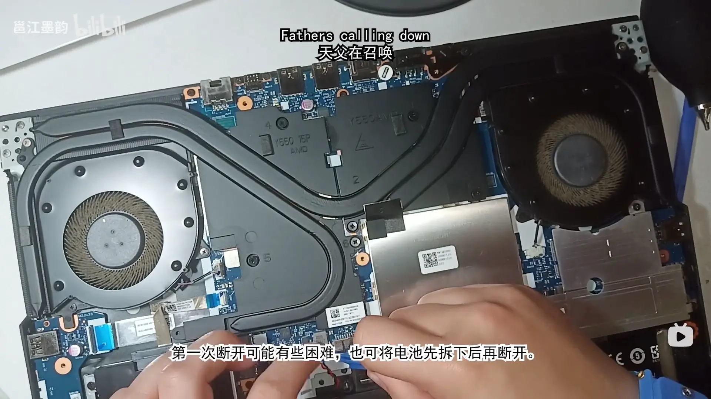

title: 我如何修好一个变砖的笔记本电脑
date: 2023-08-16 16:05:08
author: w568w
type: post
hide: false
toc: true
cover: images/artiom-vallat-mx9axbKqKW8-unsplash.webp
preview: 而且只花了不到 30 块钱
---


约莫一周前，我在闲暇时间探究给 AMD CPU（下简称 APU）降压的办法。诸如使用 [amdctl](https://github.com/kevinlekiller/amdctl/) 等工具修改 P0 State 电压 ID（Vid）的操作都失败了，其他用户猜测[可能移动 APU 简单地忽略了所有的设置值](https://github.com/kevinlekiller/amdctl/issues/40)，这让我大失所望。不过随后，我在[另一个 issue](https://github.com/kevinlekiller/amdctl/issues/18#issuecomment-1357208023) 下看到了一个用户声称 Ta 找到了一个方法，可以通过 [Smokeless_UMAF](https://github.com/DavidS95/Smokeless_UMAF) 修改 BIOS 中的某个值来降低 Mobile APU 的电压。我立即下载了这个工具，并从 U 盘启动了它，修改了 P0State Vid 的值，然后保存了 BIOS。

然后，我重启了电脑，但是电脑却无法启动了。开机后风扇会转，电源灯和键盘灯会亮，除此之外什么都没有发生——连屏幕的背光都没有启动。按照 Dell 提供的[《如何在戴尔计算机上执行 BIOS 或 CMOS 重置和清除 NVRAM》](https://www.dell.com/support/kbdoc/zh-cn/000124377/%E5%A6%82%E4%BD%95-%E5%9C%A8-%E6%88%B4%E5%B0%94-%E8%AE%A1%E7%AE%97%E6%9C%BA-%E4%B8%8A-%E6%89%A7%E8%A1%8C-bios-%E6%88%96-cmos-%E9%87%8D%E7%BD%AE-%E5%92%8C-%E6%B8%85%E9%99%A4-nvram) 一文，我尝试了各种方法，包括：

- 重新拔插电池和 CMOS 电池的排线，然后按住电源键 10-15 秒清空电容，从而重置 NVRAM
- 按住电源键 30 秒以上以执行 RTC 重置


无一例外失败了。电脑依然只会黑屏，只有风扇转动的声音提示我它还没死透。看起来，**我把电脑变砖了**。

当我回去读 Smokeless_UMAF 的 README 的时候，我才意识到它写道：

> For most options a bios clear is suitable, however for some of the more **dangerous settings, you might need a proper reflash**, which is why they are classed as "dangerous settings".
> 
> ...
>
> **Known Problem (Read This)**
>
> Known settings that will make your **brick your device** - Note this primarily refers to the "locked" intergrated **laptop / handheld APUs** rather than unlocked desktop APUs or CPUs.
>
> - P0State Vid

另外一个用户和我遇到了一样的问题，而[作者在 Discussions 下回复道](https://github.com/DavidS95/Smokeless_UMAF/discussions/13)：

> It's recoverable **if you manage to have a way to reflash the bios**. Either through an OEM designated way, for example (omitted). Or by using a manual flashing device which requires you to by that and flash the bios chip yourself. Either way would work as long as you can get a bios entirely reflashed. Yea for some reason this setting does not get cleared when bios does normally thus needing a new bios to then be cleared.

……好吧，鉴于这是我的主力笔记本，无论如何我都要修好它。看起来这困难重重——既然 BIOS 都无法启动了，我怎么可能用软件来重刷它呢？我需要一个硬件解决方案，而我——在任何意义上——都不是一个电子发烧友，手头没有万用表、烙铁、焊锡、热风枪之类的工具或者杜邦线之类的器材，我也不知道怎么使用它们。

幸运的是，最后我确实成功了，而且这只花了我不到 30 块钱和不到 1 个小时的时间。

在开始之前，先了解我的配置：

- 笔记本电脑：[Lenovo Legion R7000 2020](https://newsupport.lenovo.com.cn/products_index.html?fromsource=products_index&selname=Lenovo%20Legion%20R7000%202020)
- CPU：AMD Ryzen 7 4800H

我想这个教程对于其他笔记本电脑也是通用的，只要你能找到 BIOS 芯片、下载到对应的驱动程序和工具，就可以尝试修复它。

# 拆机
在做任何硬件操作前，我们都需要先拆开笔记本电脑，然后找到 BIOS 芯片。

然而单单拆开电脑就花费了我约 2 个小时的时间。不得不说，拯救者的模具实在太牢固了，而我也没有卡扣之类的专门拆卸工具，用手指和一张卡片拆卸的过程非常艰难。如果你也是拯救者的用户，建议你先看看[这个视频](https://www.bilibili.com/video/BV1pa41187nV/)，它会教你如何拆卸笔记本的后壳。

拆卸后还需要断开 CMOS 和笔记本电池的供电，这样才能保证电路不会有电流通过。而我这款笔记本的三个插头是如此小且紧密地排列在一起，以至于我为了拔掉它们，又用了半个小时的时间。



# 了解 BIOS 芯片
BIOS 芯片是笔记本电脑上的一个小小的独立芯片，它存储了 BIOS 的固件程序，而且可以被重写。

我笔记本的 BIOS 芯片在主板上的位置，约莫是上图的食指所操作的地方，再向上约 3 厘米（目测）的位置。它恰好被上面的整体散热板挡住了，所以需要把散热板也拆下来。

BIOS 芯片的特点是通常采用 8-SOP 封装，这会表现为很有特色的球形引脚，如下图所示。


表面写了 BIOS 芯片的型号：

```
Winbond
25Q128JWSQ
```

这个型号是非常重要的，因为它决定了我们后续的设置。就我的芯片来说，它是台湾华邦电子（Winbond）生产的 128Mbit（16MB）的闪存芯片，而且型号是 25Q128JWSQ。

我在[华邦官网](https://www.winbond.com/)上的 [Serial NOR Flash](https://www.winbond.com/hq/product/code-storage-flash-memory/serial-nor-flash/) 分类下找到了 25Q128JW 系列的数据手册，下载作备用。最后的两位 SQ 是指这个芯片的封装是 8-SOP，而且它的引脚排列是 208-mil。

# 一个编程器？
既然现在只有芯片，当然不可能把芯片拔下来插到其他电脑上去复制文件（这又不是 U 盘）。我们需要一个**编程器**，它可以把芯片的内容读取到电脑上，或者把电脑上的内容写入芯片（称为「烧录」）。

好消息是，编程器非常便宜，一个 [CH341A 芯片的编程器（注：这不是购买链接）](https://oshwhub.com/biannually/CH341Abian-cheng-qi-zhi-chi-5V-3)就可以满足我们的需求。它的价格在 15 元左右，而且可以在淘宝上买到。为了避免广告嫌疑，我就不放链接了，看官请自行搜索。

**注意：下单前请务必报出你的芯片型号，和客服确认编程器是否支持你的芯片。**

购买时，我选择了带有 SOP8 免拆夹的套装，这样就不需要把芯片从主板上焊下来了。


卖家还非常贴心地提供了使用教程和软件。软件主要包括：

- CH341A 编程器的驱动程序
- NeoProgrammer 编程软件

NeoProgrammer 是基于 Asprogrammer 的一个增强修改版。新版本支持的芯片数量达近 2k 个。

在另一台 Windows 电脑上安装好驱动程序后，尝试打开 NeoProgrammer，它会提示你插入编程器。用 USB 方式插入编程器后，NeoProgrammer 会自动识别。


# 开始烧录！
## 连接芯片
首先，我们需要把编程器连接到芯片上。因为我们有免拆夹，只需要把免拆夹夹在芯片的引脚上即可。

**注意，免拆夹、编程器和芯片的方向必须一致，芯片的 1 号引脚连接免拆夹的 1 号线（下图中红色的线），再连接到编程器的 1 号引脚，否则轻则读取失败，重则烧毁芯片。**


连接上后，打开 NeoProgrammer，点击左边的「检测」按钮，它会自动识别芯片的型号，或者提示你手动选择型号。

这里有个有意思的小插曲，我的芯片在手册上标注的额定工作电压是 1.8V，然而**我购买的编程器只支持 3.3V 和 5V 两种输出电压**，NeoProgrammer 甚至在选择芯片型号后提醒我「**重要警告：请使用 1.8V 适配器！**」，但卖家说「无所谓，主板会调整电压，不会烧芯片」，于是我就相信了卖家的话。最后看来，确实也没什么问题。

## 备份原始 BIOS
连接好后，我们需要备份原始 BIOS，防止烧录失败后无法恢复。

依次在 NeoProgrammer 的工具栏中选择「读取」「校验」，两个过程大约各需要 3-5 分钟的时间。如果读取成功，NeoProgrammer 的右边会显示芯片的内容，如下图所示。


如果都成功了，可以点击「保存」按钮，把芯片的内容保存到电脑上，一般以 `.bin` 为后缀名。

如果有失败，可以尝试重新连接芯片，或者重新插拔编程器，然后再次尝试。（也可以直接问客服……）

## 获取新 BIOS
我们现在需要获取正确的 BIOS 的 `.bin` 文件，以便烧录到芯片上。

幸运的是，我在联想官网上找到了我的[笔记本的 BIOS 更新程序]((https://newsupport.lenovo.com.cn/driveList.html?fromsource=driveList&selname=Lenovo%20Legion%20R7000%202020))，下载后是一个名为 `BIOS-EUCN39WW.exe` 的可执行文件。

根据网上的其他教程，打开它，选择一个空目录，然后安装方式选择 `Extract Only`，它会把 BIOS 的文件解压到这个目录下。

在这个目录下，需要寻找一个大小和我们刚才导出的 `.bin` 大小相同的文件（在我这里就是 16MB），一般以 `.bin/.rom/.hex/.cap` 为后缀名。

**注意：必须是正好 16MB，即 16,777,216 字节的文件，如果多一个字节少一个字节都不行，是 15.9MB 或者 16.1MB 那更不行。**

如果你找到了，那么恭喜你，你可以跳过这一节余下内容，直接开始烧录了。

可惜在我这里，解压出来的文件居然还是个可执行文件 `EUCN39WW.exe`，也罢，那就再执行它，直接进入了安装界面。


启动后会报错误提示，**先放着不要关闭它**。打开「任务管理器」，在「详细信息」选项卡中找有没有名称或者图标比较可疑的程序，我这里是 `H2OFFT-W.exe`，然后右键「打开文件所在的位置」。在这里，我们能找到一个大小大差不差的可疑文件 `BIOS.fd`。先把他复制出来，然后关闭 BIOS 更新程序。


这个 `.fd` 是什么呢？根据[这篇 UEFI 开发博文](https://blog.csdn.net/jiangwei0512/article/details/83685694)的介绍，它是所谓的烧录设备二进制镜像（Flash Device binary image）文件。显然它的大小不是 16MB，我们需要把它变成可用的 `.bin` 文件。

我查到了[2013 年的这篇帖子](https://www.chinafix.com/thread-608146-1-1.html)，它转载了一个从 `BIOS.fd` 中提取 `.bin` 文件的方法，即去除 `.fd` 文件的前 0x80000 个字节。然而我们的文件即便这样也远大于 16MB，这提示我们还需要去除一些东西。

回头看第一篇 UEFI 博文，它介绍了 `.fd` 文件的结构。我们基本可以认为：它的二进制结构是：

```text
---------
固件卷头部
---------
固件文件1
---------
固件文件2
---------
固件文件3
---------
...
---------
```

这说明我们的现代 BIOS 可能包含了多个固件文件，而我们只需要其中放在 BIOS 芯片中的那个。

为了抽取出这一部分，我们使用 WinHex（UltraEdit 也可以）打开 `BIOS.fd` 和刚才备份的 `.bin` 文件，然后对比它们的二进制结构。我们直接在前者中搜索后者的头部，例如我的 `.bin` 的头部前几个字节是：

```
02 00 00 83 FF FF
```

在 `BIOS.fd` 中搜索，一般只能找到一个匹配的位置，这就是我们需要的固件文件的起始位置。把它之前的部分全部选中删除。

然后搜索 `.bin` 的尾部。我们可以直接从头部向后加 16MB 的位置，对比一下两个文件的二进制内容，很容易找到明显的分割点。从这里开始，把它之后的部分全部选中删除。

在右边的详情中确保你的文件大小是 16MB（16,777,216 字节），**一个字节也不能差**，然后从 WinHex 中保存为新的 `.bin` 文件。

## 正式烧录
现在我们已经有了正确的 `.bin` 文件，可以开始烧录了。

在 NeoProgrammer 中，依次点击「擦除」「校验」，清空芯片上原有文件并校验是否成功。

然后点击「打开」，选择我们刚才保存的 `.bin` 文件，然后点击「写入」，开始烧录。烧录过程大约需要 3-5 分钟的时间。完成后，再点击「校验」，确保烧录成功。


# 开机
烧录完成后，我们可以把免拆夹从芯片上拿下来，然后重新连接笔记本电池和 CMOS 电池，把电脑重新组装起来。

接下来就是通电，开机！

首次开机时也有一个小插曲，因为按电源按钮后黑屏了将近一分钟，我以为又失败了，但最后屏幕终于亮起来了，成功启动了系统。我猜想这是因为之前 BIOS 芯片中的内容被清空了，需要重新初始化，所以需要一些时间。

花费了 5 天时间后，我终于让电脑重新亮起来了。

而我的心情，正如[我所参考并想感谢的这篇教程贴](https://forums.mydigitallife.net/threads/solved-lenovo-legion-y740-15irh-bios-recovery.83063/page-2#post-1644758)中的一句话：


> **F\*CK that s\*cker Lenovo!** I can now update BIOS whichever version I like...

---

插曲：我曾经试图把我的电脑抱去联想售后，但他们直接鉴定为「主板故障，需要更换」，并且要价 1000+ 元。所以 **f\*ck you, Lenovo**...

另外，如果你认为自己足够「发烧」，而且手边有树莓派、Arduino 之类的单片机以及插线板、电焊和杜邦线，还有一台 Linux 电脑，那么你可以尝试[这篇教程](https://www.partsnotincluded.com/flashing-the-bios-to-fix-a-bricked-lenovo-laptop/)，我没有这篇文章的作者那么巧妙的设备和技术。