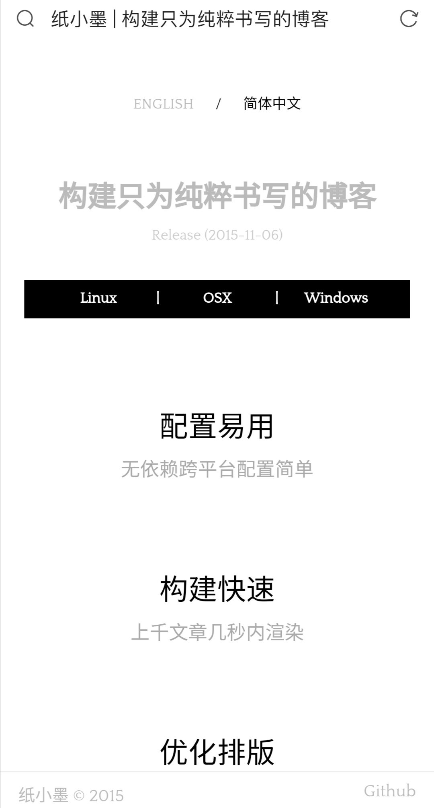

title: "纸小墨的 Material Design 主题 0.1版发布"
date: 2020-05-08 23:36:00 +0800
author: w568w
cover: /images/example-en.png
preview: 过气 Blog Generator 也要整 MD 主题.jpg
---

# 前言
[纸小墨](https://imeoer.github.io/)作为我个人从2018年开始，长时间使用的少数几个博客软件之一(另外两个是`WordPress`和`Z-Blog`)，自发现以来就一直被我寄予厚望。  
可惜的是，由于软件本身操作复杂，太过小众，前期宣传不足，只在几个程序员的小圈子里流传，后期又没有`Hexo`这样的大量开源用户支持，纸小墨的更新日期已经死在了2015年。  

不过，尽管如此惨淡，也不影响它在我心中的地位…  
  
因此，特地为它用自己~~破烂的~~前端功夫写了个`Material Design`主题。可能没有什么人会真的来使用，但是就我个人来说，留个纪念也了胜于无，证明我曾经用过吧…  
  
---
  
# InkMaterialTheme
简洁大方的 Material Design 主题。  
利用久负盛名的 [MDUI](https://www.mdui.org/) 作为框架支撑，在原版主题上稍作修改，没有进行太多改动以保持纸小墨的简洁本质。
# 使用者们
[行云小站](https://w568w.eu.org/)
# 预览

# 快速使用
## Step 1
**如果您有`git`工具** : 执行`git clone https://github.com/w568w/InkMaterialTheme.git`。  
**如果您不知道什么是`git`或者没有`git`工具** : 点击页面上绿色的`Clone or download`按钮，选择`Download ZIP`。  
## Step 2
将`theme`目录直接覆盖到你的博客目录下的同名目录。
## Step 3
**如果需要自定义**：浏览`theme`目录，在`_header.html`和`page.html`中，您可以找到自定义的相关说明。  
**如果不需要**：您已经完成了配置！
# 问题
- 搜索时不会展示为卡片
- 搜索时不能用`x`关闭搜索结果。
  
---
  
下载地址: [https://github.com/w568w/InkMaterialTheme](https://github.com/w568w/InkMaterialTheme)