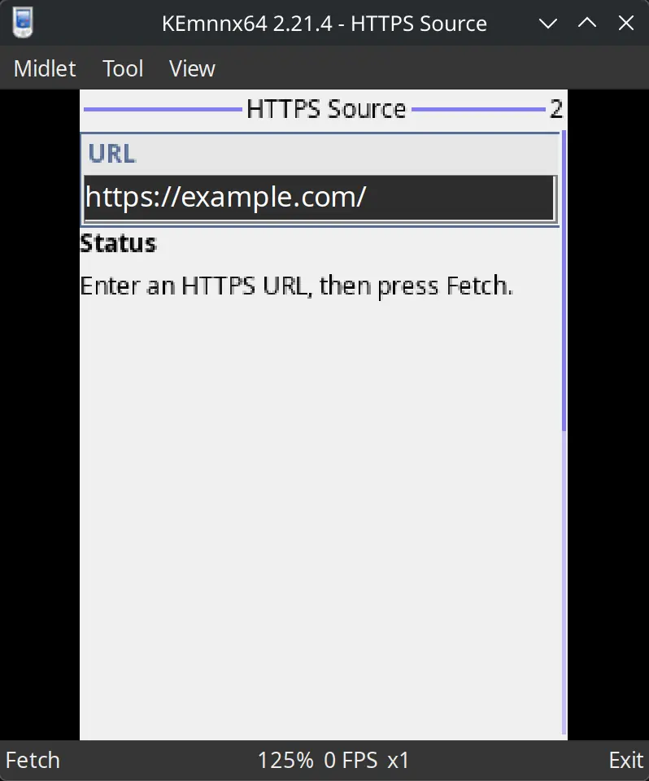

title: "[EN] (Much) Faster Way to J2ME Development in 2026"
date: 2026-06-24 02:58:00 +0800
author: w568w
cover: images/nokia-phone.webp
preview: A bit less hard than it is 2 yrs ago
---

<center>Photo by <a href="https://unsplash.com/@isaacmsmith?utm_source=unsplash&utm_medium=referral&utm_content=creditCopyText">Isaac Smith</a> on <a href="https://unsplash.com/photos/black-nokia-candybar-phone-F5V6d7nPsLQ?utm_source=unsplash&utm_medium=referral&utm_content=creditCopyText">Unsplash</a></center>

---

Long time no see! It's been nearly a year since my last post, and I have been busy with my real life.

There is sooo *much* to share in the last year about me and my tangled personal life, but I'll leave that for another post.

This is a continuation of [my previous post in 2024](/j2me-2024.html), in which I shared my journey of exploring building the J2ME development environment with Eclipse IDE and WTK for traditional experience. I was stuck in my old-school development experience and never aware of the new tools and methods that could make the process much easier.

So in this post, I gonna share a much easier (and modern) way to build J2ME apps in 2026, in case anyone is still interested in it.

## 1. Strip down what we don't need

First of all, A question must be settled down. **What's the minimal toolset do we need to develop a J2ME app?** Let's recheck the requirements in my previous post:

- **Oracle JDK 8**: **Yes, but** not necessarily vendored by Oracle. Any JDK 8 distribution should work, so let's jump in [Temurin](https://adoptium.net/), a community-driven project that provides high-quality, open-source JDKs.
- **Java ME SDK or WTK**: **Yes, but** we don't need the full SDK either. Indeed, the MIDP and CLDC libraries are all we need to build a basic J2ME app, which are included in [Maven Central Repository](https://central.sonatype.com/namespace/org.microemu) and can be easily added to our project as dependencies if using Maven or Gradle.
- **Eclipse IDE and MTJ Plugin**: **No.** After some research recently, I realized that We only need the Eclipse IDE because of the MTJ Plugin, which doesn't really do a lot of things behind the scenes:
  - For the build part, it simply calls [Apache Ant](https://ant.apache.org/) to build the `.jar` and `.jad` files. Ant, in turn, can be configured and invoked by Maven with the `maven-antrun-plugin`.
  - For the run and emulation part, it use the WTK emulator to run the app. We can use the community-maintained [KEmulator nnmod](https://github.com/shinovon/KEmulator), which is easier and more stable than the WTK counterpart.

But nobody want to install a JDK 8 just for some simple J2ME dev, right? So…

## 2. `mise` comes to rescue

[`mise`](https://github.com/jdx/mise) is a joyful CLI tool that is an Environment Manager + Task Runner. It can help us manage Java version in the project with a config file, and run tasks with a simple command. We can start with a simple one:

```toml
# mise.toml
[tools]
java = "temurin-8"
maven = "3.9.11"

[tasks.build]
description = "Build the MIDlet suite"
run = "mvn package"

[tasks.clean]
description = "Remove build outputs"
run = "mvn clean"
```

`[tools]` section defines the environment we need for the project, which is Temurin JDK 8 + Maven in our case, and `[tasks.*]` section defines the tasks we can run in the project.

With this file, we can run `mise build` to build the project, and `mise clean` to clean the outputs.

## 3. Driving with Maven

If you have ever done a bit of Java, you must know Maven. So I won't go into too much detail about it.

Add J2ME dependencies in `pom.xml`:

```xml
<!-- pom.xml -->

<!-- Define the version of J2ME libraries -->
<properties>
    <microemu.version>2.0.4</microemu.version>
</properties>

<!-- Add J2ME dependencies -->
<dependencies>
    <dependency>
        <groupId>org.microemu</groupId>
        <artifactId>midpapi20</artifactId>
        <version>${microemu.version}</version>
    </dependency>
    <dependency>
        <groupId>org.microemu</groupId>
        <artifactId>cldcapi10</artifactId>
        <version>${microemu.version}</version>
    </dependency>
</dependencies>
```

Maven itself only plays well with Java SE, so we want to manage the compile process by ourself. It's a bit verbose because of XML but readable:

```xml
<!-- pom.xml -->

<packaging>jar</packaging>

<properties>
    <!-- Define the final name of the JAR file -->
    <j2me.finalName>hiworld</j2me.finalName>
</properties>

<build>
    <plugins>
        <!-- 1. Copy J2ME API libraries we just downloaded to the build/j2me-libs folder, so we can use them as bootclasspath for the compiler -->
        <plugin>
            <groupId>org.apache.maven.plugins</groupId>
            <artifactId>maven-dependency-plugin</artifactId>
            <version>3.11.0</version>
            <executions>
                <execution>
                    <id>copy-j2me-api</id>
                    <phase>generate-sources</phase>
                    <goals>
                        <goal>copy</goal>
                    </goals>
                    <configuration>
                        <artifactItems>
                            <artifactItem>
                                <groupId>org.microemu</groupId>
                                <artifactId>midpapi20</artifactId>
                                <version>${microemu.version}</version>
                                <outputDirectory>${project.build.directory}/j2me-libs</outputDirectory>
                                <destFileName>midpapi20.jar</destFileName>
                            </artifactItem>
                            <artifactItem>
                                <groupId>org.microemu</groupId>
                                <artifactId>cldcapi10</artifactId>
                                <version>${microemu.version}</version>
                                <outputDirectory>${project.build.directory}/j2me-libs</outputDirectory>
                                <destFileName>cldcapi10.jar</destFileName>
                            </artifactItem>
                        </artifactItems>
                    </configuration>
                </execution>
            </executions>
        </plugin>
        <!-- 2. Setup to compile the source code with J2ME API libraries as bootclasspath, and the target Java version is as low as 1.2 -->
        <plugin>
            <groupId>org.apache.maven.plugins</groupId>
            <artifactId>maven-compiler-plugin</artifactId>
            <version>3.14.0</version>
            <configuration>
                <source>1.2</source>
                <target>1.2</target>
                <compilerArgs>
                    <arg>-bootclasspath</arg>
                    <arg>${project.build.directory}/j2me-libs/midpapi20.jar${path.separator}${project.build.directory}/j2me-libs/cldcapi10.jar</arg>
                    <arg>-Xlint:-options</arg>
                </compilerArgs>
            </configuration>
        </plugin>
        <!-- 3. Specify manifest file packed into the JAR package --> 
        <plugin>
            <groupId>org.apache.maven.plugins</groupId>
            <artifactId>maven-jar-plugin</artifactId>
            <version>3.4.2</version>
            <configuration>
                <archive>
                    <manifestFile>${project.basedir}/manifest.mf</manifestFile>
                </archive>
            </configuration>
        </plugin>
        <!-- 4. (Optional) Use ProGuard to shrink the JAR file -->
        <plugin>
            <groupId>com.github.wvengen</groupId>
            <artifactId>proguard-maven-plugin</artifactId>
            <version>2.7.0</version>
            <executions>
                <execution>
                    <phase>package</phase>
                    <goals>
                        <goal>proguard</goal>
                    </goals>
                </execution>
            </executions>
            <configuration>
                <injar>${project.build.finalName}.jar</injar>
                <outjar>${j2me.finalName}.jar</outjar>
                <includeDependency>true</includeDependency>
                <obfuscate>false</obfuscate>
                <options>
                    <option>-dontoptimize</option>
                    <option>-microedition</option>
                    <option>-target 1.2</option>
                    <option>-keep public class * extends javax.microedition.midlet.MIDlet</option>
                    <option>-dontnote</option>
                </options>
            </configuration>
        </plugin>
        <!-- 5. Call Ant to generate the JAD file with the correct metadata and copy artifacts to a dist folder -->
        <plugin>
            <groupId>org.apache.maven.plugins</groupId>
            <artifactId>maven-antrun-plugin</artifactId>
            <version>3.1.0</version>
            <executions>
                <execution>
                    <id>j2me-artifacts</id>
                    <phase>package</phase>
                    <goals>
                        <goal>run</goal>
                    </goals>
                    <configuration>
                        <target>
                            <mkdir dir="${project.build.directory}/j2me"/>
                            <copy file="${project.build.directory}/${j2me.finalName}.jar" tofile="${project.build.directory}/j2me/${j2me.finalName}.jar"/>
                            <length file="${project.build.directory}/j2me/${j2me.finalName}.jar" property="midlet.jar.size"/>
                            <copy file="${project.basedir}/manifest.mf" tofile="${project.build.directory}/j2me/${j2me.finalName}.jad"/>
                            <echo file="${project.build.directory}/j2me/${j2me.finalName}.jad" append="true">MIDlet-Jar-URL: ${j2me.finalName}.jar
MIDlet-Jar-Size: ${midlet.jar.size}
</echo>
                        </target>
                    </configuration>
                </execution>
            </executions>
        </plugin>
    </plugins>
</build>
```

Please note that the ProGuard plugin is optional, and you can remove it if you don't want to shrink the artifacts. But if you remove it and copy the code above, remember to change the file name in the Ant task from `${j2me.finalName}.jar` to `${project.build.finalName}.jar`.

The `j2me.finalName` definition itself is also optional and totally my personal preference. You can just use the default `${project.build.finalName}` instead for simplicity.

## 4. Structure your project and Build

If you are not familiar with what a typical Java project looks like, here is mine:

```bash
$ tree
.
├── manifest.mf
├── mise.toml
├── pom.xml
└── src
    └── main
        └── java
            └── com
                └── example
                    └── hiworld
                        └── MyMidlet.java
```

Then just fire up:

```bash
mise build
```

If everything goes well, you will find the `target/j2me` folder contains the `hiworld.jar` and `hiworld.jad` files, which can be dragged into KEmulator to run.

And that's it!



Please keep an eye on my next post ;)
