title: "一些相当棒的Java游戏"
date: 2020-07-10 08:13:25 +0800
author: w568w
cover: images/nokia-2617880_1280.jpg
preview: 扔掉老年机前，对过往的追念
---
 
# 前言  
高考终于结束了。。。现在有时间干一些自己愿意做的事了  
 
所以首先想到的是整理一下自己的过去。恰好，陪伴我将近10年的老年机（[ZTE-C R580]()）也该退休了，
  
这个手机支持`J2ME`平台————当然和`Nokia`的性能比不了啦...————所以我的中学时光，大部分时间都由这些`java`游戏陪伴。
  
话不多说，分享的内容主要分`软件`和`游戏`两部分。我的设备相关配置如下：
  
| 参数     | 详情                    |
|----------|---------------------------|
| 内存     | 3072KB                    |
| 分辨率   | 240*320                   |
| 按键/触屏？   | 按键                   |
| MIDP版本 | 2.1                       |
| CLDC版本 | 1.1                       |
| 多媒体 | 支持                       |
| 3D API   | 不支持                    |
| 蓝牙     | 不支持                    |
| 文件管理 | 支持                      |
| 外插TF卡 | 支持                      |
| CPU      | 高通骁龙 QSC6085 @ 192MHz |

配置还是相当低的。所以下面列出的软件和游戏兼容性都非常强，请放心食用\~\~  
PS1：已经全部上传到网盘，链接在文章最后。  
PS2：关于模拟器，电脑上请使用[KEmulator](http://www.downza.cn/soft/27362.html)，`Android`上请使用[J2me Loader](http://java.52emu.cn/j2me.php)。

# 软件
## X-plore
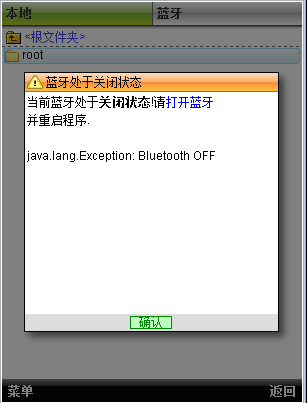
Java平台上最强的文件管理器！
## SoundMachine
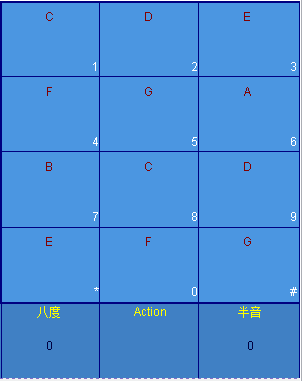
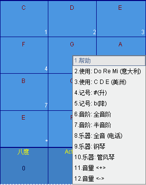
一个钢琴模拟软件，可以用键盘来弹奏简单的音乐。
## 来电小骗子
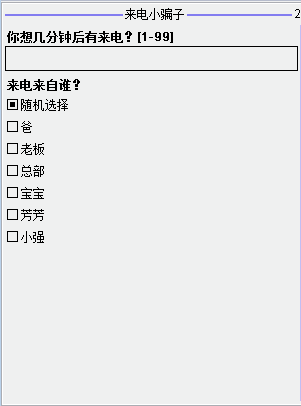
类似于`Android`平台上的模拟呼叫。可以自定义模拟来电，方便在应急时脱身。  
当然，现在用途已经不大了。
## FirstAid
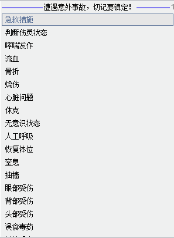
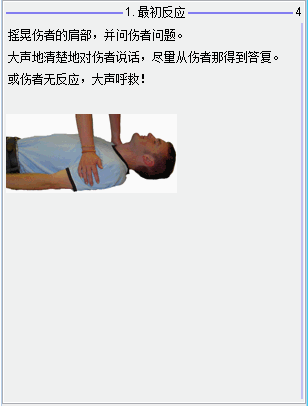
## AnyView

## 天天动听
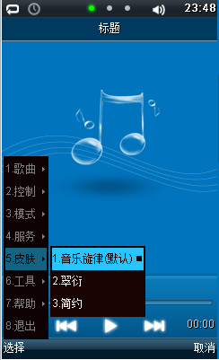
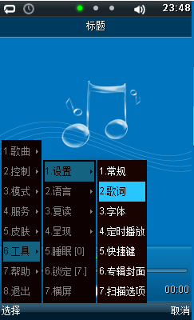
## Windows Vista
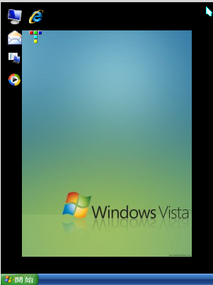
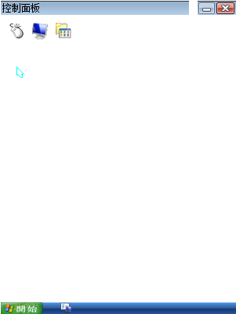
## 掌上C语言

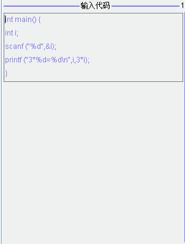

## 指南针
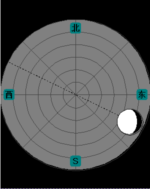
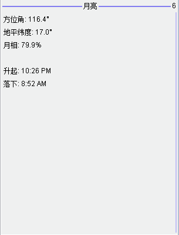
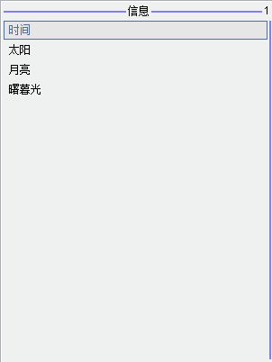
## 莫尔斯码Lighter
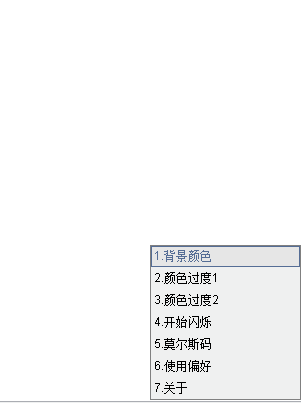
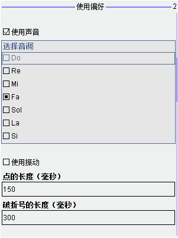