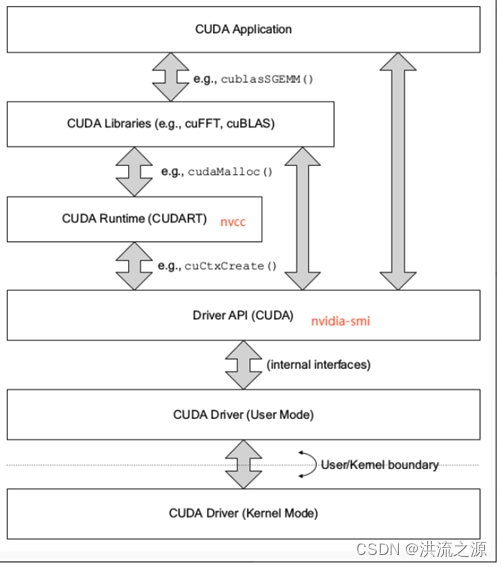
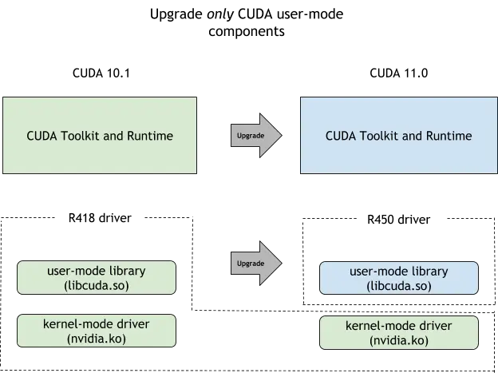
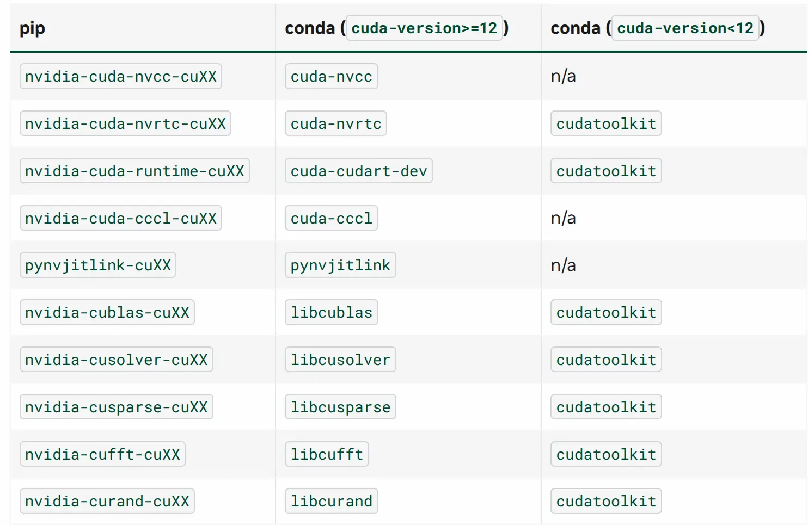

title: "NVIDIA 驱动等相关软件解惑"
date: 2025-07-06 18:28:25 +0800
author: w568w
cover: images/boliviainteligente-1GOYDLM_jcg-unsplash.webp
preview: NVIDIA 你坏事做尽！

---

Photo by <a href="https://unsplash.com/@boliviainteligente?utm_content=creditCopyText&utm_medium=referral&utm_source=unsplash">BoliviaInteligente</a> on <a href="https://unsplash.com/photos/logo-1GOYDLM_jcg?utm_content=creditCopyText&utm_medium=referral&utm_source=unsplash">Unsplash</a>

由于老黄很喜欢混用各种不精确的技术术语表达（例如「CUDA 驱动」）来描述不同的事物，NVIDIA 相关的软件安装和配置向来十分混乱。本文将对 NVIDIA 的图形栈进行解惑，帮助读者更好地理解和使用 NVIDIA 的图形驱动及 CUDA 相关技术。

> PS1：为保证事实准确性，本文中的所有论断都会附上 NVIDIA 官方的文档来源，并且会尽量避免使用不精确的术语，以供读者参考查证。
>
> PS2：为方便举证，我们主要以 x86\_64 Linux 系统为例进行说明，但大部分内容也适用于 Windows 系统上的 NVIDIA 图形栈。

# 1. 解构

> TODO：这里应该有一张很清楚的架构图，但我暂时没空画。先用别人的图意思一下。



让我们先清晰地定义部分概念。NVIDIA 的驱动和 SDK 自底向上可以分为以下几个组成部分：

## 1.1. NVIDIA 图形驱动程序（NVIDIA Graphics Driver）

这是最核心、最底层的组件，负责与 NVIDIA GPU 进行通信，并提供基本的图形渲染功能，以及 OpenGL、Vulkan 等图形 API 的支持。

它的版本号是一个比较大的数字（例如 `535.113.01`）。对于比较新的显卡，通常需要安装最新版本的 NVIDIA 图形驱动程序才支持。但一般情况下，无论你的 GPU 是新是老，总是建议安装最新版本的驱动程序。

它由两部分构成：

在**内核**中，主要包括下面几个模块 [^1]：

- `nvidia.ko`
- `nvidia-modeset.ko`
- `nvidia-uvm.ko`
- `nvidia-drm.ko`
- `nvidia-peermem.ko`

它们直接与 GPU 硬件交互，暴露出 `/dev/nvidia*` 等设备文件供上层应用操作。

在**用户空间**中，主要包括各种图形库和工具 [^2]，例如：

- 提供 OpenGL、EGL 等各类图形接口的动态链接库（如 `libGLX_nvidia.so`、`libEGL_nvidia.so` 等）
- 提供 NVIDIA 上层各类软件依赖的中间胶水库（如 `libnvidia-ml.so`、`libcuda.so` 等）
- 驱动固件（Firmware）
- 各种命令行实用工具（如 `nvidia-smi`、`nvidia-settings` 等）

如果你**只需要用 NVIDIA GPU 进行图形渲染（例如玩游戏、运行图形应用等），只安装 NVIDIA 图形驱动程序即可**，它已经包含了所有必要的组件。

**获取方式**：从 <https://www.nvidia.com/en-us/drivers/unix/> 安装

## 1.2. CUDA 驱动（CUDA Driver）

就是指上面的 `libcuda.so` [^3]，它是 NVIDIA GPU 的驱动接口，提供了 CUDA API 的调用实现。

当你编写 CUDA C++ 程序（`.cu`）时，你所调用的低级驱动函数（例如 `cuCtxCreate`）就是由这个库实现的。

> 注意：此「驱动」相比上面所说的「NVIDIA 图形驱动程序」概念要窄上很多，不包含任何内核模块。

**获取方式**：*已经包含在 NVIDIA 图形驱动程序中，无需单独安装*

## 1.3. CUDA 运行时（CUDA Runtime）

运行时，顾名思义，就是运行 CUDA 程序（注意，不包括开发 CUDA 程序）所需的组件。具体来说，它指动态链接库 `libcudart.so` [^4]。

当你编写 CUDA C++ 程序（`.cu`）时，你所调用的高级 CUDA 函数（例如 `cudaMalloc`）就是由这个库实现的。

**获取方式**：*见 2.2 节*

## 1.4. CUDA 库（CUDA Libraries）

这个名称在不同语境下的意思不同。

当没有特别指代时，它通常指的是 NVIDIA 提供的各种 CUDA 库，例如：线性代数 `cuBLAS`、深度学习 `cuDNN`、图像处理 `NPP` 等。它们也是一系列动态链接库（如 `libcublas.so`、`libcudnn.so` 等），提供了各种高级功能的实现。

**获取方式**：*见 2.2 节*

## 1.5. CUDA 工具包（CUDA Toolkit）

一般意义下，CUDA 工具包指的是 NVIDIA 提供的完整开发环境，包括 [^5]：

- CUDA 运行时
- CUDA 库
- CUDA 编译工具链：`nvcc`、`cuda-gdb` 及头文件等

它最为人熟知的位置大概就是安装在 `/usr/local/cuda[版本号]` 目录下。下面，**对于这几类组件，我们统称为「CUDA 上层组件」**。

> 然而，NVIDIA 在官网上故意模糊了这些东西的界限。例如，[CUDA Toolkit Download](https://developer.nvidia.com/cuda-downloads) 页面上，下载的 runfile 文件名通常是 `cuda_[版本号]_linux.run`，而这个文件实际上除了 CUDA 工具包外，还包含了 NVIDIA 图形驱动程序。

**获取方式**：*见 2.2 节*

以上所有和 CUDA 相关的组件都使用 CUDA 版本号，即 `X.Y`（例如 `12.1`）来标识。

# 2. 解惑

基于上述的层次结构，我们可以指出并回答一些常见的误解和问题。

## 2.1. NVIDIA 图形驱动程序和 CUDA 的兼容性

**NVIDIA 图形驱动程序决定了其支持的最高 CUDA 版本**，这是因为 CUDA 驱动包含在 NVIDIA 图形驱动程序中一起发布。当你执行 `nvidia-smi` 命令时，你会看到类似下面的输出：

```text
Tue Jul  6 18:28:25 2025
+-----------------------------------------------------------------------------+
| NVIDIA-SMI 535.113.01    Driver Version: 535.113.01    CUDA Version: 12.1   |
|-------------------------------+----------------------+----------------------+
| GPU  Name        Persistence-M| Bus-Id        Disp.A | Volatile Uncorr. ECC |
|===============================+======================+======================|
[……后略]
```

这里的 `CUDA Version: 12.1` 就是指 NVIDIA 图形驱动程序中携带的 `libcuda.so` 的版本，即**当前图形驱动能支撑的 CUDA 上层组件的最高版本**。

> 一个很常见的**误解**是：认为 `CUDA Version: 12.1` 是指「当前安装了 CUDA 12.1」。不是这样的。根本不存在「安装了 CUDA」这样一个笼统的概念，因为 CUDA 是一个多层级的复合生态系统（见上一节）。
>
> 即使硬要定义，在「PyTorch 需要 CUDA 12.1」这句话中的 CUDA 也更倾向于同时指 CUDA 驱动 `libcuda.so` 和 CUDA 运行时 `libcudart.so` 的版本。而 **NVIDIA 图形驱动程序根本不包含后者**。

因此，在上面示例的这个系统上，你可以安装任何 CUDA 上层组件，无论是 `11.8` 还是 `12.0`，只要它们的版本号 `<=12.1` 即可。

### 2.1.1. 在旧版驱动上强行安装新版 CUDA 上层组件

有的时候可能有这样的需求：机器的 NVIDIA 图形驱动程序版本较旧，但你需要使用很新的 CUDA。这有没有可能做到呢？

答案是：**有可能**。NVIDIA 提供了名为 CUDA 前向兼容性（Forward Compatibility）的支持。简单来说它允许你将 `libcuda.so` 单独更新，而不动图形驱动的其他部分，也不需要重启机器或重载内核模块。相关方法请参考 [NVIDIA 官方文档](https://docs.nvidia.com/deploy/cuda-compatibility/index.html#installing-the-cuda-forward-compatibility-package)。



## 2.2. CUDA 上层组件的多样来源

尽管 NVIDIA 的官网好像表现得 CUDA 上层组件的唯一安装方式就是安装 `.run` 或 `.deb` 包到 `/usr/local/cuda`，但实际上，他们将这些组件分散并打包成了很多不同的形式。其中最常见的就是 `pip` 包和 `conda` 包。这些包都是直接安装到你的 Python/Conda 环境中，只影响当前项目。



实际上，PyTorch 会主动依赖对应的包。换句话说，**当你用 pip 安装 PyTorch 时，它会自动安装对应的 CUDA 上层组件**。

这句话的言下之意是，**你根本不需要在系统里安装 CUDA Toolkit（即 `/usr/local/cuda` 目录）**。只需要安装最底层的 NVIDIA 图形驱动程序即可。

> 但遗憾的是，一些脑袋瓜不怎么灵通的 AI 开发者所写的 Python 库根本不会依赖这些包，而是闭眼直接翻 `/usr/local/cuda` [^6]。这时，你唯一的办法就是在系统里安装…… 所以，安装一个 system-wide 的 CUDA Toolkit 有时是一种必要的恶。

## 2.3. 如何正确「安装 CUDA」

> 就像上面反复强调的，并不存在一个叫 CUDA 的整体程序，而是许多组件的纵向集合，所以这里的标题加了引号。

相比就 CUDA 的概念辩经，可能还是直接给出正确的安装方法对你更有帮助（尤其是当你在焦急中寻找解决方案时！）。

先破除几个常见的误解：

- **安装 CUDA 上层组件不需要 Root 权限，也不需要系统管理员干预**。它就是个普通的库，就像 PyTorch、Numpy 一样
- PyTorch 等一众 Python 库所说的**「CUDA 版本」是指 CUDA 上层组件的版本**，是可以直接被安装的、可以同时安装多个版本的
- PyTorch 并**不需要系统里安装了 CUDA Toolkit**（即 `/usr/local/cuda` 目录），原因见上一节

然后给出一般的操作程序：

1. 执行 `nvidia-smi` 命令，查看当前系统的 NVIDIA 图形驱动程序支持的最高 CUDA 版本
    - 如果你需要的 CUDA 上层组件版本号大于这个版本号，则需要先**向管理员请求更新 NVIDIA 图形驱动程序或使用 CUDA 前向兼容性**
    - 如果一切都好，转**下一步**
2. 不要怕，尝试直接安装你需要的 Python 库，并尝试运行
    - 如果可以运行，**恭喜你，你不需要做任何额外操作**，因为该库已正确依赖并自动安装了对应的 CUDA 上层组件
    - 如果无法运行，且提示明确和 CUDA 版本有关，转**下一步**
3. 新建或使用现有的 Anaconda/Miniconda/Mamba 环境中（注意：不要在 `base` 环境中安装！），通过下面的命令安装 CUDA Toolkit：
    ```bash
    (my_env) $ conda install conda-forge::cuda-toolkit=12.1 # 替换为你需要的版本
    ```
4. 重新尝试安装/运行需要的库
    - 如果可以运行，**完成**
    - 如果仍然无法运行，且提示明确和 CUDA 版本有关，转**下一步**
5. 用下面的命令来指示程序优先使用刚刚安装的 CUDA 运行时和 CUDA 库（[为什么这有时是必要的](https://w568w.github.io/server-book/user/cuda.html#admonition-%E4%B8%BA%E4%BB%80%E4%B9%88%E4%B8%8A%E9%9D%A2%E8%AF%B4%E4%B8%8D%E8%A6%81%E7%94%A8-export%E8%BF%99%E4%B8%80%E6%AD%A5%E5%8F%88%E6%8E%A8%E8%8D%90%E7%94%A8%E4%BA%86)）：
    ```bash
    (my_env) $ export LD_LIBRARY_PATH=$CONDA_PREFIX/lib:$LD_LIBRARY_PATH
    ```
    - 如果可以运行，**完成**
    - 如果仍然无法运行，该库可能硬性指定了 `/usr/local/cuda` 下的 CUDA 运行时和 CUDA 库，**你只能向管理员请求在系统级别安装对应版本的 CUDA Toolkit**……

# 3. 尾声

“So fuck you, NVIDIA.” 🖕

[^1]: https://archlinux.org/packages/extra/x86_64/nvidia/
[^2]: https://archlinux.org/packages/extra/x86_64/nvidia-utils/
[^3]: https://docs.nvidia.com/deploy/cuda-compatibility/index.html
[^4]: https://blog.csdn.net/weicao1990/article/details/124098814
[^5]: https://archlinux.org/packages/extra/x86_64/cuda/
[^6]: 就我个人经验来看，有一大半的库都是这样的。我为这些库作者的短见和懒惰感到羞耻。