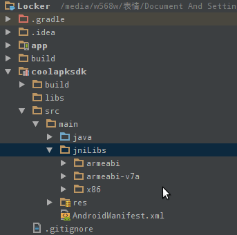

title: "酷安API的相關研究和整理"
date: 2018-01-04 14:20:00 +0800
author: w568w
preview: 祝各位新年快樂！
---
# 廢話
新年要到了...在這裏祝各位新年快樂，順便分享一堆乾貨  
這裏參考了[bjzhou/Coolapk-kotlin這個項目](https://github.com/bjzhou/Coolapk-kotlin)，看起來似乎是官方人員做的，非常感謝！  
（雖然整理了兩天時間...但是一想到可以實現寫酷安第三方版的願望就激動得要she的說）
# API 說明
_前排提示：該 API 由於用到了 native 代碼，只能在 Linux i686 或者 Android ARM/x86 平臺上使用 !_   
  
所有接口使用统一的前缀： https://api.coolapk.com/v6/  
所有接口使用统一的 HTTP 头（有特殊說明的除外）：
```
User-Agent: Dalvik/2.1.0 (Linux; U; Android 5.1.1; Nexus 4 Build/LMY48T) (#Build; google; Nexus 4; LMY48T; 5.1.1) +CoolMarket/7.3
X-Requested-With: XMLHttpRequest
X-Sdk-Int: 22
X-Sdk-Locale: zh-CN
X-App-Id: coolmarket
X-App-Token: [見下面方法]
X-App-Version: 7.3
X-App-Code: 1701135
X-Api-Version: 7
```
對於X-App-Token，首先你需要從酷安7.x中獲得 so 文件，這裏提供一個[下載鏈接](uploads/jniLibs.zip).  
然後，把它放在你的項目中，這裏提供一個例子：
接着，新建文件：
```
//:AuthUtils.java
//這裏的包名不可隨意更改！
package com.coolapk.market.util;
import android.content.Context;
public class AuthUtils {
    static {
        System.loadLibrary("a");
    }

    /**
     * @param paramContext Application上下文
     * @param paramString 一個UUID
     * @return 用於請求的Token
     */
    @SuppressWarnings("JniMissingFunction")
    public static native String getAS(Context application, String uuid);
}
```
獲取Token，調用`AuthUtils.getAS(getApplication(),UUID.randomUUID().toString())`就行了。  
**需要注意的是**，這個so庫爲了防止盜用API，調用了`application.getPackageName()`方法，並將它與`com.coolapk.market`作比較，如果不同則返回null。  
因此，我們需要"欺騙"它，這裏寫了一個`ApplicationProxy`來解決這個問題：  
```
package ml.w568w.coolapksdk.util;

import android.app.Application;
import android.content.BroadcastReceiver;
import android.content.ComponentName;
import android.content.ContentResolver;
import android.content.Context;
import android.content.Intent;
import android.content.IntentFilter;
import android.content.ServiceConnection;
import android.content.SharedPreferences;
import android.content.pm.PackageManager;
import android.content.res.AssetManager;
import android.content.res.Configuration;
import android.content.res.Resources;
import android.database.sqlite.SQLiteDatabase;
import android.graphics.Bitmap;
import android.graphics.drawable.Drawable;
import android.net.Uri;
import android.os.Bundle;
import android.os.Handler;
import android.os.Looper;

import java.io.File;
import java.io.FileInputStream;
import java.io.FileNotFoundException;
import java.io.FileOutputStream;
import java.io.IOException;
import java.io.InputStream;
import java.lang.ref.SoftReference;

/**
 * Created by w568w on 17-12-29.
 * Fuck the coolapk packageName to pretend as the truly Coolapk App against native methods.
 */

public class ApplicationProxy extends Application {
    SoftReference<Application> mTrulyapp;

    public ApplicationProxy(Application trulyApp) {
        super();
        mTrulyapp = new SoftReference<>(trulyApp);
    }

    @Override
    public String getPackageName() {
        return "com.coolapk.market";
    }

    @Override
    public void onCreate() {
        mTrulyapp.get().onCreate();
    }

    @Override
    public void onTerminate() {
        mTrulyapp.get().onTerminate();
    }

    @Override
    public void onConfigurationChanged(Configuration newConfig) {
        mTrulyapp.get().onConfigurationChanged(newConfig);
    }

    @Override
    public void onLowMemory() {
        mTrulyapp.get().onLowMemory();
    }

    @Override
    public Context getBaseContext() {
        return mTrulyapp.get().getBaseContext();
    }

    @Override
    public AssetManager getAssets() {
        return mTrulyapp.get().getAssets();
    }

    @Override
    public Resources getResources() {
        return mTrulyapp.get().getResources();
    }

    @Override
    public PackageManager getPackageManager() {
        return mTrulyapp.get().getPackageManager();
    }

    @Override
    public ContentResolver getContentResolver() {
        return mTrulyapp.get().getContentResolver();
    }

    @Override
    public Looper getMainLooper() {
        return mTrulyapp.get().getMainLooper();
    }

    @Override
    public Context getApplicationContext() {
        return mTrulyapp.get().getApplicationContext();
    }

    @Override
    public Resources.Theme getTheme() {
        return mTrulyapp.get().getTheme();
    }

    @Override
    public void setTheme(int resid) {
        mTrulyapp.get().setTheme(resid);
    }

    @Override
    public ClassLoader getClassLoader() {
        return mTrulyapp.get().getClassLoader();
    }


    @Override
    public String getPackageResourcePath() {
        return mTrulyapp.get().getPackageResourcePath();
    }

    @Override
    public String getPackageCodePath() {
        return mTrulyapp.get().getPackageCodePath();
    }

    @Override
    public SharedPreferences getSharedPreferences(String name, int mode) {
        return mTrulyapp.get().getSharedPreferences(name, mode);
    }

    @Override
    public FileInputStream openFileInput(String name) throws FileNotFoundException {
        return mTrulyapp.get().openFileInput(name);
    }

    @Override
    public FileOutputStream openFileOutput(String name, int mode) throws FileNotFoundException {
        return mTrulyapp.get().openFileOutput(name, mode);
    }

    @Override
    public boolean deleteFile(String name) {
        return mTrulyapp.get().deleteFile(name);
    }

    @Override
    public File getFileStreamPath(String name) {
        return mTrulyapp.get().getFileStreamPath(name);
    }

    @Override
    public String[] fileList() {
        return mTrulyapp.get().fileList();
    }

    @Override
    public File getFilesDir() {
        return mTrulyapp.get().getFilesDir();
    }

    @Override
    public File getCacheDir() {
        return mTrulyapp.get().getCacheDir();
    }


    @Override
    public File getDir(String name, int mode) {
        return mTrulyapp.get().getDir(name, mode);
    }

    @Override
    public SQLiteDatabase openOrCreateDatabase(String name, int mode, SQLiteDatabase.CursorFactory factory) {
        return mTrulyapp.get().openOrCreateDatabase(name, mode, factory);
    }


    @Override
    public boolean deleteDatabase(String name) {
        return mTrulyapp.get().deleteDatabase(name);
    }

    @Override
    public File getDatabasePath(String name) {
        return mTrulyapp.get().getDatabasePath(name);
    }

    @Override
    public String[] databaseList() {
        return mTrulyapp.get().databaseList();
    }

    @Override
    public Drawable getWallpaper() {
        return mTrulyapp.get().getWallpaper();
    }

    @Override
    public void setWallpaper(InputStream data) throws IOException {
        mTrulyapp.get().setWallpaper(data);
    }

    @Override
    public Drawable peekWallpaper() {
        return mTrulyapp.get().peekWallpaper();
    }

    @Override
    public int getWallpaperDesiredMinimumWidth() {
        return mTrulyapp.get().getWallpaperDesiredMinimumWidth();
    }

    @Override
    public int getWallpaperDesiredMinimumHeight() {
        return mTrulyapp.get().getWallpaperDesiredMinimumHeight();
    }

    @Override
    public void setWallpaper(Bitmap bitmap) throws IOException {
        mTrulyapp.get().setWallpaper(bitmap);
    }

    @Override
    public void clearWallpaper() throws IOException {
        mTrulyapp.get().clearWallpaper();
    }

    @Override
    public void startActivity(Intent intent) {
        mTrulyapp.get().startActivity(intent);
    }

    @Override
    public void sendBroadcast(Intent intent) {
        mTrulyapp.get().sendBroadcast(intent);
    }

    @Override
    public void sendBroadcast(Intent intent, String receiverPermission) {
        mTrulyapp.get().sendBroadcast(intent, receiverPermission);
    }

    @Override
    public void sendOrderedBroadcast(Intent intent, String receiverPermission) {
        mTrulyapp.get().sendOrderedBroadcast(intent, receiverPermission);
    }

    @Override
    public void sendOrderedBroadcast(Intent intent, String receiverPermission, BroadcastReceiver resultReceiver, Handler scheduler, int initialCode, String initialData, Bundle initialExtras) {
        mTrulyapp.get().sendOrderedBroadcast(intent, receiverPermission, resultReceiver, scheduler, initialCode, initialData, initialExtras);
    }

    @Override
    public void sendStickyBroadcast(Intent intent) {
        mTrulyapp.get().sendStickyBroadcast(intent);
    }

    @Override
    public Intent registerReceiver(BroadcastReceiver receiver, IntentFilter filter) {
        return mTrulyapp.get().registerReceiver(receiver, filter);
    }

    @Override
    public Intent registerReceiver(BroadcastReceiver receiver, IntentFilter filter, String broadcastPermission, Handler scheduler) {
        return mTrulyapp.get().registerReceiver(receiver, filter, broadcastPermission, scheduler);
    }

    @Override
    public void unregisterReceiver(BroadcastReceiver receiver) {
        mTrulyapp.get().unregisterReceiver(receiver);
    }

    @Override
    public ComponentName startService(Intent service) {
        return mTrulyapp.get().startService(service);
    }

    @Override
    public boolean stopService(Intent name) {
        return mTrulyapp.get().stopService(name);
    }

    @Override
    public boolean bindService(Intent service, ServiceConnection conn, int flags) {
        return mTrulyapp.get().bindService(service, conn, flags);
    }

    @Override
    public void unbindService(ServiceConnection conn) {
        mTrulyapp.get().unbindService(conn);
    }

    @Override
    public boolean startInstrumentation(ComponentName className, String profileFile, Bundle arguments) {
        return mTrulyapp.get().startInstrumentation(className, profileFile, arguments);
    }

    @Override
    public Object getSystemService(String name) {
        return mTrulyapp.get().getSystemService(name);
    }

    @Override
    public int checkPermission(String permission, int pid, int uid) {
        return mTrulyapp.get().checkPermission(permission, pid, uid);
    }

    @Override
    public int checkCallingPermission(String permission) {
        return mTrulyapp.get().checkCallingPermission(permission);
    }

    @Override
    public int checkCallingOrSelfPermission(String permission) {
        return mTrulyapp.get().checkCallingOrSelfPermission(permission);
    }


    @Override
    public void enforcePermission(String permission, int pid, int uid, String message) {
        mTrulyapp.get().enforcePermission(permission, pid, uid, message);
    }

    @Override
    public void enforceCallingPermission(String permission, String message) {
        mTrulyapp.get().enforceCallingPermission(permission, message);
    }

    @Override
    public void enforceCallingOrSelfPermission(String permission, String message) {
        mTrulyapp.get().enforceCallingOrSelfPermission(permission, message);
    }

    @Override
    public void grantUriPermission(String toPackage, Uri uri, int modeFlags) {
        mTrulyapp.get().grantUriPermission(toPackage, uri, modeFlags);
    }

    @Override
    public void revokeUriPermission(Uri uri, int modeFlags) {
        mTrulyapp.get().revokeUriPermission(uri, modeFlags);
    }

    @Override
    public int checkUriPermission(Uri uri, int pid, int uid, int modeFlags) {
        return mTrulyapp.get().checkUriPermission(uri, pid, uid, modeFlags);
    }

    @Override
    public int checkCallingUriPermission(Uri uri, int modeFlags) {
        return mTrulyapp.get().checkCallingUriPermission(uri, modeFlags);
    }

    @Override
    public int checkCallingOrSelfUriPermission(Uri uri, int modeFlags) {
        return mTrulyapp.get().checkCallingOrSelfUriPermission(uri, modeFlags);
    }

    @Override
    public int checkUriPermission(Uri uri, String readPermission, String writePermission, int pid, int uid, int modeFlags) {
        return mTrulyapp.get().checkUriPermission(uri, readPermission, writePermission, pid, uid, modeFlags);
    }

    @Override
    public void enforceUriPermission(Uri uri, int pid, int uid, int modeFlags, String message) {
        mTrulyapp.get().enforceUriPermission(uri, pid, uid, modeFlags, message);
    }

    @Override
    public void enforceCallingUriPermission(Uri uri, int modeFlags, String message) {
        mTrulyapp.get().enforceCallingUriPermission(uri, modeFlags, message);
    }

    @Override
    public void enforceCallingOrSelfUriPermission(Uri uri, int modeFlags, String message) {
        mTrulyapp.get().enforceCallingOrSelfUriPermission(uri, modeFlags, message);
    }

    @Override
    public void enforceUriPermission(Uri uri, String readPermission, String writePermission, int pid, int uid, int modeFlags, String message) {
        mTrulyapp.get().enforceUriPermission(uri, readPermission, writePermission, pid, uid, modeFlags, message);
    }

    @Override
    public Context createPackageContext(String packageName, int flags) throws PackageManager.NameNotFoundException {
        return mTrulyapp.get().createPackageContext(packageName, flags);
    }


}

```
然後調用`AuthUtils.getAS(new ApplicationProxy(application), UUID.randomUUID().toString())`就沒有問題了。  
# API List
## 獲得指定用戶信息
未完待續...~~(其實是博主懶得寫)~~  
如果你等不及要試用一下酷安的api，請[關注這個項目](https://github.com/w568w/CoolapkSDK)


