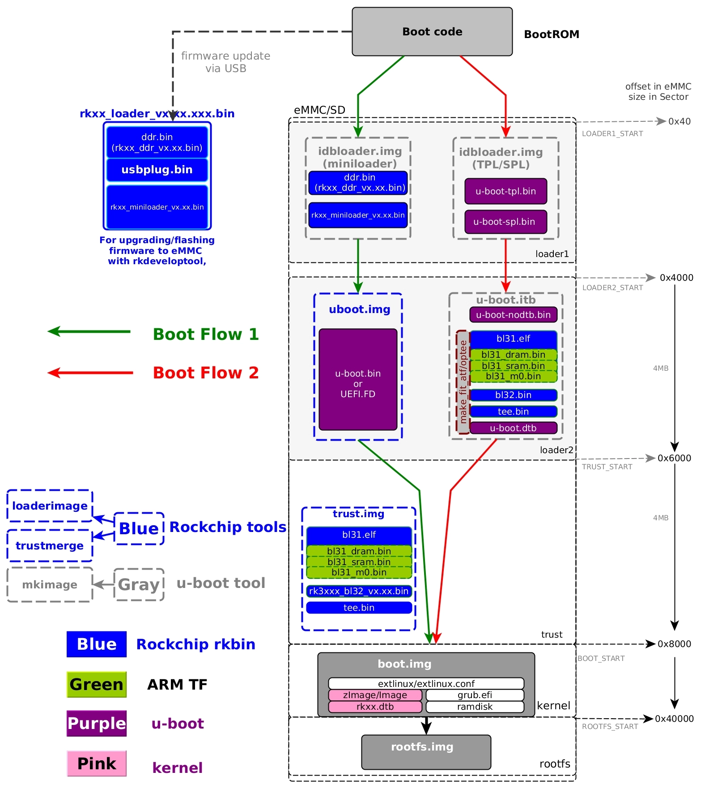

title: 瑞芯微 RK 系列芯片启动流程简析
date: 2024-02-03 12:00:00
author: w568w
type: post
hide: false
toc: false
cover: images/rockchip.webp
preview: 基于 RK3566 开发板分析
---

> **2024-02-07 更新**
>
> 昨晚读到了[瑞芯微的技术手册（Technical Reference Manual）](https://github.com/heitbaum/rk3568/)，发现本文中**我的说法存在一些错误，尚未修正**。我会在近期抽空修正这些错误，同时也会对本文进行一些补充。
> 
> **2024-02-29 更新**
>
> 错误的部分已经修复。

这篇是关于瑞芯微 RockChip 系列芯片启动流程的简析，基本是基于官网过于杂乱的 [Wiki](https://opensource.rock-chips.com/wiki_Boot_option)。很多东西并没有说明白，所以我在这里做一个~~并不~~简单的总结。

## 参考信息

- [RK3399 boot sequence](https://wiki.pine64.org/wiki/RK3399_boot_sequence)
- Rockchip TRM

## 启动流程

RockChip 系列芯片的启动流程大致分成五个阶段，分别为：

### 1. 一级程序载入器（Primary Program Loader）
这一部分位于不可擦除的 ROM 中（又名 BootROM），主要负责初始化一些硬件设备，以及加载第二阶段的启动程序。其地位相当于电脑上的 BIOS 或 UEFI。

BootROM 本身在上电时会被加载到内存 `0xFFFF0000` 处，然后执行。

它按如下顺序搜索设备中是否存在有效的 ID Block：

1. SPI NOR Flash
2. SPI NAND Flash
3. eMMC
4. SD 卡

ID Block 是一个 Rockchip 定义的 512 字节的数据结构，用于标识设备的可启动性。一般以 0x3b 8c dc fc 开头，包含二级程序载入器的起始地址、大小等信息。

如果第二阶段的启动程序加载失败了（例如，在以上设备中均未找到），它会负责启动 MaskROM 烧写模式，以便用户可以线刷固件。

### 2. 二级程序载入器（Secondary Program Loader）
这一部分（和以下部分）均是可以自定义（也就是说，位于 SPI Flash、eMMC、SD 卡等）的，主要负责初始化 DDR 并加载下一阶段的启动程序（如 U-Boot）。

常用文件名是 `idbloader.img`，意为 Initial Device Boot Loader。

它有两个不同的实现，一个是开源的 U-Boot TPL/SPL，一个是瑞芯微自己的 MiniLoader。

> **备注**
>
> **U-Boot TPL/SPL 说是开源，其实使用时不完全开源。**因为有一些组件的源码依然是闭源的，需要从瑞芯微的仓库中下载。
> 
> 试举例来说，RK3566 编译 U-Boot TPL/SPL 时依赖 [rkbin 仓库](https://github.com/rockchip-linux/rkbin)中的 `rk3566_ddr_1056MHz_v1.10.bin` 这个二进制文件，它是 TPL/SPL 用于初始化 DDR（DRAM）的程序，而这个程序并没有开源。

### 3. U-Boot
[U-Boot](https://docs.u-boot.org/) 是一个开源的启动程序，它可以从各种设备中加载内核镜像，然后启动操作系统内核。其地位相当于电脑上的 GRUB 或者「Windows 启动管理器」。

> **备注**
>
> U-Boot 有一些组件的源码也是闭源的，需要从瑞芯微的仓库中下载。
> 
> 依然以 RK3566 为例，编译 U-Boot 时依赖 `rkbin` 仓库中的 `rk3568_bl31_v1.32.elf`，它是 TF-A（Trusted Firmware-A）固件，用于初始化 AArch64 处理器的安全状态。对另一些型号来说，可以从 [ARM 的仓库](https://github.com/ARM-software/arm-trusted-firmware.git) 中自行编译，但至少 RK3566 是不行的，没开源。

**二级程序载入器一般和 U-Boot 一起打包成一个镜像**，然后写入一个设备中。U-Boot 也支持直接编译出单个可以烧写的、同时包含 SPL 和 U-Boot 的镜像，**无需编译两次**。

有关如何编译 SPL 和 U-Boot，可以参考[我的仓库](https://github.com/w568w/u-boot-orangepi-3b)。[U-Boot 的 Wiki 页](https://docs.u-boot.org/en/latest/board/rockchip/rockchip.html)中提供了更多关于如何编译、如何烧写的信息。

### 4. 引导分区（内核）
U-Boot 会从设备（即 Flash、eMMC、SD 卡等）中扫描所有分区，找到标记为可引导的分区，然后加载其中的内核镜像。

> **备注**
>
> 从这里开始，启动程序已经有能力理解「分区」和「文件系统」的概念，也可以任意读写文件了，所以**第 4 和 5 阶段都只是普通的文件系统上的俩分区而已（甚至可以在网络上，TFTP 了解一下？）**，可以任意规划，可以用你喜欢的分区工具，而不像前面几个阶段那样需要特定的格式和烧写工具。

引导分区一般是一个 FAT32 分区，里面包含了 `zImage` 或 `Image` 内核镜像、`dtb` 设备树文件、`extlinux.conf` 引导配置文件等。在 Linux 系统中，这个分区一般会被挂载在叫 `/boot` 的目录下。

### 5. 根分区（文件系统）
这已经是特定于 Linux 操作系统的内容了。它可能包含了你操作系统上一切重要的配置文件和关键程序，例如 `/etc`、`/usr` 等等。

**所谓的「制作一个发行版」，其本质一般就是制作一个根分区而已**。Ubuntu、Debian、ArchLinux、OpenWrt 等等，**它们的区别主要就是这个分区的内容不同**。

## 官网示意图勘误
下面是官网 Wiki 上的一张图，展示了这个启动流程：

这张图其实有些地方画得很清楚，有些地方画得很烂。比如说：

1. 并没有人规定说 BOOT 分区和 ROOTFS 分区必须从 0x8000 和 0x40000 开始，这可能只是官方的推荐值而已；
2. loader1 是指「二级程序载入器」，不是「一级程序载入器」，loader2 是指 U-Boot；
3. loader1 的部分画得模糊不清：使用右边的 U-Boot TPL/SPL 时，也可能需要 DDR 程序（见上面的备注）；

另外，这张图也没有详细解释左边蓝色的 `rkxx_loader_vxxx.xxx.bin` 是什么东西，它其实是一个临时的启动器。

当你用官方的烧写工具烧写镜像时，通常需要选择一个叫 `MiniLoaderAll.bin` 的文件，它就是这个临时的启动器。它的作用是，当你按下烧写工具上的「烧写」按钮时，这个临时的启动器会被首先直接复制到内存里开始执行，然后它会负责完成接下来的烧写工作（因为 BootROM 没有写设备的能力，必须有额外的程序来读写这些设备）。这个临时的启动器本身也是闭源的。

最后，这张图中展示了两个不同的启动流程，一个是使用 MiniLoader，一个是使用 U-Boot TPL/SPL。它们的区别在于左边闭源，右边开源，**通常我们推荐尽可能开源的解决方案，方便进一步开发调试。**

## Orange Pi 的 U-Boot 启动缺陷
在使用 Orange Pi 的 RockChip 开发板时，你可能常常遇到无法启动的问题，官方建议都是「清空 SPI Flash」，但没有解释为什么。

实际上，这个问题的根源在于 **Orange Pi 的 OpiOS 镜像（以及 SPI Flash）中的使用的 U-Boot TPL/SPL 过于古老，导致表现出奇怪的行为**。

例如，它以以下顺序尝试启动下一阶段（即 U-Boot）：

1. SPI Flash
2. TF 卡
3. eMMC
4. USB / NVMe

对于其中任何一个设备，只要存在（且不为空），它似乎就会尝试启动 U-Boot，**而且一旦失败，就不再继续下一步。比如，如果你的 TF 卡插上了，那么它就会尝试从 TF 卡启动，然后直接失败卡住，而不管 eMMC 上有没有系统。**

更糟糕的是 Orange Pi 系列的开发板出厂时 SPI Flash 里面已经预装了 U-Boot（和镜像里的版本一样古老）和一个微型 Linux 系统，这个系统启动后什么都不做。这意味着，**如果你不清空 SPI Flash，那么你的板子就会一直启动到这个系统，而不管你的 TF 卡或 eMMC 上有没有系统**。

而即使清空之后也有问题。假设你的目的是「系统放在 eMMC 里、TF 卡作为储存空间」，所以往 eMMC 里烧写了一个 OpiOS（包括 U-Boot），那么这个 eMMC 上的 U-Boot TPL/SPL 也会直接去尝试启动 TF 卡，然后失败。

这个问题的目前的解决方案有两个：

1. 自己编译一个新的 U-Boot（回忆我们说的，编译 U-Boot 其实是指编译一个 SPL+U-Boot 的镜像），然后烧写到 eMMC；
2. 把 eMMC 上的 U-Boot 部分复制到 TF 卡里。

> **备注**
>
> 有网友反馈把 eMMC 上的 BOOT 分区复制到 TF 卡上才能解决这个问题，复制 U-Boot 不行，这意味着我的推理可能是错误的。但是，通过控制变量我认为这个问题的根源在于 U-Boot 的问题，所以这个解决方案的原理是一样的。