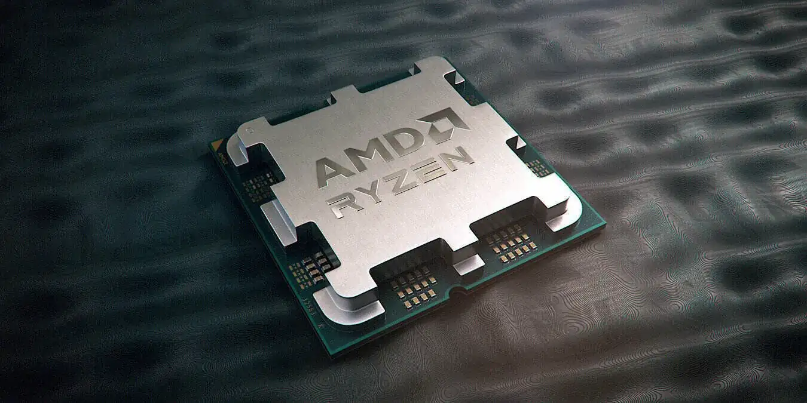
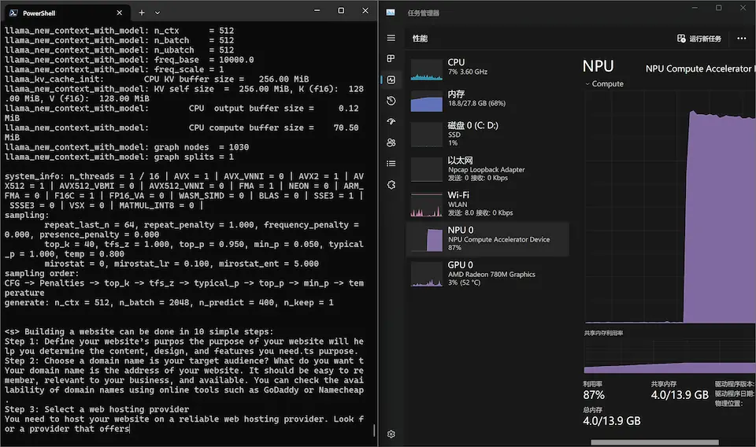

title: "[EN] Running LLMs on AMD Ryzen AI Processor"
date: 2024-10-04 14:36:00 +0800
author: w568w
cover: images/amd.webp
preview: An exploration of running Large Language Models on recent AMD CPUs with AI accelerators
---



AMD has been making some noise in the AI space recently, with the determination to catch up with [Intel](https://www.intel.com/content/www/us/en/products/details/processors/core-ultra.html) and [Qualcomm](https://www.qualcomm.com/products/mobile/snapdragon/smartphones/mobile-ai) in the personal AI computing market. The company has released a series of processors with AI accelerators, including the Ryzen 7000, 8000 and AI 300 series, equipped with the so-called [AMD Ryzen™ AI](https://www.amd.com/en/products/processors/consumer/ryzen-ai.html) technology. These processors are designed to accelerate AI workloads, especially on Windows, such as [Windows Copilot+](https://learn.microsoft.com/en-us/windows/ai/npu-devices/) features, allowing users to upscale images, generate text, and more on the local device.

When we talk about AMD's ***competence*** in its software stacks, I have never failed to be impressed by the company's ***incompetence*** in providing a comprehensive software ecosystem, after such a mess with the [ROCm](https://rocmdocs.amd.com/en/latest/) project: a joke of a project developed by AMD but not even compatible with the AMD consumer GPUs except for a few recent models, and [a corporate competition and personal career upheaval](https://www.tomshardware.com/pc-components/gpus/amd-asks-developer-to-take-down-open-source-zluda-dev-vows-to-rebuild-his-project) concerning [ZLUDA](https://github.com/vosen/ZLUDA), a hobby project that simulates CUDA on AMD GPUs and beats ROCm in terms of compatibility and [performance](https://opendata.blender.org/benchmarks/query/?device_name=AMD%20Radeon%20RX%207900%20XT&compute_type=OPTIX&compute_type=CUDA&compute_type=HIP&compute_type=METAL&compute_type=ONEAPI&blender_version=4.2.0&group_by=device_name).

Thus, when it comes to new AI infrastructure, I am always skeptical about AMD's ability to provide a good software stack, and they don't fail to disappoint me. The Ryzen AI processors are published with a brand new architecture called [AMD XDNA™](https://www.amd.com/en/technologies/xdna.html), kind of a NPU with its own on-chip memory tiles and VLIW SMID instructions. And - ***surprise!*** - a totally novel SDK called [Ryzen AI SDK](https://ryzenai.docs.amd.com/) is provided to developers to utilize the AI accelerators on these processors (did I mention that ROCm is the abbreviation of "Radeon Open Compute", which uses HIP (Heterogeneous-Compute Interface for **Portability**) as its programming model?). No compatibility with ROCm or OpenCL. Oh yeah, portability, that's what AMD is ***good*** at.

Putting aside the nonsense, I decided to give it a try and see how well these processors can run some LLMs. It came out that **it just works**, if you are willing to put up with the lack of documentation and the poor software support. Here is a brief documentation of my experience.

## 1. System requirements

- **A Ryzen AI processor.** I used a [Ryzen™ 7 8845HS](https://www.amd.com/en/products/processors/laptop/ryzen/8000-series/amd-ryzen-7-8845hs.html) in my test. Check the product page for whether your processor is supported.
    - **Note:** Also check what family your processor is in on the product page. For pre-STX (i.e. Phoenix and Hawk Point) processors, you need to use the PHX variant of the SDK. For STX (Strix) processors, you need to use the STX variant of the SDK.
- **A Windows 11 device.** The Ryzen AI SDK and documentation is only available on Windows, although [a Linux kernel driver](https://github.com/amd/xdna-driver) is recently published.
- **Conda.** The SDK heavily relies on Conda for package management. 
- **A model in GGUF format.** The SDK is said to support ONNX, AWQ and SmoothQuant models, but I only tested the GGUF format. Note that the SDK only supports models with `Q4_0` quantization.

## 2. Install the driver
First, you need to install the NPU driver from the [official website](https://ryzenai.docs.amd.com/en/latest/inst.html). 

At the moment, the driver is gated behind a registration wall, so you need to sign up for an AMD account to download it.

> **Note**
>
> You don't need to install `Ryzen AI Software` on the website above. That SDK is for image processing tasks, not for running LLMs.

After installation, you can check if the driver is installed correctly by check `Device Manager` in Windows. You should see a new device called `NPU Compute Accelerator Device` under `Neural processors` category. And in the `Task Manager`, you should see a new device called `NPU` in the `Performance` tab.

> **Tip**
>
> The NPU driver also comes with a command-line tool called `xrt-smi`, similar to `nvidia-smi` for NVIDIA GPUs. You can use it to monitor the NPU usage and temperature. 
>
> By default, the tool is installed at `C:\Windows\System32\AMD\xrt-smi.exe` and not added to the system PATH. You can add it to the PATH manually or run it with the full path.

## 3. Build the environment
Most of our following steps will be done with the offical SDK [amd/RyzenAI-SW](https://github.com/amd/RyzenAI-SW); to be specific, the llama.cpp fork at `example/transformers/ext/llama.cpp`.

Clone the repository first in your PowerShell:

```powershell
git lfs install # Install Git LFS if you haven't
git clone https://github.com/amd/RyzenAI-SW.git # Clone the repository. Be patient, it's a large repository around 2~3 GB
```

Then, build the llama.cpp following the instructions at `example/transformers/models/llm_gguf`:

```powershell
# 1. Create the Conda environment. Be patient, it could take a while
cd RyzenAI-SW/example/transformers/
$TRANSFORMERS_ROOT=$PWD
conda env create --file=env.yaml
conda activate ryzenai-transformers

# 2. Setup the environment variables. Use the correct setup script according to your processor family
.\setup_<phx/stx>.ps1

# 3. Build & Install the RyzenAI C++ Library
cd $TRANSFORMERS_ROOT\ops\cpp
cmake -B build\ -DCMAKE_INSTALL_PREFIX="$env:CONDA_PREFIX"
cmake --build build\ --config=Release
cmake --install build\ --config=Release

# 4. Build the llama.cpp
cd $TRANSFORMERS_ROOT\ext\llama.cpp
cmake -B build\ -DCMAKE_PREFIX_PATH="$env:CONDA_PREFIX;$env:XRT_PATH" -DLLAMA_RYZENAI=ON
cmake --build build\ --config=Release
```

And that's it! You can now obtain the llama.cpp executable with RyzenAI support at `$TRANSFORMERS_ROOT\ext\llama.cpp\build\bin\Release\main.exe`.

## 4. Run the model
Let's have a try:

```powershell
.\main.exe -m Meta-Llama-3-8b-Instruct.Q4_0.gguf -e -t 4 -n 400 -p "Building a website can be done in 10 simple steps:\nStep 1:"
```

And here it is. Bam!



# Conclusion
Honestly speaking, the NPU performance is not impressive. The model I tested is a 7B parameter model with `Q4_0` quantization, and it took around 70 seconds to load the model and 80 seconds to generate \~400 tokens:

```
llama_print_timings:        load time =   68599.20 ms
llama_print_timings:      sample time =      13.88 ms /   400 runs   (    0.03 ms per token, 28818.44 tokens per second)
llama_print_timings: prompt eval time =     773.69 ms /    19 tokens (   40.72 ms per token,    24.56 tokens per second)
llama_print_timings:        eval time =   79234.49 ms /   399 runs   (  198.58 ms per token,     5.04 tokens per second)
llama_print_timings:       total time =   80166.82 ms /   418 tokens
```

The performance is around 5 tokens per second, which is far from the performance of an ordinary GPU or a TPU. I would say it is slower than running AVX512 or Vulkan Compute on its CPU or iGPU, Radeon 780M Graphics (did I mention that it is the most powerful consumer iGPU at the moment?).

However, RyzenAI-SW is said to be a [proof-of-concept project](https://ryzenai.docs.amd.com/en/latest/llm_flow.html) with bare minimum functionality and no optimization. The performance could be improved in the future with better optimization and more features. AMD already has several [highly-optimized models in their hands](https://account.amd.com/en/member/ryzenai-sw-ea.html), but they are not open to the public yet and require enterprise contracts to access. [The image processing tasks are said to be more mature and optimized](https://www.amd.com/en/developer/resources/technical-articles/model-pipelining-on-npu-and-gpu-using-ryzen-ai-software.html), so if you are interested in image processing tasks, you might want to [give it a try](https://github.com/amd/RyzenAI-SW/tree/main/demo/NPU-GPU-Pipeline).

In conclusion, the Ryzen AI processors are a promising start for AMD to catch up with the AIPC hype, but they still have a long way to go to catch up with Intel in terms of software support and performance. If you are a researcher or a developer, you might want to wait for a while before investing in these processors. But if you are just a hobbyist like me, it's still fun to play around with these new toys.