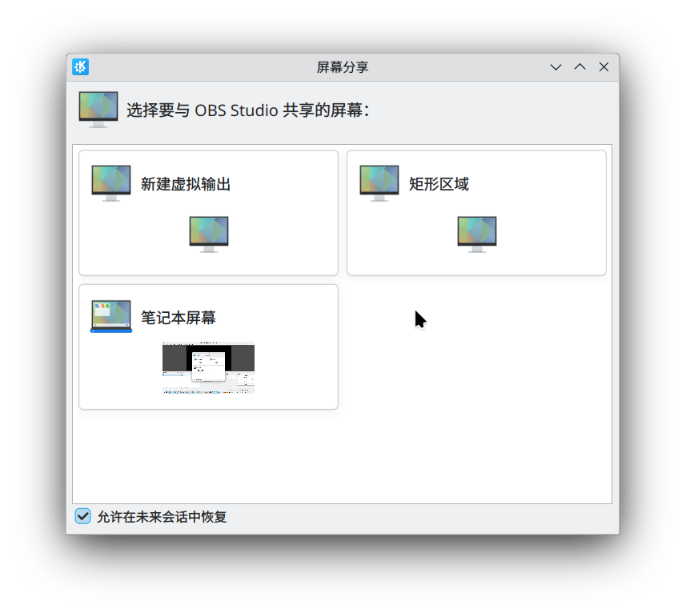

title: "在 Wayland 上实现类似 SpaceDesk 的平板副屏"
date: 2024-07-04 19:46:00 +0800
author: w568w
cover: images/lauren-mancke-qc3sE5lGLbA-unsplash.webp
preview: 把 Android 平板当成 Linux (Wayland) 的扩展屏幕
---

SpaceDesk 是一个 Windows 和 Android 平台上的软件，可以让你把 Android 平板当成 Windows 的扩展屏幕使用。

# 1. 无解的问题？

自从切换到 Linux + Wayland 后，我一直在找类似的软件，但是没有找到。

这种串流方式对刷新率和延迟要求都很高，而对画质要求并不高。因此更接近于游戏串流。我在这个[这个 Reddit 帖子](https://www.reddit.com/r/pcgaming/comments/hfp4vy/absolute_lowest_latency_inhome_streaming_option/)找到了一些专为低延迟设计的解决方案。然而研究后发现均不适用：

1. **[Parsec](https://parsec.app/)**：[据称](https://www.reddit.com/r/cloudygamer/comments/eq0pf5/best_low_latency_in_home_solution/)延迟低至 1 ms。然而它[不支持 Linux 主机](https://www.reddit.com/r/ParsecGaming/comments/1bk0xek/parsec_linux_host/)；
2. **[Moonlight (NVidia Game Stream)](https://moonlight-stream.org/)**：同样，只支持 Windows 和 NVidia GPU；
3. **Steam 的[远程同乐](https://store.steampowered.com/remoteplay)**：似乎只在有线场景下表现良好，而且只能串流单个游戏画面（而不是显示器画面）。

另一个老大难问题是**「如何创建虚拟显示器」**。这个问题在 X11 时代非常麻烦，好在 KDE Plasma Wayland 在其 XDG Desktop Portal 的接口中实现了添加虚拟显示的功能：



我还找到了[这篇博文](https://blog.chyk.ink/2022/07/17/linux-virtual-display/)，提到的投屏方法是 **[Deskreen](https://www.deskreen.com)**。用确实是能用，但我实测：

1. 该 Electron 应用性能非常拉胯，延迟很高，还有残影；
2. 每次连接都要输一串验证码，不方便；
3. 截至目前已 2 年不在维护中；
4. 主页和主界面充斥着政治宣传广告，进入应用还必须点个「天佑乌克兰」的按钮，我觉得很不舒服。

此外尝试过的方法还包括 **OBS Studio + [OBS-RTSPServer](https://github.com/iamscottxu/obs-rtspserver) + VLC for Android**，但是不知为何延迟高得离谱，目测 4000 ms 以上，无论如何调节参数都无法降低。

# 2. 一个新的思路

我偶然想起了 Moonlight 似乎有一个 Linux 端的主机实现，很快就找到了 **[Sunshine](https://github.com/LizardByte/Sunshine)**。安装、连接都很顺利，延迟也很低。

然而一个关键问题是：Sunshine 串流时直接从 KMS 显示器列表中读取数据，这意味着 KDE 创建的 Wayland 虚拟输出对其无效。咨询群友后发现最简单的办法可能是购买一个 HDMI 显示器欺骗器，然而我实在不想再买个硬件了。

天无绝人之路，我在 Reddit 上又看到最近一篇关于[如何欺骗 amdgpu 驱动添加虚拟显示器的帖子](https://www.reddit.com/r/linux_gaming/comments/199ylqz/streaming_with_sunshine_from_virtual_screens/)，测试之后惊喜地发现有效。分享给群友后，发现这一方法对 NVIDIA 显卡也有效。

我将这个方法总结如下：

1. 在电脑上安装 Sunshine，平板上安装 Moonlight，确保能搜索到并能正常控制电脑；
2. 用下面的命令枚举所有设备接口的连接情况，选择一个未连接（`disconnected`）的 HDMI 接口（如 `HDMI-A-1`），记下它：

    ```shell
    for p in /sys/class/drm/*/status; do con=${p%/status}; echo -n "${con#*/card?-}: "; cat $p; done 
    ```
3. 从[这里](https://git.linuxtv.org/edid-decode.git/tree/data)获得一个 EDID 文件，如 `samsung-q800t-hdmi2.1`；
4. 在 `/usr/lib/firmware/` 下创建一个新的 `edid` 目录（如果没有），并将你的 edid 文件放在那里。例如 `/usr/lib/firmware/edid/samsung-q800t-hdmi2.1`；
5. 编辑内核参数，添加以下内容。其中 `HDMI-A-1` 是你选择的接口，`edid/samsung-q800t-hdmi2.1` 是你的 EDID 文件。注意不要漏了最后的 `:e`：

    ```shell
    drm.edid_firmware=HDMI-A-1:edid/samsung-q800t-hdmi2.1 video=HDMI-A-1:e
    ```
6. 重启电脑。如果一切正常，你的电脑会认为有一个新的 HDMI 显示器连接上了，而实际上它是一个虚拟显示器；
7. 在命令行中运行 `sunshine`，查看其输出的 `KMS Monitor List`，找到你的 HDMI 接口对应的编号，停止 Sunshine；
8. 在正常启动的 Sunshine 的设置中填入上一步的编号，应用设置，确定其投屏的来源是你的虚拟显示器。

这样就完成了，你可以在 KDE 设置中像普通显示器那样配置该虚拟显示器的分辨率和空间位置，甚至可以在不用时禁用该显示器。

Moonlight 连接体验很好，基本和 SpaceDesk 差不多。