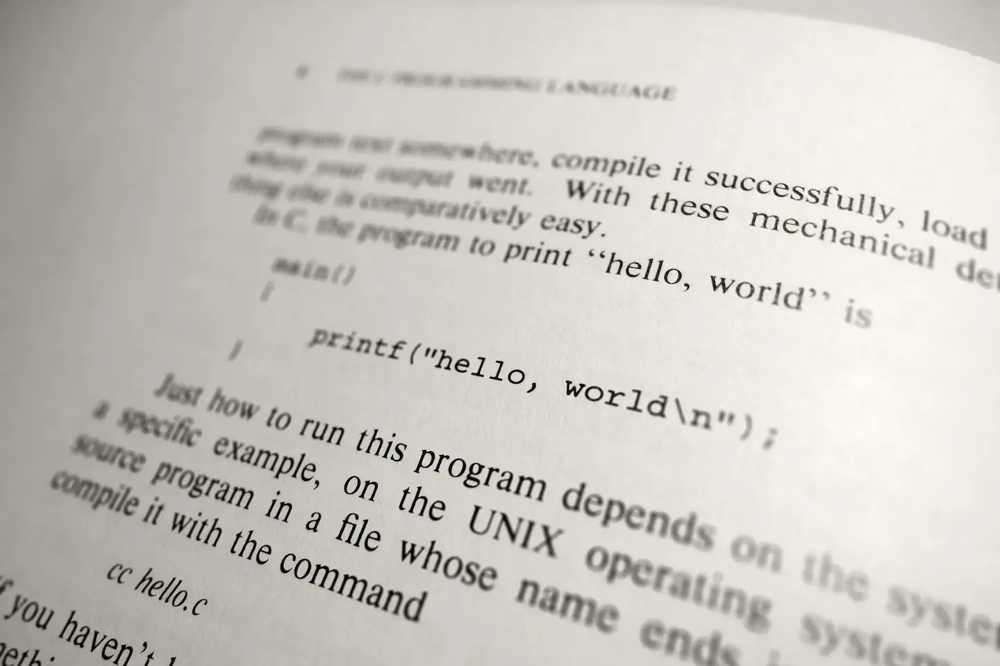

title: "[EN] Stung by Every Language"
date: 2025-06-15 16:17:00 +0800
author: w568w
cover: images/languages.webp
preview: Programming languages are like a box of chocolates. You never know what you're gonna get
toc: true

---



Ever since entering university, one of my pleasures has been browsing online, randomly picking up recent programming languages, delving into their features, often hoping to find those "dream features" I've envisioned, and attempting to build something practical with them.

Over the course of several years exploring this space, I've gradually come to the realization that **every language has its flaws**. A language that looks promising at first glance will soon reveal its less-than-ideal aspects, even those lauded as "elegant" or "highly modern." My watchlist is now overflowing with such languages. To keep myself from forgetting these issues and potentially falling back into being stung by them, I've decided to jot down these languages' hidden frustrations.

> (Here is where a meme should be, saying: "*You decide to pick up a game you haven't played in a year. Ten minutes later, you finally remember why you stopped playing.*")

Consider this blog post a pure rant, and solely reflecting my *personal* views, as I'm not deeply familiar with most languages, nor do I intend to spend months thoroughly researching each one. And I'll intentionally conflate issues of the toolchain and ecosystem with those of the language itself. I've typically only written simple numerical or GUI programs in each, quickly moving on afterward. So, if anything I say rubs you the wrong way, feel free to tell me!

Additionally, some pain points recur across several languages. In such cases, I'll elaborate on them only when discussing the first language they appear in, and merely touch upon them later.

# 1. Rust

Rust has become a blend of religious fervor and a bit of a witch hunt: some see it as a silver bullet, while others view it as a modern blight and the embodiment of rotten academic ideas, needlessly adding too much complexity. Meanwhile, the majority are quietly using it to build tools and applications.

Despite all the hype and criticism, I have to say that **one of the reasons I feel most confident about an open-source project's quality** (the other being `100% Go`, which I'll explain later) is **if it's `100% Rust`**. Such projects are typically well-maintained, behave predictably, and are incredibly robust against various erroneous inputs.

(🤦 In contrast, a `100% C/C++` project often feels like being told: "*Get ready to download thirty git submodules, then install autotools, visual studio, meson, cmake, xmake, make, or whatever, then pray I haven't relied on features, functions, keywords, or macros specific to a particular compiler, third-party library or Linux kernel version, be prepared to turn off all the compiler warnings and suppress errors because my executable will literally link to EVERYTHING in your system's `lib` directories, and finally, enjoy my software!*")

But anyway, getting back on track. While I am a Rust supporter myself, there are still aspects of Rust that I find uncomfortable:

**Lack of specialization.** You cannot implement a trait for `MyVec<T>` and then specialize it for `MyVec<i32>`. This is a common feature in many languages, including C++. It allows you to write generic code while still being able to optimize for specific types. 

There is a [RFC](https://github.com/rust-lang/rust/issues/31844) for it, but it has been stalled for years. The workaround? Go nightly and enable the `specialization` feature. But this is not a solution, as it is not stable and will unlikely be in the recent future.

**Error and async have colors.** When you're defining a trait for others to use, its signature can severely limit what implementations can do. For example, if you write `Foo`:

```rust
trait Foo {
    fn foo(&self) -> i32;
}
```

But then someone complains that their `Foo` is fallible, so you introduce `TryFoo`:

```rust
trait TryFoo {
    fn try_foo(&self) -> Result<i32, Box<dyn Error>>;
}
```

But wait, someone else needs their `Foo` operation to be asynchronous, leading you to create `AsyncFoo`:

```rust
#[async_trait::async_trait]
trait AsyncFoo {
    async fn async_foo(&self) -> i32;
}
```

Ans don't forget `TryAsyncFoo`! Now, for what was originally just one concept, you might end up needing to declare four different traits. This is ridiculous. A viable solution would be to [introduce something like algebraic effects](https://github.com/rosefromthedead/effing-mad), but that is a whole different topic.

**Complex macro system.** Macros are powerful, and everyone loves using them. But have you ever heard of a programming language with so many different types of macros? I'm talking about *declarative macros*, and *procedural macros* (which further split into *function-like*, *attribute*, and *derive macros*).

For each type, you need to learn and remember complex helper tools, syntax rules, and new concepts, figure out [what "Hygiene" is](https://veykril.github.io/tlborm/syntax-extensions/hygiene.html), and how to debug a macro expansion. Creating a procedural macro inevitably means creating a new crate and learning how to use libraries like `proc-macro2`, `quote`, and `syn`.

As for complex macro functions, they eventually devolve into an AST parsing, traversal, and manipulation hell that no one, except the original author, can really understand or maintain. (Usually even the original author can't understand it anymore, and they have to spend hours trying to remember what they were thinking when they wrote it.)

Despite excellent resources like [*The Little Book of Rust Macros*](https://veykril.github.io/tlborm/), which attempts to explain these concepts clearly, I still find it regrettable that Rust doesn't make these things easily understandable for a novice. For beginners, how things like `println!` actually work under the hood remains a mystery. And to understand the internals, they have to climb the entire Rust "mountain" and read various blogs and tutorials on macros. By then, however, they are no longer beginners. [^1]

[^1]: I know this example is controversial, as beginners in C/C++ and other languages also can't and shouldn't try to understand the internals of standard library functions like `printf` and `iostream`, but you get my point.

**Slow type checking.** I know this is tied to Rust's complexity—every save requires running the borrow checker, expanding all macros, completing all type inference, and meticulously checking the code to provide those insightful error messages—but I sometimes still feel the check process is a bit slow.

What I mean is, they *have* optimized it really well. But look at Zig (with [zls](https://github.com/zigtools/zls)) and Go – they can provide error feedback almost instantly (<=100ms), which really boosts development comfort. In contrast, Rust analyzer typically takes several seconds to check a medium-sized file. This transforms the "write code - review code" loop into a "write code - save file - hands off keyboard while waiting for `cargo check` - check and fix errors - review code" loop. For some people doing actual coding (like myself), this can feel a bit uncomfortable.

# 2. Go

Go is a language I have a love-hate relationship with. I love its simplicity, its focus on concurrency, and its excellent tooling. Damn, `go build` is a godsend after dealing with CMake, autotools, and other sh*ts.

Its "*errors are return values*" philosophy is a breath of fresh air compared to the exceptions and try-catch blocks of other languages. And it has proved that even without rigorous error systems like Rust and Haskell, you can still write simple and maintainable code. It does find a good balance between simplicity and robustness.

But sometimes it is just way too simple.

**Wrong type abstraction.** Go models error returns using a *product* type – essentially a tuple of `(Value, Error)` – when arguably, the correct approach is a *sum* type, representing *either* a `Value` *or* an `Error`.

Compared to simply returning an error, you now have to write `return 0, err`, `return "", err`, or `return nil, err`. This is awkward.

> I guess someone will argue, "But what about the case where you *do* have both a value and an error? Go's approach is more flexible!"
>
> And my point is, that specific situation requires a more complex sum type representing *either* a `Value` *or* an `Error` *or* `(PartialValue, Error)`. A simple `(Value, Error)` tuple as the *standard* way to represent success *or* failure isn't the right model. Even if, by coincidence, the `(Value, Error)` tuple *can* represent three different states, you still have to explicitly check for `value != nil && error == nil`, `value == nil && error != nil`, and potentially `value != nil && error != nil` later on.  
> See what's happening? You're effectively reinventing a sum type and the simple pattern matching that comes with it.

You can see this limitation elsewhere as well. For example, you can't declare a pointer or interface return type that must be non-nil.

**Lack of optimization.** Go is advertised as "native", "minimal", and "fast". But in reality, it is not (at least for the last two points). Go does have basic optimizations, like escaping analysis and dead code elimination. But that's about it.

It has a simple GC: no young/old split, no moving, no bump pointer allocation. Latency is low, but throughput is not. Someone is [moving away from it](https://discord.com/blog/why-discord-is-switching-from-go-to-rust) because of this. [^2]

**Generic type is a joke.** I won't go into the details of this. You got my point.

---

(To be continued, too lazy to write more right now 😅)

[^2]: Though there are criticisms that Discord team never really reached out to the Go team for optimizing the rare cases on Go sides and just rewrote the whole thing in Rust with more performance consideration. But I'm not in favor of this viewpoint: not everyone has the time and resources to communicate with the Go team to understand what they did wrong and who to blame. You are not Discord, nor am I. Are we supposed to just accept these performance degradations when dealing with the tail cases?
