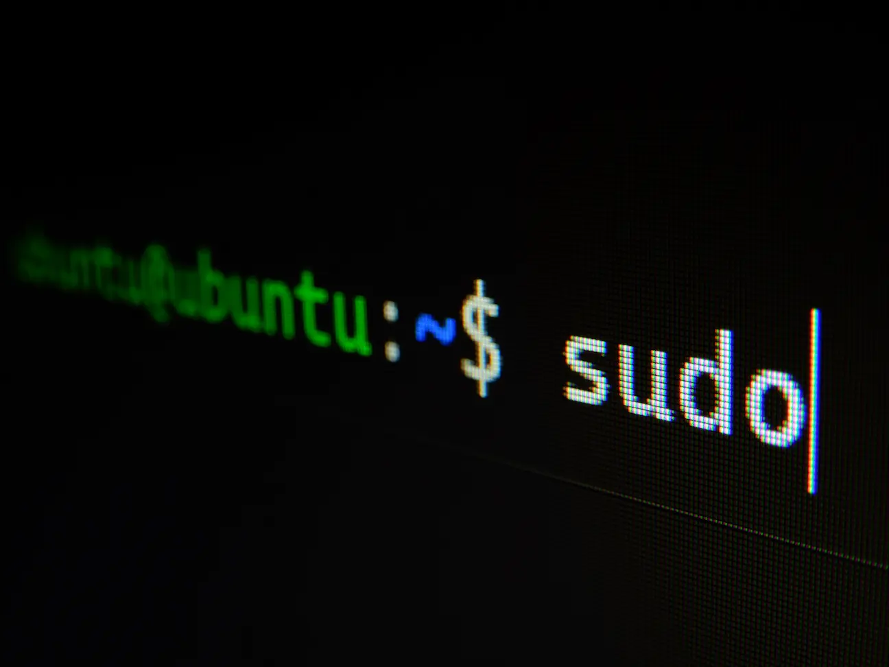
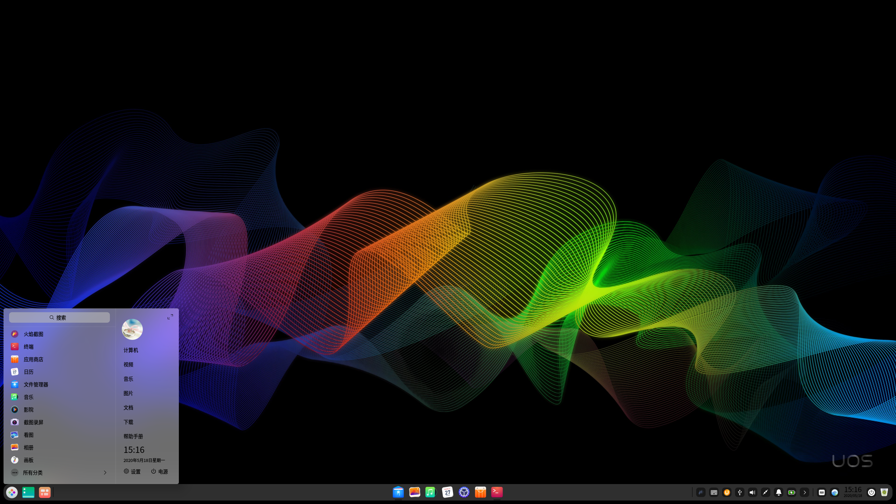

title: "2022 年，为什么我依然不推荐 Linux 作为日用环境"
date: 2022-08-25 16:03:25 +0800
author: w568w
cover: images/photo-1629654297299-c8506221ca97.webp
preview: 因为它并不好用。
---


本文分为两部分，第一部分阐明问题，第二部分则列出博主个人的 Linux 配置记录。

---

上个月把各个备受互联网推崇的 Linux 发行版试用了一遍。浅浅地发表一下个人感想。

作为一个有 Linux 4 年使用史的老用户，自然也有将 Linux 完全充当日常使用操作系统的经历。从最大众的 Ubuntu、Mint，到（当时）更为小众的 Arch Linux，再到国产的 Start OS、Deepin、UOS，如果要用两个字形容 Linux 相比于 Windows 的使用体验，那就是「**折腾**」：安装要折腾分区，开机要折腾图形驱动，使用要折腾软件包源、桌面管理器、输入法、Wine……

2022 年，已经有一众的 Linux 桌面版号称能给用户带来大众级的桌面体验。那么，这些平台的体验到底如何呢？

鉴于互联网上吹嘘 Linux 优点的文章、视频已经多到让人审美疲劳，**本文仅限于记录部分 Linux 发行版的缺点和不足，以便帮助读者擦亮眼睛，认清现状，减少折腾。** 也希望社区不断查漏补缺，让「Linux 桌面年」别再永远是「下一年」。


*PS：* 当然，下文中大部分问题，都与系统环境、个人配置有关，可能你根本不会碰到，因此仅供参考。也欢迎在评论区分享你自己的 Linux 使用体验。

# Ubuntu 22.04 的问题
Ubuntu 作为目前号称拥有最高支持率、最全驱动厂家支持和最活跃社区支持的发行版，自然被放在试用的第一位。

## 第一次开机就报错
第一次开机后提示系统更新。点击「立即更新」后，报错如下：
```
无法解决软件包依赖
这个错误可能是需要不存在或不可安装的软件包引起的。或者可能在软件包之间有冲突，它们不能同时安装。
Transaction failed: 无法解决软件包依赖
 下列软件包未满足的依赖关系：

libmutter-10-0: Depends: mutter-common (>= 42.2-0ubuntu1) 但是将要安装 42.2-0ubuntu1
                Depends: libgudev-1.0-0 (>= 232) 但是将要安装 1:237-2build1
                Depends: libice6 (>= 1:1.0.0) 但是将要安装 2:1.0.10-1build2
                Depends: libsystemd0 (>= 226) 但是将要安装 249.11-0ubuntu3
                Depends: libudev1 (>= 183) 但是将要安装 249.11-0ubuntu3
                Depends: libx11-6 (>= 2:1.7.0) 但是将要安装 2:1.7.5-1
                Depends: libx11-xcb1 (>= 2:1.7.5) 但是将要安装 2:1.7.5-1
                Depends: libxau6 (>= 1:1.0.9) 但是将要安装 1:1.0.9-1build5
                Depends: libxcomposite1 (>= 1:0.4.5) 但是将要安装 1:0.4.5-1build2
                Depends: libxdamage1 (>= 1:1.1) 但是将要安装 1:1.1.5-2build2
                Depends: libxext6 (>= 2:1.3.0) 但是将要安装 2:1.3.4-1build1
                Depends: libxfixes3 (>= 1:6.0.0) 但是将要安装 1:6.0.0-1
                Depends: libxi6 (>= 2:1.6.99.1) 但是将要安装 2:1.8-1build1
                Depends: libxinerama1 (>= 2:1.1.4) 但是将要安装 2:1.1.4-3
                Depends: libxkbfile1 (>= 1:1.1.0) 但是将要安装 1:1.1.0-1build3
                Depends: libxrandr2 (>= 2:1.5.0) 但是将要安装 2:1.5.2-1build1
```

这个问题**自从 Ubuntu 有「系统更新」的图形化程序以来，就从未得到真正的解决。** 每一次尝试「系统更新」，就像玩俄罗斯轮盘，你永远不知道这次更新又要爆出什么稀奇古怪的错误。

而这一错误信息，即便对于有经验的用户也是非常棘手的。考虑到第一次进入桌面就「开门见山」地报错，一般的桌面用户很难对这样一个操作系统有非常高的评价。

## 大批中英文混杂
系统设置、桌面右键菜单、商店显然都没有做到完全的翻译，在各个不主要的页面上基本都是中英文参半，或者干脆报出中英文混杂的错误信息。

尽管 Windows 11 在 21 年 6 月发行之初，也有过[汉化不完全](https://www.appinn.com/windows-11-insider-preview-10-0-22000-51/)的问题，但在之后的正式版中很快就补全了所有细枝末节位置的本地化语言。相比之下，Ubuntu 作为正式版发行的 22.04 版，依然大面积出现「三明治」语言页，让人不禁疑问：Ubuntu 的语言社区贡献人力真的足够吗？

## 应用商店差强人意
相比于我使用 Ubuntu 16.04 时，Ubuntu 自带的应用商店有了比较大的改观。主要在两点：

1. **可以打开。** 是的，在 16.04 中，我甚至无法在不科学上网的情况下打开商店，常常展示为白屏或者直接闪退。现在？或许是添加了镜像源吧；
   
2. **可以安装软件。** 直到 Ubuntu 的第 20 版，我都从未成功在软件商店里安装过一个软件——它在下载时卡住，安装中崩溃，报出莫名其妙的未知错误，白屏，或者干脆在点击「安装」按钮时没有任何反应。我很高兴在 22.04 上，我*终于*可以使用它安装软件了。

然而，令人恼火的问题依旧存在。例如，当我在应用商店的更新页面选择「全部更新」后，**它只更新了一半的软件，在没有任何错误提示的情况下，自己停止更新了**。而且，当我再次尝试点击「全部更新」时，**整个页面直接白屏**。关闭重开才恢复正常。

即便反复这个恼人的过程几次、全部升级好后，应用商店仍继续白屏，再一次关闭重开后才显示「All Update to date」（全部最新）的字样——是的，在中文系统里仍是英文提示，即便应用商店其他文本都是中文！

其他的小问题数不胜数，我甚至有些担心社区开发人员能否修复它们——**包括对部分自带软件点击「卸载」总是提示「未安装」、切换安装版本（Snap 和 APT）时白屏**，等等。
## 高分屏效果感人
由于显卡驱动，或者是由于窗口管理器的年久失修，Ubuntu 无法很好地支持 150% 缩放。在系统设置里只能选择 100%、200% 等整数倍窗口缩放，分数倍数的缩放则只有软件支持，非常模糊且消耗性能。在我的 15 吋显示屏上，**要么字太小无法辨清，要么字太大影响阅读。**

有人说，可以自行安装 gnome-tweak，设置字体缩放比例。但是，仅仅设置字体缩放会使得按钮和其他控件的视觉大小过小，而且**部分软件（如网易云音乐）甚至都不遵循系统的字体缩放设置，而是自己决定缩放比例。**

## 其他瑕疵
零零散散的小问题还有很多，试举几例：

1. 点「注销」直接黑屏，回到 Linux 终端模式，而不是「切换用户」界面。

2. 部分主要应用不支持暗色模式，如 Edge、Gedit（是的，Gnome 自家出的编辑器不适配自家桌面环境的暗色模式！）。

还有一些比较强迫症的，比如「应用程序」的文件夹内的项目数超过一页时，第一列的图标左半边显示不全，等等。

# OpenSUSE Tumbleweed、Linux Mint 的问题
OpenSUSE 被部分爱好者评价为「最新、最稳定的桌面操作系统」，Linux Mint 则是「最接近 Windows 的桌面体验的发行版」。

然而，这两款发行版在我的笔记本上都吃了「闭门羹」。具体来说，两者都在第一步，也就是安装上就跌了跟头：**OpenSUSE 在安装界面直接控件重叠、中文字间距怪异且缺字，按钮全部无法点击，根本不能进行下一步安装；Linux Mint 则更进一步，安装界面直接黑屏，连 Live 版系统都无法进入。**

我尝试了一些常见的解决办法，例如 Safe graphic 或者禁用独显，但均以失败告终。或许是天时地利人和均不沾，God (~~Linus~~) 也不想让我使用吧。
# Deepin 20 的问题
Deepin 作为国产发行版，也是 UOS 的公用开源版本，自然对本地化有着完全的支持，但这并不代表 Deepin 是完全有能力替代 Windows、macOS 使用体验的作品。实际上，它的问题也有不少。

## 托盘体验差
Deepin 有自己的桌面环境 [DDE](https://www.deepin.org/zh/dde/)，这很好。但在 Linux 桌面永远的痛——Wine 托盘图标上，依旧问题不断。

例如，Deepin QQ 挂在后台，托盘图标一会儿就自己消失了，而实际上还在运行（重新登录提示已经登录）。这时没有任何办法，只能自行在进程管理器中寻找 Wine QQ 进程并结束。
## UI 混乱
Deepin 在 15 前后有过一次非常棒的 [UI 变更](https://blog.csdn.net/qq_33154343/article/details/106195055)，直接让我爱上了 DDE 的质感。但在目前的 20 版本中，或许是为了迎合大众感受，或许是为了「深度抄袭」macOS，换用了现在的 UI 风格。

而这套风格，给我整体感受是：**不伦不类**。任务栏图标风格严重不统一（**黑白扁平、彩色拟物风混杂**），使用字体不抗锯齿；**任何按钮、图标均无悬停、点击动效**，只能通过是否弹出新窗口来判断是否点击上了、是否打开了相应功能；最离谱的是，默认是半透明任务栏、暗色系壁纸，任务栏和开始菜单字体颜色却默认也是黑色，你细品能不能看得见字。

 

## 应用商店同样略有瑕疵
虽然 Deepin 的应用商店为国人使用习惯下足了功夫，但并不意味着它已经完美无瑕。除了从很多个版本之前以来就有的「常常安装失败，且无任何错误信息」的问题，这一版本也仍未修复一些更难察觉、但一旦察觉使用体验就会打折扣的问题。

例如，**在系统更新时，于应用商店下载任何软件均立刻安装失败，且点击「查看失败详情」无任何反应**。必须等到更新完成，并且重新打开应用商店才恢复正常。

由于 Linux 的系统更新频率远胜于 Windows 和 macOS，很难说诸如此类的设计缺陷是用户友好的。

---
下面是第二部分，列出了个人的 Ubuntu 常用软件的配置流程，希望对执意体验 Linux 的你有帮助。
# 个人 Ubuntu 配置过程
## 安装 VSCode
应用商店为 Snap 版本，性能低。到官网下载 deb 包安装。
## 安装 Git
apt 安装。使用 Git Pull 时若提醒：
```
$ git pull --tags origin master
ssh_askpass: exec(/usr/bin/ssh-askpass): No such file or directory
Host key verification failed.
fatal: 无法读取远程仓库。

请确认您有正确的访问权限并且仓库存在。
```
安装提示的库后即恢复正常。
## 安装 Edge
使用 Edge 的主要原因是我在 Windows 上也是 Edge 主力，方便同步；另一个原因是，Ubuntu 预装的 Firefox 是 Snap 版，打开速度慢不说，由于用到了沙盒机制还无法连接到外部应用程序，比如 Keepass、Gnome Extension 等。

直接到官网下载即可。

实际使用时，第一次登录账号后崩溃了一下，之后就没啥问题了。
## 安装 Clash
到 https://github.com/Fndroid/clash_for_windows_pkg 下载即可。
## 替换软件源
官方源问题一堆，选择了中国依然连接不上。到「软件与更新」里切换到清华源（或者别的）。
## 安装 Onedrive
从 https://github.com/abraunegg/onedrive 安装 Onedrive。注意查看它关于 Ubuntu 的特别安装提醒，应当安装来自 OpenSUSE 的包。

还可以安装 https://github.com/bpozdena/OneDriveGUI/ 的 GUI。

> **注意：** 若使用 AppImage，首先要根据执行 AppImage 时的提示安装 Fuse；其次，首次运行该工具时必须通过命令行创建 profile，再导入 GUI 工具中。GUI 工具本身不支持直接创建。
>
> 详见 OneDriveGUI 的官方文档。

## 安装 Keepass
应用商店下载 `KeePassXC` 即可，注意不要选择 Snap 版。浏览器安装 `KeePassXC-Browser` 集成。
## 安装 QQ
使用 `Icalingua-plus-plus` 项目，初步实际体验较佳。但由于是基于 Electron，系统占用相比 Windows 原生版有过之而无不及。
## 安装飞书
直接去官网下载就好了。
## 安装 uTools
直接去官网下载就好了。

uTools 安装后出现打不开的问题。根据[官方论坛](https://yuanliao.info/d/5224-ubuntu-2204/22)，安装旧版 `libssl1.1` 的 DEB 包后可解。
## 安装网易云音乐
直接去官网下载。

安装后也出现打不开的问题。根据 https://blog.csdn.net/u010457081/article/details/124544601 的解决办法，在启动脚本中加一行命令就行了。

## 调整字体大小
apt 安装 `gnome-tweaks`。在 `字体` 页面调整缩放比例即可。

## 安装独显驱动以及调节亮度
安装独显驱动很容易，装完后不能调节亮度很痛苦。根据 https://zhuanlan.zhihu.com/p/348624522 设置一下就行了。

## 关闭 Bracketed paste mode
它使得你在粘贴文本到终端时，会在首部添加类似于 `^[[200~` 的东西。根据 https://askubuntu.com/questions/662222/why-bracketed-paste-mode-is-enabled-sporadically-in-my-terminal-screen 关闭即可。

---
# 后记
在试用了一圈主流 Linux 发行版后，我有些泄气：Linux 发行版在最近几年，大多数只能以「毫无长进」来形容。

但我又安慰自己：毕竟，这是由爱好者组成的开源社区志愿开发的。没有厂家的官方驱动，没有商业的资金支持，大多数开发者都寸步难行，取得[这样的成就](http://healthnews.sohu.com/a/575728185_223764)实属不易。

不过，我个人认为，**Linux 各个发行版目前最大的问题是**：发行版的数量实在太多，光是包管理器就有数十种：apt、pacman、yum、pkg、apk…… 碎片化情况比 Android 还严重，几乎每月都有新的发行版出现，又有老旧的发行版宣布停止开发。新的发行版带来了新的包格式、新的窗口管理器、新的桌面环境……需要花大量开发者的人力物力予以适配；而老的则让一部分应用程序的运行机会又消失在历史的长河中。如此下去，没有哪一个发行版真正有机会覆盖每一种需求、修复每一个 Bug、添加每一项支持，只是重复「出现——造轮子——失去资金/社区支持——倒闭」的循环，Linux 桌面系统也会一直原地踏步，无法前进。

坚信 Linux 越变越好并不会让它越变越好，自由软件也不是所有问题的答案。只有 Linux 这些桌面发行版愿意抛弃各自建立的代码堡垒、联合起来，制定统一的标准，发出一致的声音，才会有厂家愿意提供驱动支持，有大众消费者愿意接受这一崭新的平台。

